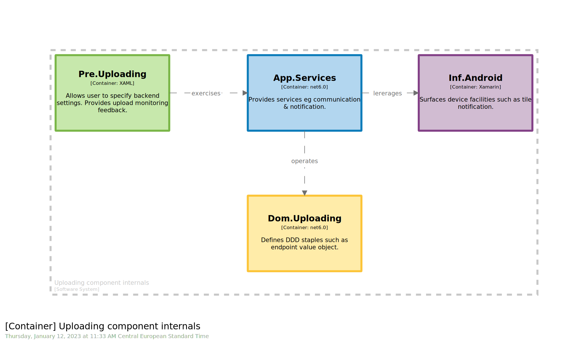

# BONUS STAGE 01

 

⌛ Estimated time to complete: 15 min

You may have noticed that `Structurizr DSL` does not handle the 4th level, the `code` one. As stressed before, this one is complex to streamline and thus to craft tooling around. Moreover, many modern `IDE` already provide meaningful toolkit to surface information such as `project dependency diagram` or `class diagram`. Obviously, if you think you are lacking something, it is up to you to craft the missing link by either enriching existing tooling, crafting your own, ...

Let's see how one could do so by wringing the `Structurizr` pipeline.

One last time, coming from `component` diagram, imagine you dapped in the `Uploading` green box. At this low-level stage, we need to refine the way we will craft the bounding context we are focusing at. A good way to shape modern application is to stick to **hexagonal** (`onion`, `port & adapter`, & Co siblings) architecture. It is then very easy to highlight the different projects involved, including the layer they belong to. It is now time to really detail the technical stack. Pay attention to the way you name your project, and of course provide more than ever meaningful description to sum up responsibility of each projects.  

> Following stuff is a trick, so you need to accommodate some mismatches regarding taxonomy, and some mind shifting. Goal is to stress that one could achieve this leveraging existing stack.

1. ✏️ Create a `workspace`
	```diff
	+workspace "Hexagonal Architecture Experimentation" "Wringing Structurizr pipeline to tackle C4.4." {
	+	!identifiers hierarchical
	+	!impliedRelationships false
	+	
	+	model {
	+	}
	+	views {
	+	}
	}

	```
2. ✏️ Shift your mind, considering `uploading` `component` will temporarily act as local `software system`:
	```diff
	model {
	+	uploading = softwareSystem "Uploading component internals" "" "" {}
	```
3. ✏️ Refine `uploading` internals, once again shifting your mind, considering them as `container`:
	```diff
	uploading = softwareSystem "Uploading component internals" "" "" {
	+	app = container "App.Services" "Provides services eg communication & notification." +"net6.0" "#app" {
	+	}
	+	dom = container "Dom.Uploading" "Defines DDD staples such as endpoint value object." +"technology" "#dom" {
	+	}
	+	inf = container "Inf.Android" "Surfaces device facilities such as tile notification." +"Xamarin" "#inf" {
	+	}
	+	pre = container "Pre.Uploading" "Allows user to specify backend settings. Provides +upload monitoring feedback." "XAML" "#pre" {
	+	}
	}
	```
4. ✏️ Add `relationships` to tie everything
	```diff
	model {
	+	uploading.app -> uploading.dom "operates" "" ""
	+	uploading.app -> uploading.inf "lererages" "" ""
	+	uploading.pre -> uploading.app "exercises" "" ""
	}
	```
5. ✏️ Ask for a `view`
	```diff
		views {
	+		container uploading "HexagonalArchitecture" "" {
	+			include *
	+			autolayout
	+		}
		}
	```
6. ✏️ Make sure that you reference a proper theme:
	```diff
	views {
	+	theme https://raw.githubusercontent.com/rvr06/cornifer-contrib/main/themes/hexagonal/theme.json
	}
	```

✏️ Save your workspace, and refresh your browser.



## Wrapup

📘 Completing this stage should lead to this [final workspace](./workspace.dsl).  

You see how one could leverage existing tooling to experiment and open new horizons. Hands on stack outside off the box is one of the most effective way to sustain evolution. 
