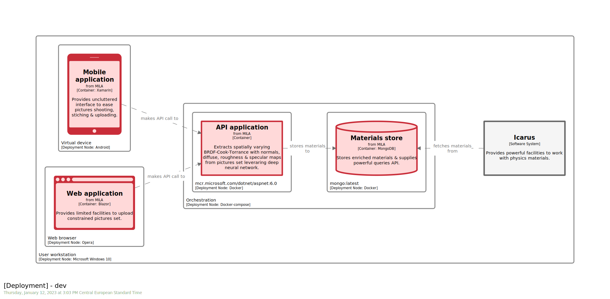
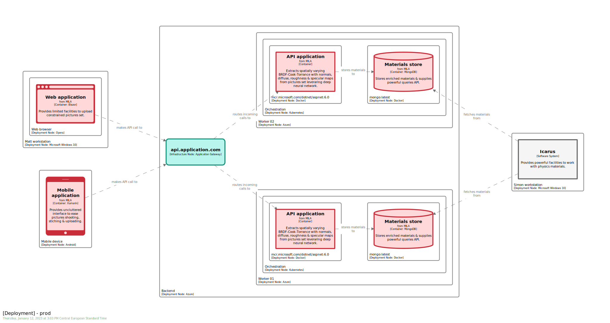
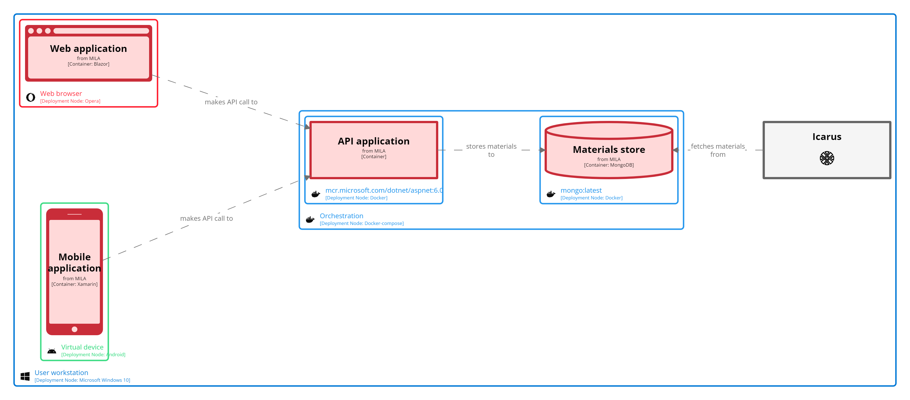
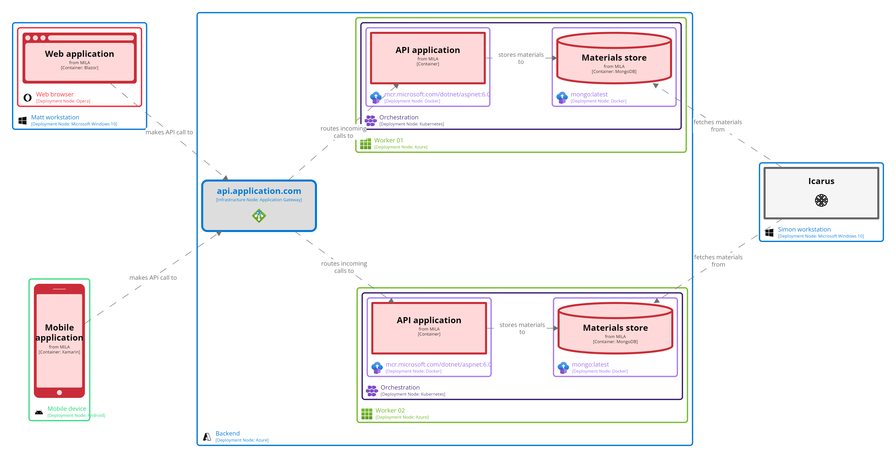
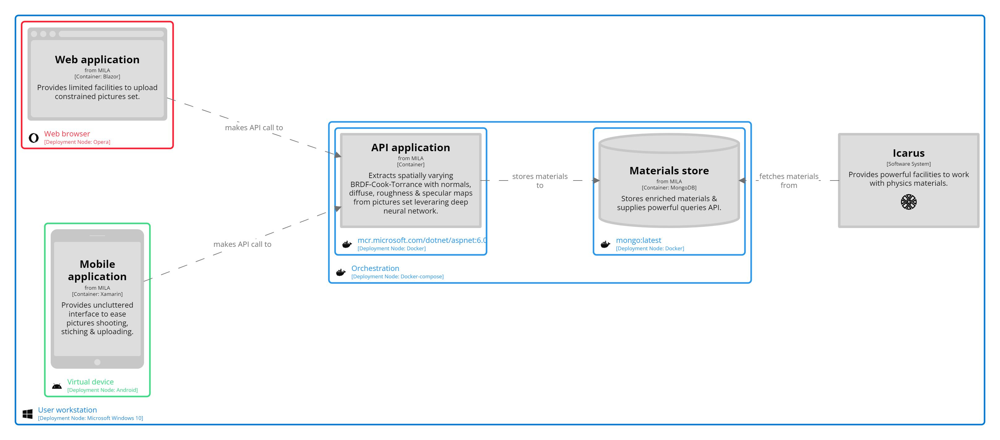
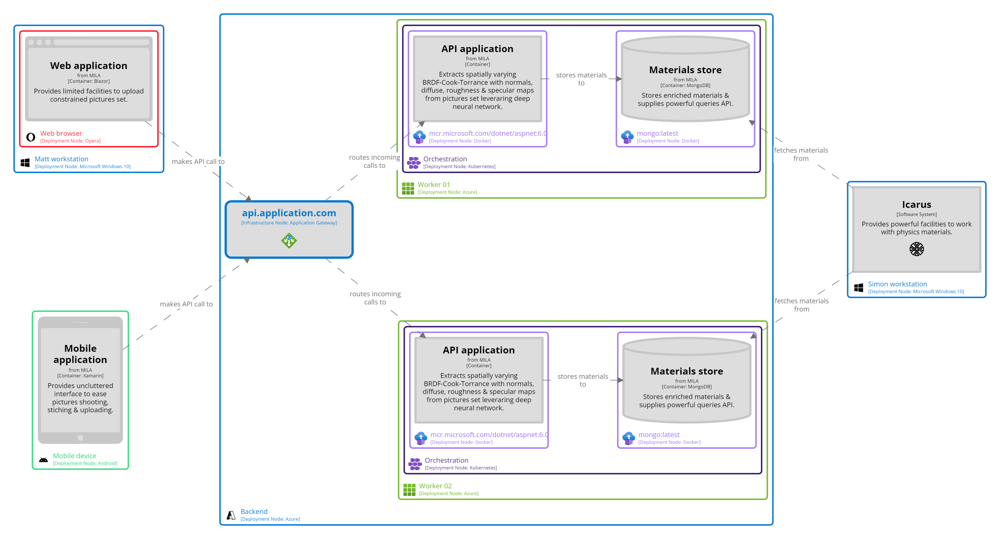
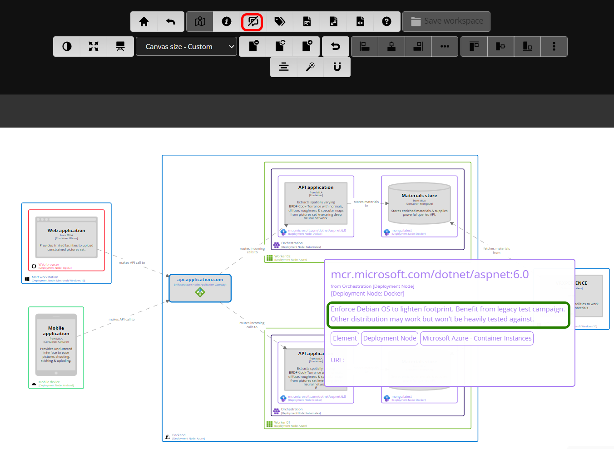
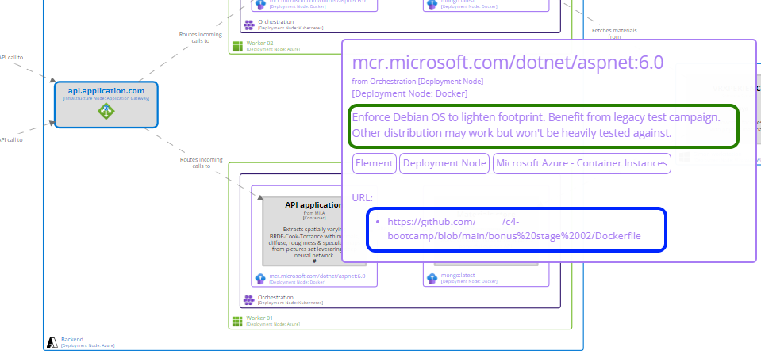
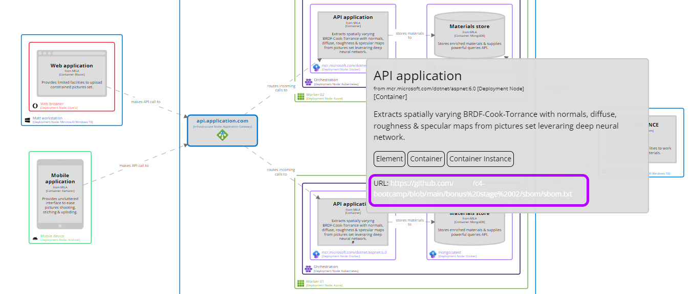

# BONUS STAGE 02


  
 

In this module, you will learn how to:
- Leverage `theme` to adapt to audience
- Enrich `software model` with technical insights, such as `Dockerfile` or `SBOM`, via `description` or `url`.

⌛ Estimated time to complete: 15 min

Assume we start from a meaningful [workspace](./source.dsl).

## Semantic view

Thanks to [stage 10](../stage%2010/README.md), we know how one can easily reference existing theme to support diagramming.

```diff
views {
+	theme https://raw.githubusercontent.com/rvr06/cornifer-contrib/main/themes/semantic-alt/theme.json
```

Underlying `software model` semantic is complemented by style to reduce mental load:




## Iconic view

We also saw that we can combine themes to surface other dimensions. We did it [by the past](../stage%2010/README.md) as well to enrich our `software model` with branding, combining existing themes such as `heraldry` or `microsoft-azure-2021.01.26`, or adding brand-new inlined styles like `#android`:

```diff
views {
	theme https://raw.githubusercontent.com/rvr06/cornifer-contrib/main/themes/semantic-alt/theme.json
+
+	theme https://raw.githubusercontent.com/rvr06/cornifer-contrib/main/themes/heraldry/theme.json
+	theme https://static.structurizr.com/themes/microsoft-azure-2021.01.26/theme.json
+	
+	styles {
+		element "#android" {
+			stroke #3DDC84
+			color #3DDC84
+			icon "https://raw.githubusercontent.com/rvr06/cornifer-contrib/main/assets/android.png"
+		}
+		
+		element "#opera" {
+			stroke #FF1B2D
+			color #FF1B2D
+			icon "https://raw.githubusercontent.com/rvr06/cornifer-contrib/main/assets/opera.png"
+		}
+		
+		element "Container Instance" {
+			metadata true
+			description true
+			height 300
+		}
+		
+		element "Software System Instance" {
+			metadata true
+			description true
+			height 300
+		}
+	}
```

Enriching `software model` comes with a cost, as many dimensions are now visually interleaved, which may result in blurry sketches and overload outcome diagramming:




Visualizing a complex model through tailored views is not new to software development. We do it for years now with pattern like `MVVM` (Model-View-ViewModel). We are used to apply such a pattern to geographical maps as well, asking for either satellite or elevation map of a dedicated area. Even if it may be useful to superimpose those dimensions for correlation, we are used to look at dimension in isolation.

Sadly, at the time of writing, `Structurizr` does not provide a built-in way of achieving such flexibility. We need some manual steps, namely amending `workspace.dsl` each time we want to look at a given dimension. For example, to stress deployment dimension, we should be tempted to comment `semantic` theme to only keep `branding` ones:

```diff
views {
-	theme https://raw.githubusercontent.com/rvr06/cornifer-contrib/main/themes/semantic-alt/theme.json
+	# theme https://raw.githubusercontent.com/rvr06/cornifer-contrib/main/themes/semantic-alt/theme.json
	theme https://raw.githubusercontent.com/rvr06/cornifer-contrib/main/themes/heraldry/theme.json
	theme https://static.structurizr.com/themes/microsoft-azure-2021.01.26/theme.json
+	theme https://raw.githubusercontent.com/rvr06/cornifer-contrib/main/themes/shape/theme.json
	
```

Resulting diagrams now focus on deployment dimension, without noising visual space with `semantic` one.




There are many remaining dimensions which could be helpful to visualize, such as:
* gathering elements by teams in charge
* spreading elements over releases
* identifying elements governance (enterprise vs customer)
* ...  

Of course, we could leverage `perspective` to do so, but having their own `theme` (and resulting tailored views) will be very helpful for those extra dimensions. `Structurizr` would definitively benefit scaling its approach on that matter...

## Prerequisites view

 Some element that can benefit from extra - and often verbose - information are `deploymentEnvironment` children, such as `deploymentNode`, `infrastructureNode`, `containerInstance` and `softwareSystemInstance`. What to attach, and how, will be covered in the current section. 

### Description

`Description` field is available for most elements and we previously stressed the importance to feed it properly and contextually. Feel free to use `description` field to highlight key prerequisites or provide meaningful insights. Eg, we may enrich `w01_.k8s_.docker_` `deploymentNode` to explain why we pick this particular `Linux` ditribution:

```diff
w01_ = deploymentNode "Worker 01" "" "Azure" "Microsoft Azure - All Resources" 1 {
	k8s_ = deploymentNode "Orchestration" "" "Kubernetes" "Microsoft Azure - Kubernetes Services" 1 {
-		docker_ = deploymentNode "mcr.microsoft.com/dotnet/aspnet:6.0" "" "Docker" "Microsoft Azure - Container Instances" 1 {
+		docker_ = deploymentNode "mcr.microsoft.com/dotnet/aspnet:6.0" "Enforce Debian OS to lighten footprint. Benefit from legacy test campaign. Other distribution may work but won't be heavily tested against." "Docker" "Microsoft Azure - Container Instances" 1 {
			api_ = containerInstance mila.api worker1_ "" {
			}
		}
		
		deploymentNode "mongo:latest" "" "Docker" "Microsoft Azure - Container Instances" 1 {
			store_ = containerInstance mila.store worker1_ "" {
			}
		}
	}
}
```

Enabling `diagram tooltip` in the `Structurizr` toolbar (in red) will activate pop-up when hovering element, which in-turn surfaces `description` field (in green).  



### Dockerfile

Application containerization is based on self-contained blueprint files, such as `Dockerfile` for `docker` or `definition file` (`.def`) for `singularity`, that can be easily referenced from `software model` leveraging `url` field. Then, you can decide to:
* provide base image `url`, e.g. `https://hub.docker.com/_/mongo` to speed up access or point to a dedicated version
* provide blueprint `url`, e.g. `https://github.com/rvr06/c4-bootcamp/blob/main/bonus%20stage%2002/Dockerfile` to link to matching blueprint

```diff
w01_ = deploymentNode "Worker 01" "" "Azure" "Microsoft Azure - All Resources" 1 {
	k8s_ = deploymentNode "Orchestration" "" "Kubernetes" "Microsoft Azure - Kubernetes Services" 1 {
		docker_ = deploymentNode "mcr.microsoft.com/dotnet/aspnet:6.0" "Enforce Debian OS to lighten footprint." "Docker" "Microsoft Azure - Container Instances" 1 {
+			url https://github.com/rvr06/c4-bootcamp/blob/main/bonus%20stage%2002/Dockerfile
			api_ = containerInstance mila.api worker1_ "" {
			}
		}
		
		deploymentNode "mongo:latest" "" "Docker" "Microsoft Azure - Container Instances" 1 {
+			url https://hub.docker.com/_/mongo
			store_ = containerInstance mila.store worker1_ "" {
			}
		}
	}
}
```

`Url` is available through pop-up (in blue) and navigable by double-clicking the matching item:



It is really helpful to provide the ability to navigate from the `software model` to its underlying insights, and is very efficient to support heterogeneous discussion, as we can zoom in and out from a single model. 

### SBOM

`SBOM`, standing for `Software Bill Of Material`, recently gained some traction and has been standardized [here](https://spdx.dev/). There is multiple ways of generating the `SBOM` of a dedicated software. For example, `docker` recently decided to enrich its built-in tooling to integrate `SBOM` generation, during build pipeline or from an existing image.

```sh
# Generate SBOM as part of the build pipeline
$ docker buildx build `
	--build-arg BUILDKIT_SYNTAX=crazymax/dockerfile:sbom `
	-o sbom `
	.
```

Above command generates a bunch of files:
* [sbom.txt](./sbom/sbom.txt)
* [sbom_cyclonedx.json](./sbom/sbom_cyclonedx.json)
* [sbom_spdx.json](./sbom/sbom_spdx.json)
* [sbom_syft.json](./sbom/sbom_syft.json)

that you can in-turn reference through `url` field to enrich the `software model`:

```diff
w01_ = deploymentNode "Worker 01" "" "Azure" "Microsoft Azure - All Resources" 1 {
	k8s_ = deploymentNode "Orchestration" "" "Kubernetes" "Microsoft Azure - Kubernetes Services" 1 {
		docker_ = deploymentNode "mcr.microsoft.com/dotnet/aspnet:6.0" "Enforce Debian OS to lighten footprint." "Docker" "Microsoft Azure - Container Instances" 1 {
			url https://github.com/rvr06/c4-bootcamp/blob/main/bonus%20stage%2002/Dockerfile
			api_ = containerInstance mila.api worker1_ "" {
+				url https://github.com/rvr06/c4-bootcamp/blob/main/bonus%20stage%2002/sbom/sbom.txt
			}
		}
		
		deploymentNode "mongo:latest" "" "Docker" "Microsoft Azure - Container Instances" 1 {
			url https://hub.docker.com/_/mongo
			store_ = containerInstance mila.store worker1_ "" {
			}
		}
	}
}
```

As expected, `url` is available through pop-up (in magenta) and navigable by double-clicking the matching item:



## Wrapup

📘 Completing this stage should lead to this [final workspace](./workspace.dsl).  

You see how one could leverage fields like `description` or `url`, or play with `themes` to tailor outcome. UX through `Structurizr` is not as smooth as expected, but those ideas could lead to interesting evolution.

## Further reading

- [theme](https://github.com/structurizr/dsl/blob/master/docs/language-reference.md#theme)
- [url](https://github.com/structurizr/dsl/blob/master/docs/language-reference.md#url)