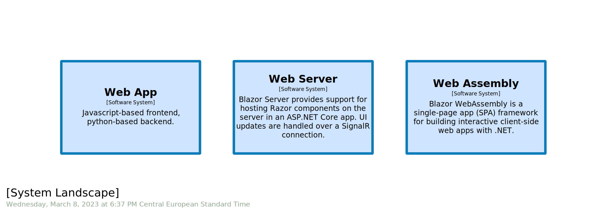
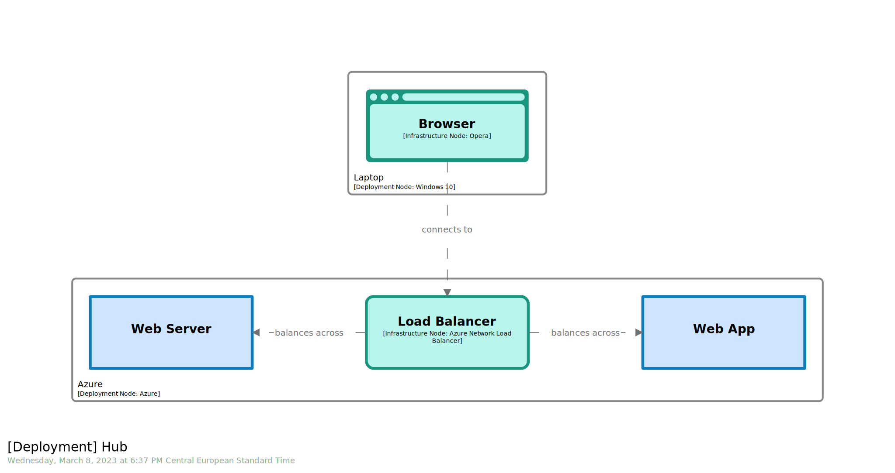
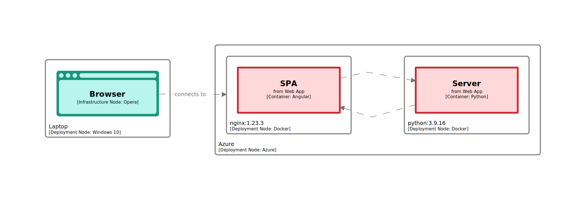
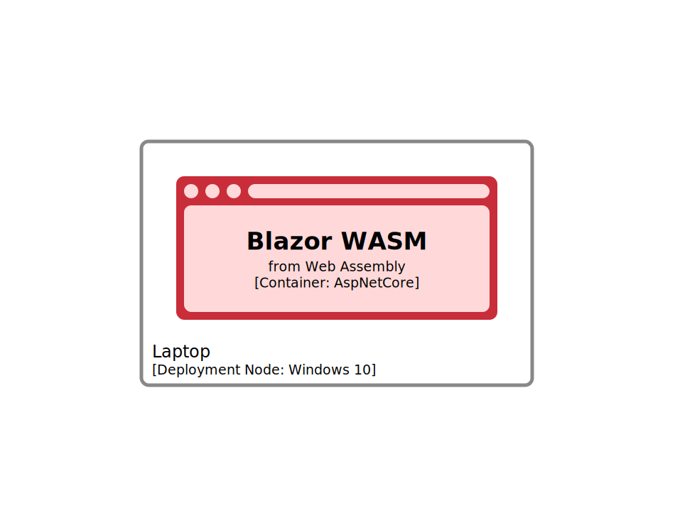
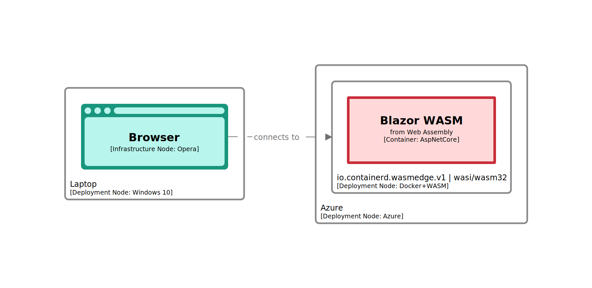

# BONUS STAGE 03

  

  

In this module, you will learn how to:
- Streamline web application `deployment` views
- Leverage `infrastructure node` to materialize entry point

⌛ Estimated time to complete: 15 min

Web applications come with many flavors, including:

## Deploy as software systems

Deployment diagrams can become noisy. To mitigate this, it's perfectly fine to deploy at the `software system` level, instead of zooming in at the `container` one. To do so, we leverage `software system instance` elements. Those `software system instances` land remotely. They are likely to be articulated leveraging a bunch of `infrastructure nodes`. To keep it simple, we only materialize one of them here, namely a `load balancer`.  

Because your deployment is likely to grow and complexify, and because you have to accommodate heterogenous audience, it is a good habit to materialize entry point right now. Here, personas will interact with `software systems` through a proxy, namely their favorite web browser. Materializing it via a dedicated `infrastructure node` makes perfect sense.
Deployment can be complemented using:
- a brand-new `deployment node` to host this `infrastructure node` and materialize user _realm_.
- a brand-new `relationship` between the browser and the load balancer to materialize the coupling between the two _realms_.
- a `browser` shape to tag the `infrastructure node` with. 

## Deploy as containers

In case we want to surface web application internals, we have to zoom in and deploy stack leveraging `container instances`. Once again, supporting user to effectively read and grasp intent is key.  

### Front-end & back-end

Deployment can be expressed using:
- 2 `container instances`, properly containerized through matching `deployment nodes`, landing on server _realm_.
- an `infrastructure node` to materialize the browser entry point, landing on user _realm_.
- a `browser` shape to tag the `infrastructure node` with.

### Web server

Deployment can be expressed using:
- a `container instance`, properly containerized through a `deployment node`, landing on server _realm_.
- an `infrastructure node` to materialize the browser entry point, landing on user _realm_.
- a `browser` shape to tag the `infrastructure node` with.

### Web Assembly

[WASM](https://learn.microsoft.com/en-us/aspnet/core/blazor/?view=aspnetcore-7.0#blazor-webassembly) - standing for `Web Assembly` language - is a relatively new way of deploying a web application. This said, `WASM` application is far beyond the plain old `SPA` usage only and new usages on the backend side - services & databases integration - are gaining traction.  

In this paradigm, `.NET` code is directly executing inside the browser.

#### Bare metal

Deployment can be expressed using:
- a `container instance` to materialize the application, landing on user _realm_.
- a `browser` shape to tag the `container instance` with, and enforce fact that application is fully embedded.

#### Containerized

> `Docker` is promoting `WASM` technology as a viable [alternative to Linux container](https://docs.docker.com/desktop/wasm/). 

Deployment can be expressed using:
- a `container instance`, properly containerized through a `deployment node`, landing on server _realm_. Notice how we use `deployment node` name to surface `runtime` & `platform` insights.
- an `infrastructure node` to materialize the browser entry point, landing on user _realm_.
- a `browser` shape to tag the `infrastructure node` with.

## Wrapup

📘 Completing this stage should lead to this [final workspace](./workspace.dsl).  

You see how one could leverage `Structurizr` semantic to accuretaly materialize how a web application is deployed.

## Further reading

- [deployment environment](https://github.com/structurizr/dsl/blob/master/docs/language-reference.md#deploymentEnvironment)
- [deployment node](https://github.com/structurizr/dsl/blob/master/docs/language-reference.md#deploymentNode)
- [infrastructure node](https://github.com/structurizr/dsl/blob/master/docs/language-reference.md#infrastructurenode)
- [software system instance](https://github.com/structurizr/dsl/blob/master/docs/language-reference.md#softwareSystemInstance)
- [container instance](https://github.com/structurizr/dsl/blob/master/docs/language-reference.md#containerInstance)
- [deployment view](https://github.com/structurizr/dsl/blob/master/docs/language-reference.md#deployment-view)
- [theme](https://github.com/structurizr/dsl/blob/master/docs/language-reference.md#theme)