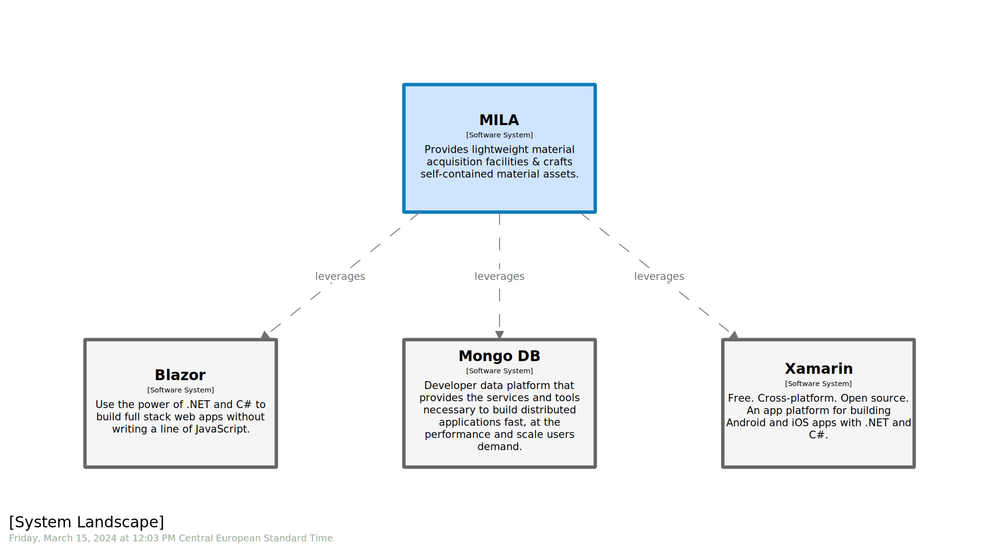
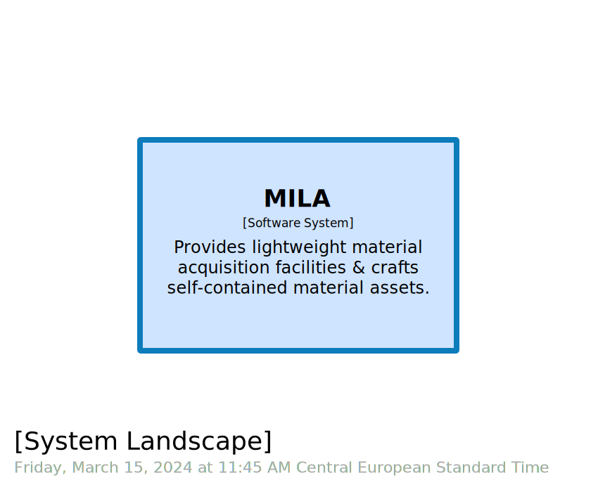
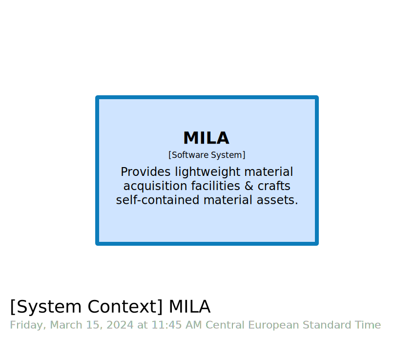
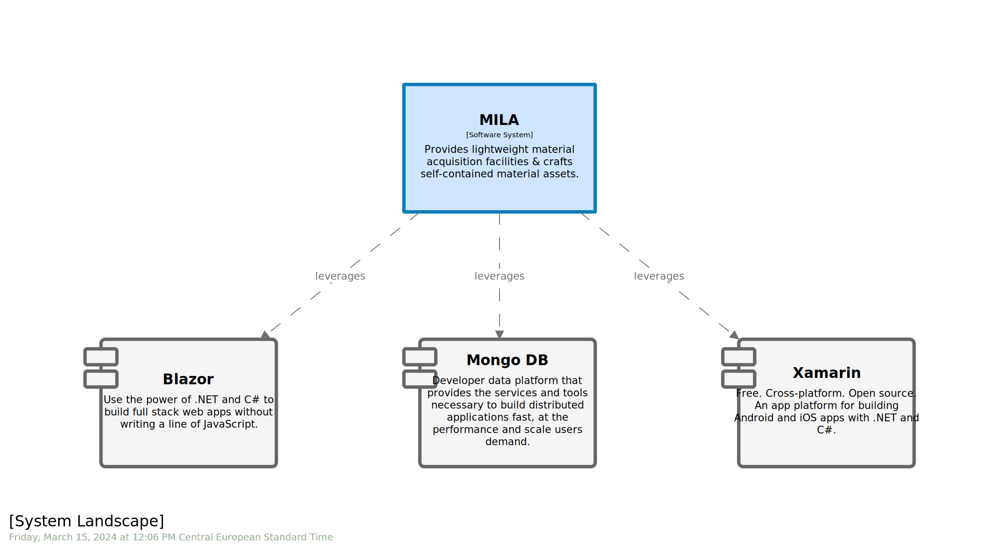

# BONUS STAGE 04

  

 
  

 
 

In this module, you will learn how to:
- Enrich `software model` with `technology` systems 
- Hack `systemLandscape` to surface technology stack
- Leverage `tag` & `theme` to tailor outcome

⌛ Estimated time to complete: 10 min

Assume we start from a meaningful [workspace](./source.dsl).

## Materialize technology as systems

Reading through given workspace, reader is exposed to some technologies, such as `Blazor`, `Mongo DB` & `Xamarin`. Because they deserve more than the couple of words `technology` field allow us to fill in. Because you should prevent yourself to assume upstream audience awareness on such topics. Because some technology stack are so broad enough, that sometimes we need more than a name or an acronym to fully grasp usage intent. For all those reaons, and probably many valid more, everyone will benefit of properly materializing them. As there is no dedicated `element`, one could leverage `software system` to do so.

✏️ Introduce dedicated `software systems` and implied `relationships`.  
✏️ Feel free to use `url` field to feed reader with a strong entry point.  
✏️ As none of them are proprietary, ensure you tag them accordingly.

<details><summary>📙 REVEAL THE ANSWER</summary>

```diff
model {
+   blazor = softwareSystem "Blazor" "[...]" "#external" {
+       url https://dotnet.microsoft.com/en-us/apps/aspnet/+web-apps/blazor
+   }
+   mongodb = softwareSystem "Mongo DB" "[...]" "#external" {
+       url https://www.mongodb.com/
+   }
+   xamarin = softwareSystem "Xamarin" "[...]" "#external" {
+       url https://learn.microsoft.com/en-us/xamarin/get-started/what-is-xamarin
+   }

+   mila -> blazor "leverages" "" ""
+   mila -> mongodb "leverages" "" ""
+   mila -> xamarin "leverages" "" ""
}
```
</details><br>

| &nbsp;&nbsp;&nbsp;&nbsp;&nbsp;&nbsp;&nbsp;&nbsp;&nbsp;&nbsp;&nbsp;&nbsp;&nbsp;&nbsp;&nbsp;&nbsp;&nbsp;&nbsp;&nbsp;&nbsp;&nbsp;&nbsp;&nbsp;&nbsp; C4.L &nbsp;&nbsp;&nbsp;&nbsp;&nbsp;&nbsp;&nbsp;&nbsp;&nbsp;&nbsp;&nbsp;&nbsp;&nbsp;&nbsp;&nbsp;&nbsp;&nbsp;&nbsp;&nbsp;&nbsp;&nbsp;&nbsp;&nbsp;&nbsp; | &nbsp;&nbsp;&nbsp;&nbsp;&nbsp;&nbsp;&nbsp;&nbsp;&nbsp;&nbsp;&nbsp;&nbsp;&nbsp;&nbsp;&nbsp;&nbsp;&nbsp;&nbsp;&nbsp;&nbsp;&nbsp;&nbsp;&nbsp;&nbsp; C4.1 &nbsp;&nbsp;&nbsp;&nbsp;&nbsp;&nbsp;&nbsp;&nbsp;&nbsp;&nbsp;&nbsp;&nbsp;&nbsp;&nbsp;&nbsp;&nbsp;&nbsp;&nbsp;&nbsp;&nbsp;&nbsp;&nbsp;&nbsp;&nbsp;|
|:-:|:-:|
|  |  |

So far, we both enrich the model with valuable insights and noise existing materials with those same insights, that may not be contextually relevant...

## Denoise views

You may have noticed we effectively materialize `technology` stack, but those new `elements` now noise existing views. Let's see how we could mitigate that.

✏️ Introduce a new `#fwk` tag and adorn newcomers accordingly.

<details><summary>📙 REVEAL THE ANSWER</summary>

```diff
model {
    mila = softwareSystem "MILA" "Provides [...]" ""  {

-   blazor = softwareSystem "Blazor" "Use [...]" "#external" {
+   blazor = softwareSystem "Blazor" "Use [...]" "#fwk, #external" {
}

```
</details><br>

✏️ Leverage `exclude` keyword to filter existing views. See [language reference](https://github.com/structurizr/dsl/blob/master/docs/language-reference.md#exclude) for usage.

<details><summary>📙 REVEAL THE ANSWER</summary>

```diff
views {	
    systemLandscape "SystemLandscape" "" {
        include *
+	    exclude element.tag==#fwk
        autoLayout
    }
    
    systemContext mila "SystemContext" "" {
        include *
+		exclude element.tag==#fwk
        autoLayout
    }
}
```
</details><br>

| &nbsp;&nbsp;&nbsp;&nbsp;&nbsp;&nbsp;&nbsp;&nbsp;&nbsp;&nbsp;&nbsp;&nbsp;&nbsp;&nbsp;&nbsp;&nbsp;&nbsp;&nbsp;&nbsp;&nbsp;&nbsp;&nbsp;&nbsp;&nbsp; C4.L &nbsp;&nbsp;&nbsp;&nbsp;&nbsp;&nbsp;&nbsp;&nbsp;&nbsp;&nbsp;&nbsp;&nbsp;&nbsp;&nbsp;&nbsp;&nbsp;&nbsp;&nbsp;&nbsp;&nbsp;&nbsp;&nbsp;&nbsp;&nbsp; | &nbsp;&nbsp;&nbsp;&nbsp;&nbsp;&nbsp;&nbsp;&nbsp;&nbsp;&nbsp;&nbsp;&nbsp;&nbsp;&nbsp;&nbsp;&nbsp;&nbsp;&nbsp;&nbsp;&nbsp;&nbsp;&nbsp;&nbsp;&nbsp; C4.1 &nbsp;&nbsp;&nbsp;&nbsp;&nbsp;&nbsp;&nbsp;&nbsp;&nbsp;&nbsp;&nbsp;&nbsp;&nbsp;&nbsp;&nbsp;&nbsp;&nbsp;&nbsp;&nbsp;&nbsp;&nbsp;&nbsp;&nbsp;&nbsp;|
|-|-|
|  |  |

We are now back to previous state, with denoised `system landscape` and `system context`. But `technology stack` we were claiming to materialize is still missing.

## Surface technology view

✏️ Introduce a new `system landscape` view.  
✏️ Leverage `include` keyword to pick `elements` we would like to embed. See [language reference](https://github.com/structurizr/dsl/blob/master/docs/language-reference.md#include) for usage.

<details><summary>📙 REVEAL THE ANSWER</summary>

```diff
views {
+   systemLandscape "TechStack" "" {
+       include mila
+       include element.tag==#fwk
+       autoLayout
+	}
}
```
</details><br>


Mission partially completed. Even if we allocate a dedicated view to show case `technology stack`, it is not optimal. Technologies are considered as plain old `software systems` and will benefit from better styling.

## Beautify

✏️ Style `#fwk` `element` by hiding metadata and using `Component` shape.

<details><summary>📙 REVEAL THE ANSWER</summary>

```diff
views {
+   styles {
+       element "#fwk" {
+           shape Component
+           metadata false
+       }
+   }
}
```
</details><br>



This time, outcome is far better as hidding metadata will prevent audience for misreading. `Component` shape strengthens the fact we are leveraging reusable staples, and technology stacks are but this kind of beast.

## Wrapup

📘 Completing this stage should lead to this [final workspace](./workspace.dsl).  

You see how one could leverage existing tooling to experiment and open new horizons. Hands on stack outside off the box is one of the most effective way to sustain evolution. `Struturizr` will benefit of providing a built-in `technology landscape` view, aka `C4.T`. Technology stack dimension is a 1st class citizen in an architecture design, and deseves to be processed accordingly.

## Further reading

- [software system](https://github.com/structurizr/dsl/blob/master/docs/language-reference.md#softwareSystem)
- [tag](https://github.com/structurizr/dsl/blob/master/docs/language-reference.md#tags)
- [url](https://github.com/structurizr/dsl/blob/master/docs/language-reference.md#url)
- [systemLandscape view](https://github.com/structurizr/dsl/blob/master/docs/language-reference.md#systemLandscape-view)
- [filtered-view](https://github.com/structurizr/dsl/blob/master/docs/language-reference.md#filtered-view)
- [theme](https://github.com/structurizr/dsl/blob/master/docs/language-reference.md#theme)