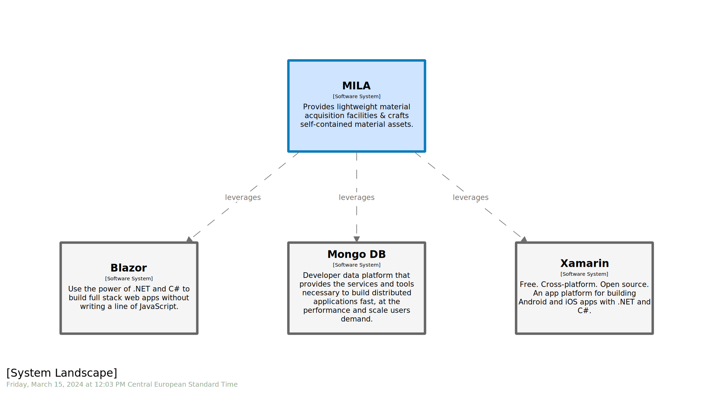
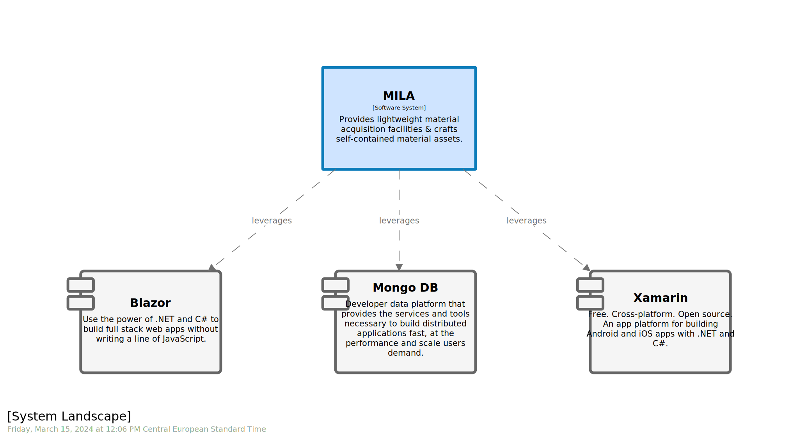

# BONUS STAGE 04

  

 
  

 
 

In this module, you will learn how to:
- Enrich `software model` with `technology` systems 
- Hack `systemLandscape` to surface technology stack
- Leverage `tag` & `theme` to tailor outcome

⌛ Estimated time to complete: 10 min

Assume we start from a meaningful [workspace](./source.dsl).

## Materialize technology as systems

Reading through the given workspace, the reader is exposed to some technologies, such as `Blazor`, `Mongo DB`, and `Xamarin`. They deserve more than the few words the `technology` field allows us to provide. We should also avoid assuming that upstream audiences are already familiar with these topics. Some technology stacks are broad enough that we need more than a name or acronym to fully grasp the usage intent. For all these reasons, and many more, everyone benefits from materializing them properly. As there is no dedicated `element`, you can leverage `software system` to do so.

✏️ Introduce dedicated `software systems` and implied `relationships`.  
✏️ Feel free to use `url` field to feed reader with a strong entry point.  
✏️ As none of them are proprietary, ensure you tag them accordingly.

<details><summary>📙 REVEAL THE ANSWER</summary>

```diff
model {
+   blazor = softwareSystem "Blazor" "[...]" "#external" {
+       url https://dotnet.microsoft.com/en-us/apps/aspnet/+web-apps/blazor
+   }
+   mongodb = softwareSystem "Mongo DB" "[...]" "#external" {
+       url https://www.mongodb.com/
+   }
+   xamarin = softwareSystem "Xamarin" "[...]" "#external" {
+       url https://learn.microsoft.com/en-us/xamarin/get-started/what-is-xamarin
+   }

+   mila -> blazor "leverages" "" ""
+   mila -> mongodb "leverages" "" ""
+   mila -> xamarin "leverages" "" ""
}
```
</details><br>

| &nbsp;&nbsp;&nbsp;&nbsp;&nbsp;&nbsp;&nbsp;&nbsp;&nbsp;&nbsp;&nbsp;&nbsp;&nbsp;&nbsp;&nbsp;&nbsp;&nbsp;&nbsp;&nbsp;&nbsp;&nbsp;&nbsp;&nbsp;&nbsp; C4.L &nbsp;&nbsp;&nbsp;&nbsp;&nbsp;&nbsp;&nbsp;&nbsp;&nbsp;&nbsp;&nbsp;&nbsp;&nbsp;&nbsp;&nbsp;&nbsp;&nbsp;&nbsp;&nbsp;&nbsp;&nbsp;&nbsp;&nbsp;&nbsp; | &nbsp;&nbsp;&nbsp;&nbsp;&nbsp;&nbsp;&nbsp;&nbsp;&nbsp;&nbsp;&nbsp;&nbsp;&nbsp;&nbsp;&nbsp;&nbsp;&nbsp;&nbsp;&nbsp;&nbsp;&nbsp;&nbsp;&nbsp;&nbsp; C4.1 &nbsp;&nbsp;&nbsp;&nbsp;&nbsp;&nbsp;&nbsp;&nbsp;&nbsp;&nbsp;&nbsp;&nbsp;&nbsp;&nbsp;&nbsp;&nbsp;&nbsp;&nbsp;&nbsp;&nbsp;&nbsp;&nbsp;&nbsp;&nbsp;|
|:-:|:-:|
|  |  |

So far, we both enrich the model with valuable insights and noise existing materials with those same insights, that may not be contextually relevant...

## Denoise views

You may have noticed that we effectively materialize the `technology` stack, but those new `elements` now add noise to existing views. Let's see how you can mitigate that.

✏️ Introduce a new `#fwk` tag and adorn newcomers accordingly.

<details><summary>📙 REVEAL THE ANSWER</summary>

```diff
model {
    mila = softwareSystem "MILA" "Provides [...]" ""  {

-   blazor = softwareSystem "Blazor" "Use [...]" "#external" {
+   blazor = softwareSystem "Blazor" "Use [...]" "#fwk, #external" {
}

```
</details><br>

✏️ Leverage `exclude` keyword to filter existing views. See [language reference](https://docs.structurizr.com/dsl/language#exclude) for usage.

<details><summary>📙 REVEAL THE ANSWER</summary>

```diff
views {	
    systemLandscape "SystemLandscape" "" {
        include *
+	    exclude element.tag==#fwk
        autoLayout
    }
    
    systemContext mila "SystemContext" "" {
        include *
+		exclude element.tag==#fwk
        autoLayout
    }
}
```
</details><br>

| &nbsp;&nbsp;&nbsp;&nbsp;&nbsp;&nbsp;&nbsp;&nbsp;&nbsp;&nbsp;&nbsp;&nbsp;&nbsp;&nbsp;&nbsp;&nbsp;&nbsp;&nbsp;&nbsp;&nbsp;&nbsp;&nbsp;&nbsp;&nbsp; C4.L &nbsp;&nbsp;&nbsp;&nbsp;&nbsp;&nbsp;&nbsp;&nbsp;&nbsp;&nbsp;&nbsp;&nbsp;&nbsp;&nbsp;&nbsp;&nbsp;&nbsp;&nbsp;&nbsp;&nbsp;&nbsp;&nbsp;&nbsp;&nbsp; | &nbsp;&nbsp;&nbsp;&nbsp;&nbsp;&nbsp;&nbsp;&nbsp;&nbsp;&nbsp;&nbsp;&nbsp;&nbsp;&nbsp;&nbsp;&nbsp;&nbsp;&nbsp;&nbsp;&nbsp;&nbsp;&nbsp;&nbsp;&nbsp; C4.1 &nbsp;&nbsp;&nbsp;&nbsp;&nbsp;&nbsp;&nbsp;&nbsp;&nbsp;&nbsp;&nbsp;&nbsp;&nbsp;&nbsp;&nbsp;&nbsp;&nbsp;&nbsp;&nbsp;&nbsp;&nbsp;&nbsp;&nbsp;&nbsp;|
|-|-|
|  |  |

We are now back to previous state, with denoised `system landscape` and `system context`. But `technology stack` we were claiming to materialize is still missing.

## Surface technology view

✏️ Introduce a new `system landscape` view.  
✏️ Leverage `include` keyword to pick `elements` we would like to embed. See [language reference](https://docs.structurizr.com/dsl/language#include) for usage.

<details><summary>📙 REVEAL THE ANSWER</summary>

```diff
views {
+   systemLandscape "TechStack" "" {
+       include mila
+       include element.tag==#fwk
+       autoLayout
+	}
}
```
</details><br>



Mission partially completed. Even if we allocate a dedicated view to show case `technology stack`, it is not optimal. Technologies are considered as plain old `software systems` and will benefit from better styling.

## Beautify

✏️ Style `#fwk` `element` by hiding metadata and using `Component` shape.

<details><summary>📙 REVEAL THE ANSWER</summary>

```diff
views {
+   styles {
+       element "#fwk" {
+           shape Component
+           metadata false
+       }
+   }
}
```
</details><br>



This time, outcome is far better as hidding metadata will prevent audience for misreading. `Component` shape strengthens the fact we are leveraging reusable staples, and technology stacks are but this kind of beast.

## Wrapup

📘 Completing this stage should lead to this [final workspace](./workspace.dsl).  

You see how you can leverage existing tooling to experiment and open new horizons. Hands-on work outside the box is one of the most effective ways to sustain evolution. `Structurizr` would benefit from providing a built-in `technology landscape` view, aka `C4.T`. The technology stack dimension is a first-class citizen in architecture design, and it deserves to be handled accordingly.

## Further reading

- [software system](https://docs.structurizr.com/dsl/language#softwareSystem)
- [tag](https://docs.structurizr.com/dsl/language#tags)
- [url](https://docs.structurizr.com/dsl/language#url)
- [systemLandscape view](https://docs.structurizr.com/dsl/language#systemLandscape-view)
- [filtered-view](https://docs.structurizr.com/dsl/language#filtered-view)
- [theme](https://docs.structurizr.com/dsl/language#theme)