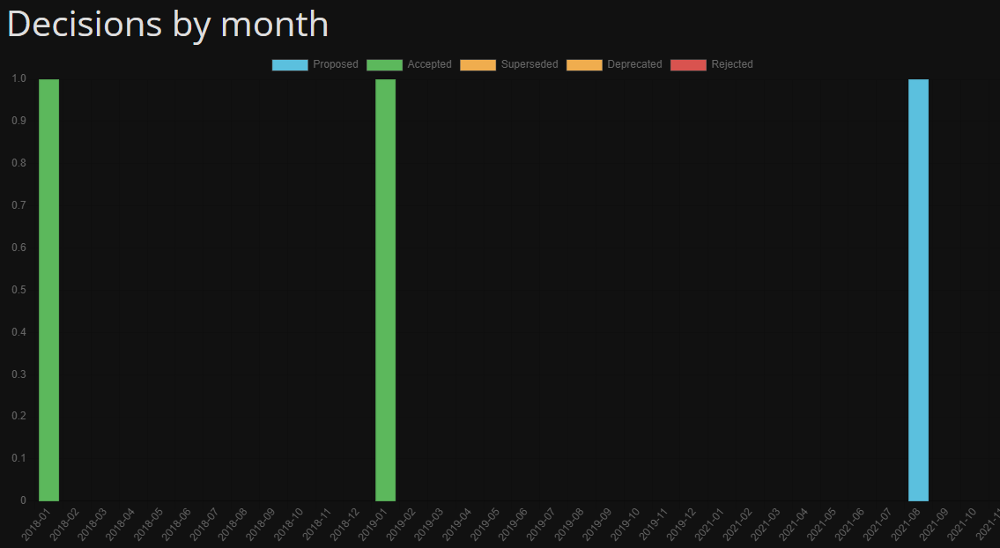
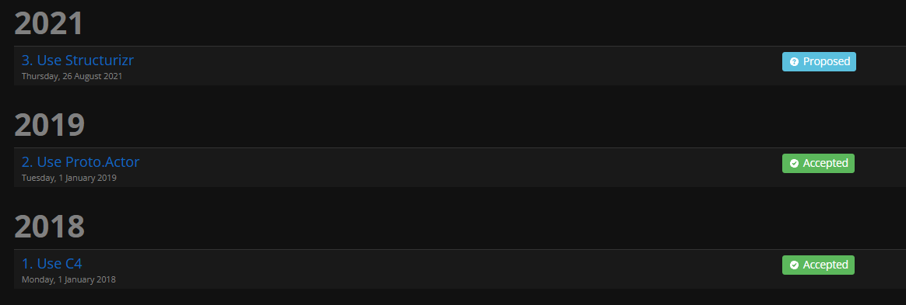
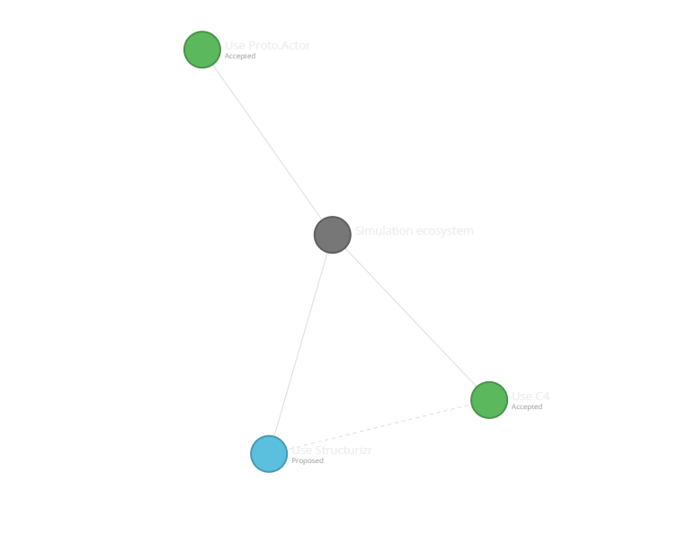

As we stated before, there is no per say bad choices, provided that you can explain why you made it.
A choice can appear to be unlucky or inappropriate if we analyze it through our current perspective, but can make sense if we do it via past prism.
Thus, the importance of tracking those choices to be able to rewind and replay without be tempting to rewrite the history.
Of course, this applies to many domains, especially History. Let's see how it fits into software crafting.

## The What & The How

You start a project by defining its purpose, WHAT issue it will solve, WHAT service it will provide, ...
Once done comes the 2nd stage, the HOW. HOW will you do that? HOW will you deliver this? ...

As usual, issues quickly arise, namely when you discover a WHAT can be achieved by many HOW.
​​​​​​​Then, it is important to explain why you pick this particular HOW among other siblings. ​​​​​

{}

{}  
  
Assuming you would like to travel for holidays. With friends. Every one towards a single relaxing place. This is the WHAT.
{}

{}

Some will go by plane, some other by car. Some will stage the journey, stopping-off every city in the middle. Some others will choose to travel by night. And so on. This is the HOW.
And it is important to explain why those decisions were made eg plane makes me sick, or nighttime passage is cheaper. And so on. 
{}

{}

## Architecture Decision Record

Log sizable decision making during project lifecycle is a good habit. As for other satellite artifacts like dependencies listing (and their induced licensing model), it complements very well the documentation side. And contribute to story-telling. **ADR** comes with multiple flavors, more or less complicated. As usual, start gently and complexify only if needed. It is commonly used to leverage the 6 following traits.

{}

{}

Each ADR deserves a proper name. Make it unambiguous. It is also common to index them to support timeline discussion.
{}

{}

Most of the project we work on stretch out over several months. It is thus important to track when we make decision to be able to contextually correlate later on.
{}

{}

Decision making is a process. As for every process, it is important to track the status, and keep full history including ideas that were refused. They often help further brain storming.
{}

{}

{}

{}

Take time to specify the context which leads to this decision process. Are we experiencing bottlenecks or issues? Would we like to ensure that we will avoid those pitfalls? 
{}

{}

Explain your choice. Provide insights if you pick a choice within multiple offer. Stress out if you fallback rather than choose (eg for cost reason).
{}

{}

Every single decision may have impact on the project, on the team, on your daily life. Foresee consequences of a choice is a good habit. And ensure every one agree upon both decision & consequence(s).
{}

{}

## Hands-on, the C4 journey

Find below the hypothetic ADR subset relative to C4 one could end up with on a given project. 

{}

{}

* 05/08/2020
* Accepted
* Project architecture is complex and must be regularly discussed with heterogenous audience. We lack both diagramming convention and unified model.
* Leverage C4 model to describe architecture. UML is too complex & thus rejected.
* Streamline C4 usage, starting with tech leads. Provide tooling.
{}

{}

* 07/11/2020
* Accepted
* C4 model has been broadly accepted but is costly to put in place due to lack of tooling
* Enrich corporate diagramming solution with C4 facilities. Define guidelines to group & sort diagramming within libraries. 
* Raise team members awareness. Ask for licensing. Promote tool by systemizing usage during tool specs & reviews.
{}

{}

* 09/18/2021
* Proposed
* We experience difficulty over past months to properly scale the sketch-first approach. Maintenance cost is high. Diagramming are uncoupled from source code.
* Gradually switch from sketch-first approach to code-first one leveraging dedicated tooling.
* Introduce migration to teams. Once again leverage local champion to lead changes. Ask for licensing. Create workstream to gather & process team needs on that matter.
{}

{}

Obviously, ADR are simplified there. You are likely to end up with more details for context, decision & consequences. Remember as well that ADR should be part of our project, obeying the same workflow (branching, PR, reviews) and enforcing our repository as the only source of truth. ​​​​​​​A good approach is to create a dedicated file per ADR, sticking to markdown or equivalent format ie human readable and version control friendly.

## Analysis

Once again, we do not store & track for the sake of storing & tracking. Data are there to be explored and to support us in our endless journey to improve workflow. Thus, it is important to be able to generate views as well. ADR becomes another code-first approach model one can query to surface consolidated metrics. Find below some views that are provided by Structurizr suite.

{}

{}

Timeline view to correlate with project lifecycle eg do we make more decisions during design phase or hardening one? How sustainable our decisions are?
{}

{}

Timeline view focusing (arbitrarily) on year but highlighting ADR name. Could be used in conjunction with the previous one. Could be great to sketch a pattern from the sequence of status. Full green sequence highlights Mojo momentum. Green & red interleaves may highlight uncertainty or paradigm inversion.  
{}

{}

Graph view to materialize ADR coupling eg relationship or lineage (accepted -> superseded). Can be helpful to rewind the journey or to start a brand-new project ie directly starting with leaves.
{}

{}

## Closing

We saw in this module why recording architecture decisions does matter.
By reusing what we learned before, namely defining a model & agreeing upon convention, it becomes straightforward to surface custom views to explore and analyze data. Trying hard to grasp what we did well and what we did wrong is the best way to improve upcoming projects. Do not miss opportunity to leverage modern approach & efficient tooling to support you on this challenging journey.