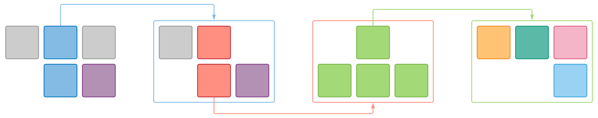

## Status

{}
Ask somebody in the building industry to visually communicate the architecture of a building and you'll be presented with site plans, floor plans, elevation views, cross-section views and detail drawings. In contrast, ask a software developer to communicate the software architecture of a software system using diagrams and you'll likely get a confused mess of boxes and lines … inconsistent notation (color coding, shapes, line styles, etc.), ambiguous naming, unlabeled relationships, generic terminology, missing technology choices, mixed abstractions, etc.  
​​​​​​​Simon Brown
{}

## Philosophy

{}
There are many different audience for diagrams and documentation, all with different interest.  
​​​​​​​Simon Brown
{}

Thus, the necessity to end up with a so called _Ubuiquitous language_ for diagramming to support & improve discussion.
Let's introduce the pillars the **C4 model** (created by Simon Brown) is based upon.

## Zoom levels

With ever-growing & complex ecosystems, it becomes unmanageable to end up with a single picture that can both exhaustively capture the whole scope and be properly processed by standard human being. When facing such a situation, splitting the overall problem into chunks or layers, which focus on a dedicated set of aspects instead, is a common way to address the issue.
Humanity has been treating geographical maps this way (Continent, Country, Region, Local) for centuries.


The C4 model is no exception and introduces 4 different zoom levels, hence the name:

| ID | Name | Description |
|-|-|-|
| C4.1 | **C**ontext | Focuses on personas and software systems rather than technologies, protocols and other low-level details. |
| C4.2 | **C**ontainer | Focuses on the way a given system is broken down, and the induced relationships. Highlights relevant technology choice. |
| C4.3 | **C**omponent | Materializes components that shapes a given container, refining technology choices and how everything articulates. |
| C4.4 | **C**ode | Explains how a given component is chunked into projects or classes. |	

## Zoom consistency

The main idea is to ease an element’s identification & coupling and to cluster/hide information details to the level it is pertinent to.

Zoom levels are not mixed to avoid discrepancy e.g. a restaurant menu is:
- either abbreviated
    ```
    starter
    main course
    dessert
    ```
- or verbose
    ```
    starters (…, …, …)
    main courses  (…, …, …)
    desserts  (…, …, …)
    ``` 

but rarely mixed like
```
starter
main course
desserts  (…, …, …)
```

Once again, the same is true of the geographic maps we are used to.

|||
|-|-|
||Typical international map. Notice how every country is fairly dealt with: name, color, boundary. No insights.|
||If we focus on France, we usually end up with first level of granularity, known as region. Once again, fairness treatment.|
||Zooming one last time to department layer. Notice how context is provided through gray neighboring without noising the focused area (the colored one). And once again, each department or dependency is equally processed. |

It is vital to decrease mental workload to cluster information by introducing this level of consistency or treatment equity. 

## Navigation

One issue that is never encountered when we stick to a "god"-diagram-like paradigm is the navigation one.
As soon as we decide to split architecture into multiple diagrams or views, we have to provide an efficient way to navigate back and forth for the reader.
As for monolith to micro-services migration, what we get in term of uncoupling must be paid back in terms of stitching. 

Most of us have already played with Google Earth and experienced how natural it is to pick a point on the globe, and seamlessly focus back and forth by zooming in and out accordingly. Same goes for our architecture materials.

Consider the bunch of diagrams as Google Earth staples. Wherever you are, you could then just zoom in or out, and the view will react accordingly, either by refining area and providing more insights, or stepping back and hiding underlying irrelevant complexity.
The noticeable difference with Google Earth lies in the fact our scroll wheel operates in discrete steps. Remember we have a finite number of indexed layers, and we cannot deal with 1.5 or 2.8 zoom level.

## Recipe

The main advantage of these metaphors is that they are easy to grasp regardless of the audience and thus, ease communication between technical folks & business guys while enforcing consistency.

So, basically, what you should end up with, if you stick to the recipe exposed above is 4 layers with semantic content that you can easily navigate back and forth through and the content is contextually & smartly narrowed.   



Obviously, this diagram only renders one single system-container-component-code vertical slice. Real life projects are likely to be more complex. That is why it is important to first agree on some [conventions]({}) before engaging further...


## Complementary diagram

Sadly, sticking to only 4 levels is not enough to cover other strategic aspects architecture diagramming should deal with. 
Thus, `C4 model` introduces a bunch of complementary diagrams:

| ID | Name | Description |
|-|-|-|
| C4.L | **L**andscape | Nowadays, system is likely to be part of a bigger thing, often referred as ecosystem. Landscape diagrams come in handy to fill this gap, zooming out from C4.1 (dedicated to a single system) to embrace the whole complexity, highlighting coupling, synergy and interactions of all actors. |
| C4.W | **W**orkflow | Workflows, even simple ones, poorly accommodate the inherent static nature of diagram. It is used to leverage indexed actions to show case the dynamic of a usage. |
| C4.D | **D**eployment | 4 main levels describe how a given system is made and can be broken down, w/o specifying how it will be deployed, as it is not relevant in that context. But to cope with this missing dimension, model proposes to tailor new kind of diagram that illustrate how systems and containers will be mapped to infrastructure.|


## Closing

In this session, we introduced the **C4 model** and its underlying concepts.  
We also sketched some raw diagrams to materialize what we should end up with.  
It is now time to agree on some conventions, prior to engage further.  
Good news, that's what the next [session]({}) is all about.