Previously, we saw that **sketch-first** approach, as appealing as it may look like, comes with painful drawbacks that can prevent sizable project to properly scale eg huge maintenance cost, human error prone, ...

This post will give some insights of the **code-first** or **architecture as code** approach, stressing out pros and cons of such a method.
It should be read in parallel with [previous one]({}), which covers the **architecture as sketch** or **sketch-first** approach.

As always, **YMMV**, so spend time to learn and experience prior to make your **own** decision.

## Recipe

|||
|-|-|
| Describe | Leveraging either an API or a DSL, 1st stage is to describe your model in an human-readable, source control friendly way. |
| Parse & build | Next stage is the realm of parser, analyzer & builder which are in charge of ingesting & validating model description and transforming it into a operable model. | 
| Explore | Final stage is to provide ways/views to explore and display your model to fit audience need and support discussion. |

## Model

Instead of drag & dropping shapes & arrows, code-first approach implies to write code. Amazing.
A model can be defined as a set of types, data & behaviors. You can do so with any modern languages.
So, instead of picking the System shape & filling the placeholders, you will create a new instance of the System type, providing name & description properties. Then attach a new instance of Container to this System, and so on. Plain-old coding.

C4 model provides such API for both [.NET](https://github.com/structurizr/dotnet) & [Java](https://github.com/structurizr/java) languages.

To ensure everyone can participate to model creation, a widespread practice is to shape a **D**omain **S**pecific **L**anguage. This particular language focuses only on a specific domain, hence the name. Narrowing the scope allows to end up with simple syntax and manageable rules, most of the people can rapidly learn & be proficient with. No more coding prerequisites. One well-known diagramming DSL is the [mermaid](https://mermaid-js.github.io/mermaid/#/) one.

C4 model comes with its own, fully specified [here](https://docs.structurizr.com/dsl/language).
It defines types, data & structure as below:

This simple grammar is easy to grasp, and layman friendly.
Most often, DSL comes with syntax highlighter & analyzer as well to support user.
DSL is also complemented with necessary tooling - more or less automated - that allows transformation of DSL into matching model structure.

So whatever the entry point you pick, you now have a fully-described model you would like operate to surface compelling views.

## Tags

Tags is a very popular and powerful way to enrich a model. We often refer to this extra information as metadata. As you may have notice, the C4 model is quite simple. There is very few types (person, system, container, component). One can enrich the model by adding tags that will be used to:

tailor the views (eg using a database shape for - guess what - stuff that are tagged with #database)
filter the views (eg all component but those tagged with #external)
...
See tags as new dimensions you add to your model and you can leverage downstream to smartly shape the view(s). 
Unlike types, there is no constraints on tags, they are plain old text. That means you can tag the way you want, which can be good, but, corollary, you cannot leverage tooling to check for failure. Nothing will prevent you to misspell a word.

## Views

Uncoupling model from view(s) is the core concept of modern **UI** framework such as **M**odel **V**iew **V**iew**M**odel pattern.​​​​​​​
The underlying idea is to focus on creating a single rich model and be able to provide on-demand consolidated view(s).
Applied to the solar system, we can end up with a model gathering planet name, traits (such as size, distance from the sun, ...), ... 
Then, we can expose and explore our model in many different ways like:

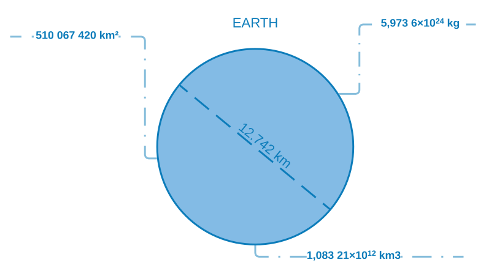

## Theme

By uncoupling model from view(s), we are now able to tailor view(s) without even touching the model.
​​​​​​​And theming is a very powerful tool to accommodate heterogenous users & situations.

||||
|-|-|-|
| 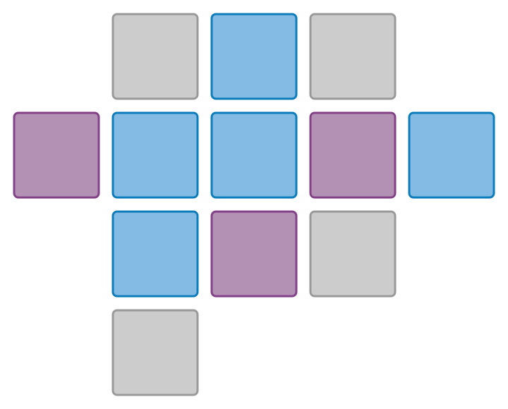 | Semantic | C4 model semantic color schema we agree upon. |
|  | Corporate | Need to incorporate diagramming within a slide deck or marketing materials where visual consistency does matter and sticks to corporate brand. Just swap your theme. |
| 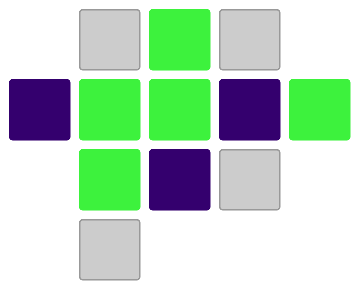 | High contrast | Experience should be tailored to every user. Every modern OS, IDE or application make accessibility a first-class citizen. Theming supports us on that field by enabling smart UX with a very limited investment. |                                      

## Point of views

As said above, uncoupling model from view(s) allows to tailor as many views and as many forms we need to smartly explore our model.
It is up to you to experience which shape you are more comfortable with, which one better conveys information, which one is better suited to support this kind of discussion or to interact with this particular audience.
And the beauty here is that all of those are built upon a single common model. It is just different ways of interacting with this underlying model. Your model acts now as a database, you can query/filter/tailor to suit your needs.

|||
|-|-|
| Exhaustive description of the ecosystem. | 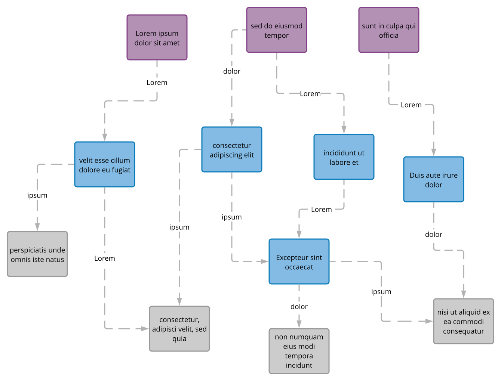 | 
| Highlight workflow. | 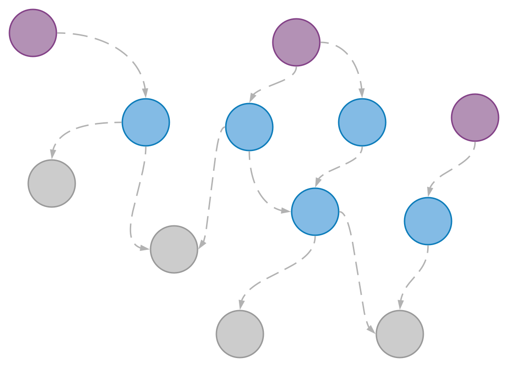 | 
| Schematic view to gauge type & cardinality. | 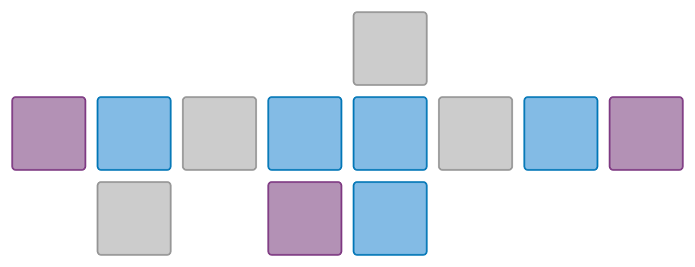 | 

## Structurizr

As an architecture as code evangelist, Simon Brown (creator of the C4 model) provides community with a comprehensive set of utility to shape & explore diagramming, the Structurizr suite:
- [C4 DSL](https://github.com/structurizr/dsl): A way to create Structurizr software architecture models based upon the C4 model using a textual domain specific language
- [C4 CLI](https://github.com/structurizr/cli): A command line utility for Structurizr, designed to be used in conjunction with the Structurizr DSL
- [Structurizr](https://structurizr.com/): Visualize, document and explore your software architecture  

From here, we will leverage Structurizr suite to show case what one could expect from this model-first approach but keep in mind you should be able to end up with similar results using other alternatives.
Moreover, Structurizr is smart enough to ship a docker-based lite version everyone can locally play with. Give it a try.

Assuming your described your model leveraging the C4 DSL (200 lines of text for this particular sample), Structurizr crafts for you:

|||
|-|-|
|  | Landscape aka C4.L |
|  | Context aka C4.1 | 
|  | Container aka C4.2 | 
|  | Component aka C4.3 | 
|  | Back and forth navigation. | 
| 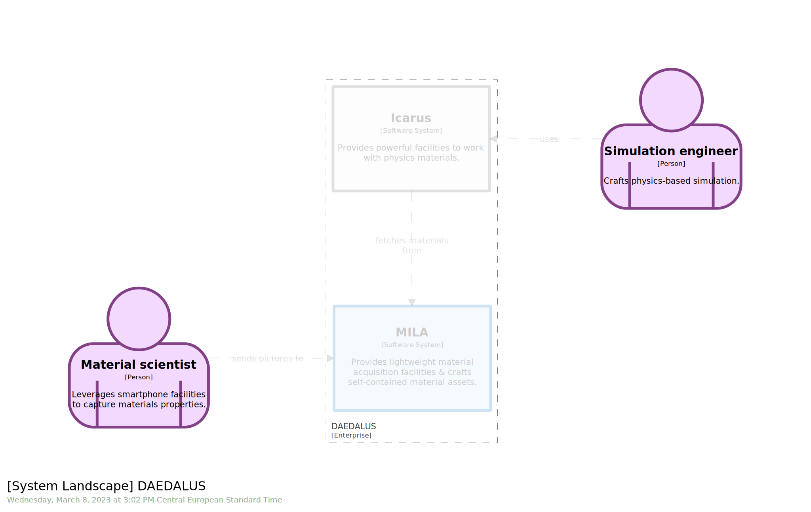 | All views can be dynamically filtered leveraging tags. Elements that does not fulfill tags query are made semi-transparent. | 
| 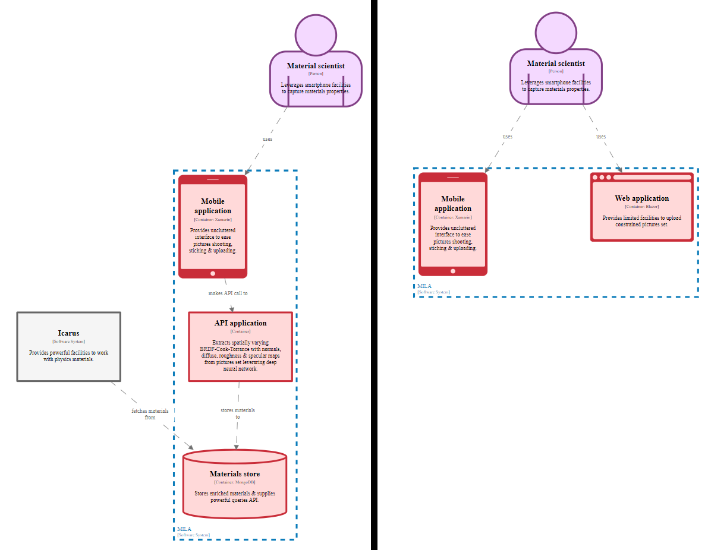 | You can craft filtered views from a single parent one to highlight different use cases. The layout is kept to ease comparison (spot the difference alike). |
|  | As it can become difficult without speaker to support, complex diagram can be animated to support journey & ease understanding. |
|  | Workflow aka C4.W. Relationships are indexed and animation can be played, including fading in/out elements to improve journey experience. |
|  | Deployment aka C4.D. |
| 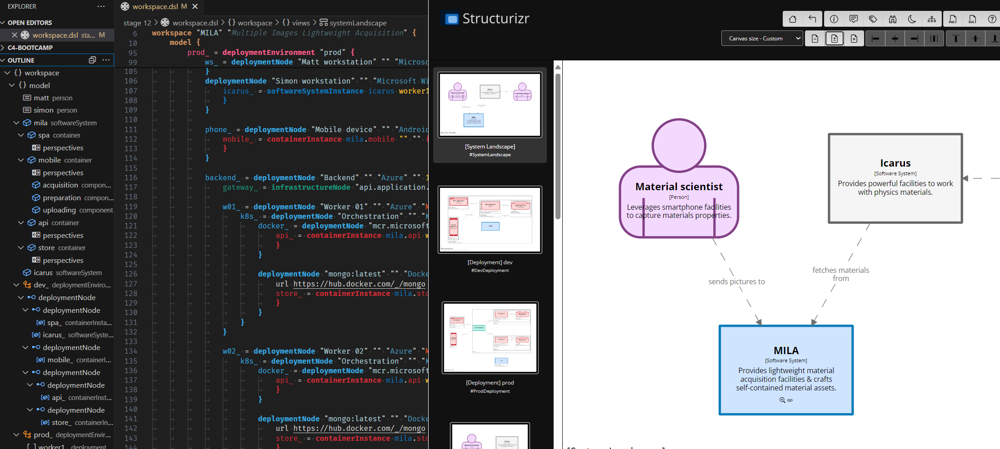 | Real-time feedback. Diagram library is shaped & refined as you type. |
|  | Every diagram comes with its own dynamic legend to underline active elements & their meaning. |
|  | Graph view can be generated on-demand if you need to shift gears. |
| 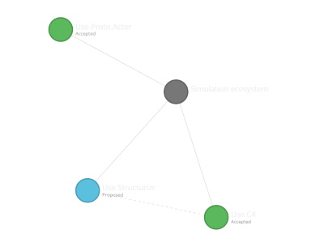 | Architecture Decision Record (see next chapter) support. |
| 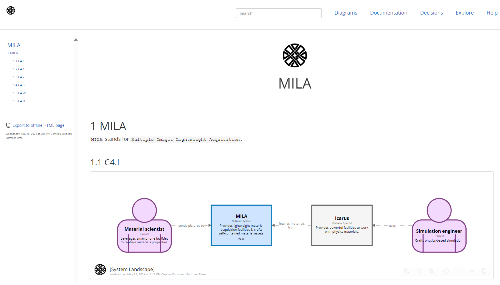 | Your markdown can embed dynamic & up to date C4 views you can interact with (not simple snapshots). |

## Drawbacks

|||
|-|-|
| Layout issue | One concern about **sketch-first** approach was Design Obsession ie grant to much time to sharp layout instead of improving the model. With **code-first** approach, we get rid of that which is most of the time fine, but there are still corner cases where auto-layout algorithm cannot do magic and you end up with a diagram which looks not optimal. Some tooling like Structurizr allows to switch to manual layout but it is not resilient to changes. Assuming those cases remain corner ones, you are safe. Otherwise, it is painful.  |
| Track to follow | Sometimes you may be tempted to enrich a diagram with some extras. If you leverage dedicated tooling, it is hard to do so as this tooling is there to constrain usage, and keep it compliant with the model and the convention. It is the price of auto-generation, there is no place for improvisation. Regarding the situation, it can be a good point or a bad one... |

## Closing

The code-first approach looks very interesting and straightforward, especially for people who are used to software development.
Your software model is but yet another piece of code, obeying the same rules and processed through the same pipeline (source control, branching, Pull Request). As for deployment as code like Dockerfile that lands among C# files or python scripts, it seems very natural at the end to proceed this way.

Dedicated tooling that morphs your model into meaningful views becomes part of the project CI/CD, and resulting materials full-blown project artifacts. It is then up to you to refine and improve the pipeline the way you are used to with source code. It may take time, but this time will probably be worth spent.

As stressed before, code-first & sketch-first approaches are the 2 ends of the spectrum. You may end up with mixing them together, or shaping an in-between one. Choice is yours to pick but remember that there is no single approach to fit them all, and best decisions are contextual ones.