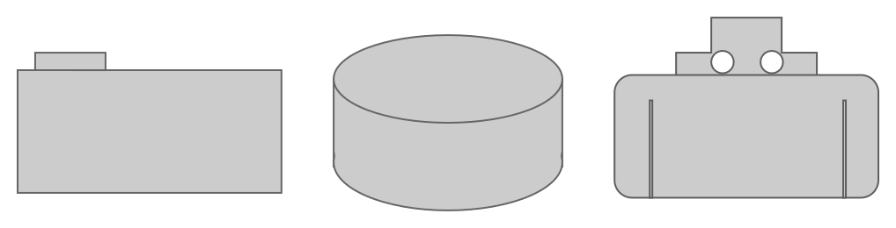

Main challenge of diagramming is to convey multi-dimensional message to heterogeneous audience. Find below some conventions, one could leverage to empower the vision he would like to convey while minimizing mental workload.

## Self-contained

There are some aspects that are not straightforward to achieve when speaking about diagramming. A famous one, common to all documentation materials, is the ability to keep content up to date. Another core one is the ability for a content to be effectively processed without support of a speaker or 100 pages manual. One diagram should clearly expose aspect(s) of an architecture in an autonomous fashion.
Let's list below some points you should pay attention at to achieve this

### Taxonomy

Properly name thing is an important part of every design. Because one could never foresee knowledge and skills of the audience, one should prevent himself to leverage acronyms and prefer meaningful word to name the things.

Remember that your diagramming has to be self-explanatory without the need of a speaker to explain every ambiguous wording that may pop-up.

For example, on one hand, some are used to use RT for Real Time. On another hand, others are used to use RT for Ray Tracing. You can easily grab how cumbersome situation will become, if one need to sketch application that mixes those 2 contexts and decide to stick to acronyms.

Take the habit to explicitly name stuff. And feel free to come with unique name. Especially when you need to couple with others that have same wording for different meaning. One more time, ubiquitous language is the way to go.

### Type | Tech | Payload

Once naming stage is over, it is time to give more insights. Important traits to consider are:

|||
|-|-|
| Type| Main category e.g. `software system`, `container`, `component`. It could be complemented by semantic color schema to speed up visual segmentation. |
| Technology | Underlying technology. This one is refined along with zooming in. Pay attention to provide information accurate to the level you are in. When dealing with container level, it is perfectly fine to have a `Single Page Application` specifying `Blazor WASM` as underlying technology stack. Most of the time, it is not useful at this stage to provide neither language information nor version of it. Same goes to enrich relationship through boxes through arrows. At a `software system` level, it could be fine to only surface technology agnostic interaction to stress the coupling. When you dive in, you can then refine information by specifying `REST` or `gRPC`. |
| Payload | As exchanges are an important part of an application, you should provide meaningful information. It is the perfect place to highlight that you use some data standard or detail payload specificity. Prefer one-way arrows if relationship is not symmetric as it is easier to reason about, especially when you describe workflows. |

### Description

Last stage is to provide meaningful description to crystallize purpose & behavior. Information must be contextually tailored as you want your audience to quickly grasp it.
Pay attention to not repeat yourself (DRY pattern applies to diagramming as well). Name & type are already defined above, so spare your words and starts your sentence with a verb. It will be straightforward for the reader to assemble all parts by prefixing description by type-name tuple.

## Visual consistency

When we talk about classification, regardless of the pattern, we relatively quickly hit the point of making a decision regarding cardinality. It is pretty much like lasagna where most of the chefs have an opinion about the ideal number of layers one should stack to cook the best dish...  
There is no universal answer - and for sure it is not 42 - and YMMV but a good guideline could be:
- Do take enough to achieve goal
- Don't take too much to avoid endless discussion about neighborhood dispute...

### Color

Color is a powerful vector to visually identify and cluster stuff. Eg, we are used to pick green for forest and blue for sea when we color a map, whatever our culture, our country, ...
​​​​​​​Same should apply for diagramming. Color should be used to support semantic. Sticking to C4 model, one could end up with the following schema.

||||
|-|-|-|
| Persona | Purple | Color of royalty.   Because end-user/customer is the only one to please at the very end |
| System | Blue | Color of ocean.   Systems are big blobs that arise, shape & evolve within a bigger ecosystem. |  
| Container | Red | Color of danger.   The place where you make important split decision in terms of unit of deployment for your application. |
| Component | Green | Color of sustainability.   Whatever the shape of the final application your components will be part of, they are there to last. |
| Out of scope | Gray | Color of shadow/half-light.   Support schema by complementing with context without noising the primary intent. |
| Code | | Because the last stage deep dives in specific implementation, there is no enforced policy there. This said, it is recommended to define local semantic as well eg hexagonal layers color mapping. | 

### Shape

Shape is another well-known and broadly used tool to discriminate stuff and ease classification. To achieve this goal, shapes should be meaningful and usage broadly acknowledged.  

### Transparency

Transparency is often used to highlight required content from optional one. It is recommended to stick to 3 visibility states as it could be difficult especially when materials are broadcasted and recorded to visually discriminate between many levels of transparency:

- Visible: component is required
- Transparent: component is optional
- Not visible: component does not bring any value for this contextual view.

### Style

Streamlining style is an important part prior to ship anything. Uncluttered eye-candy layout conveys subliminal positive information to end-user. If your diagramming looks good and easy to grasp, you install confidence. Otherwise, it may indicate that underlying implementation is so poor that you are not able to surface a clear and understandable view of it.   

Define and enforce usage of architecture style over ones that do not enforce semantic or are likely to change without adding any value like brand color palette.

Amend core rules only if you think it brings value for reader. For example, if you have 2 concurrent workflows you would like to prompt on the same diagram, pick a color for each of them.

### Layer

Layers are highly efficient tooling to cluster information. Unsurprisingly, they come in handy for diagramming as well. Remember that most of the systems you will interact with, even the simplest ones,  are inherently multi-dimensional.

Segmenting the information will allow you to contextually tailor views and provide on-demand schema. It is important to enrich your model with all meaningful metadata. This said, it is not especially helpful to end up with views that mix & match orthogonal traits. Too many stuff had nothing but noise. Shaping a single view that can accommodate every audience and context is a pipe dream. If you don't need content, don't show it. It is simple as it sounds and will prevent speaker to lose 5 minutes explaining what to focus on and what to omit every time the diagram is used to support a discussion.

Sadly, there are a lot of poorly materials living around that stick to this anti-pattern...

### Icon

Complementing a model with metadata is a good habit to tailor contextual views, but can rapidly become cumbersome and noise the whole picture. Naming length can also blur the picture.
As we previously said that using acronyms is generally a bad habit (of course, when there is no ambiguity, they are fine e.g. gRPC, REST, CRUD, ...), we need to find another way to shorten information without losing accuracy.

One well-known tool for that are icons. There are tiny, eye-candy, most of the time self-explanatory and culture neutral. And last but not least are easily processed by human being. No more reading, welcome to visual memory.

If you decide to opt for icon usage, please enforce coherency by leveraging icon library (tere are many free available) instead of random google harvest, as it will defeat the initial purpose.  

## Closing 

So, we go over some useful conventions one should enforce in his model to ensure he surfaces consolidated & compelling materials.
It is now time to see how we can apply all we have learned so far.
Next [session]({}) will process a fictional case study, explaining step by step decisions that have been made to craft the different diagrams. 