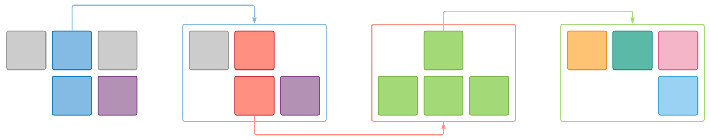
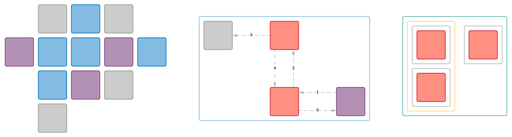
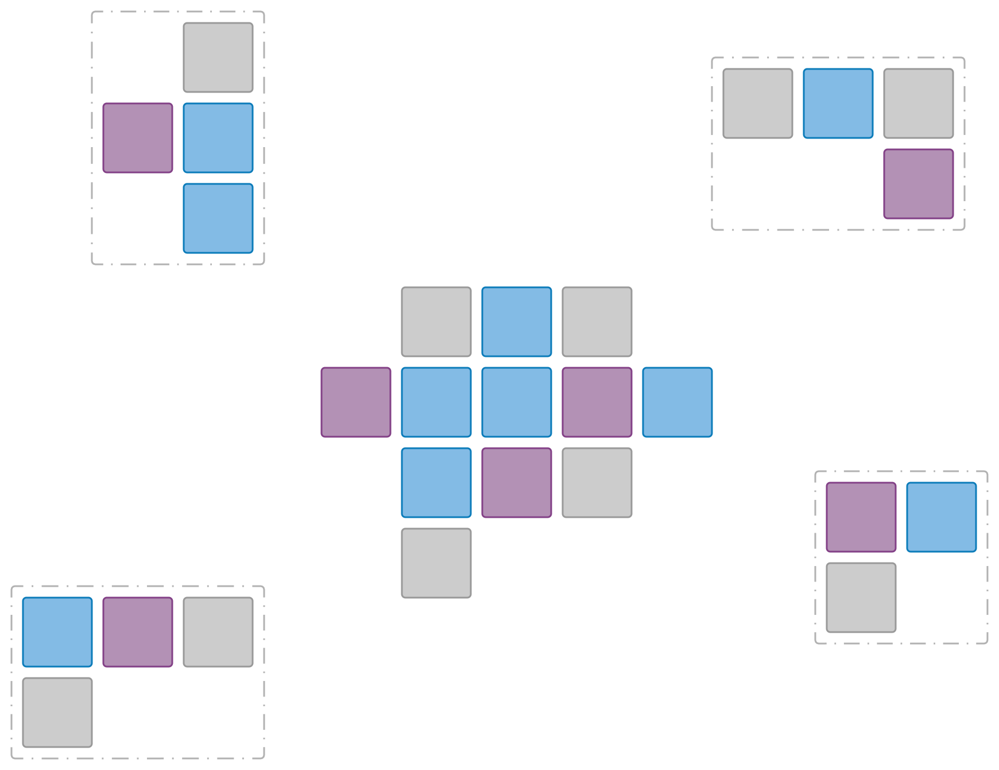
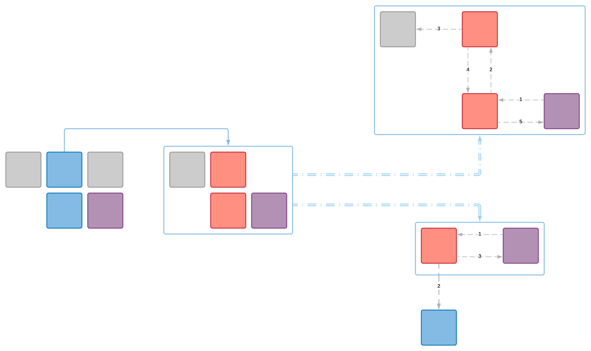
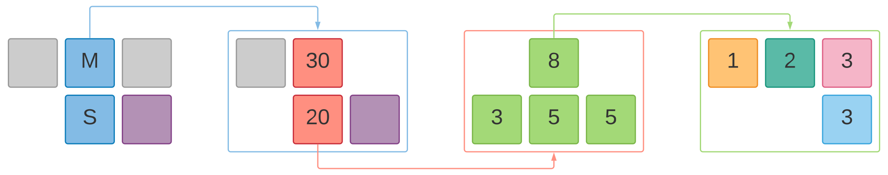
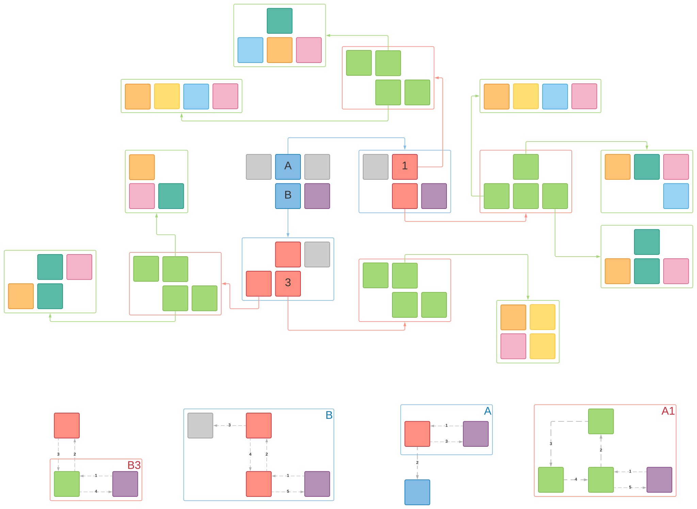
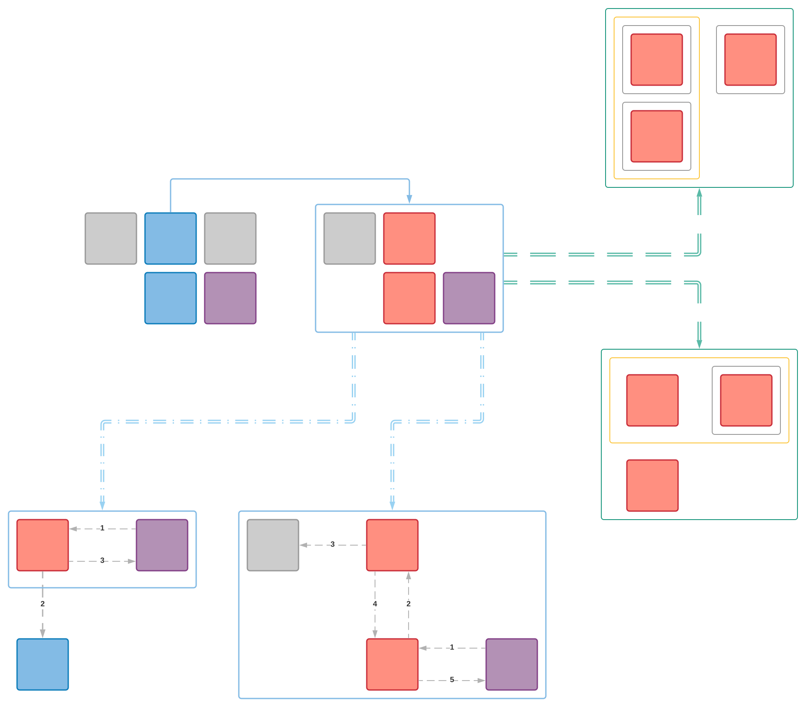
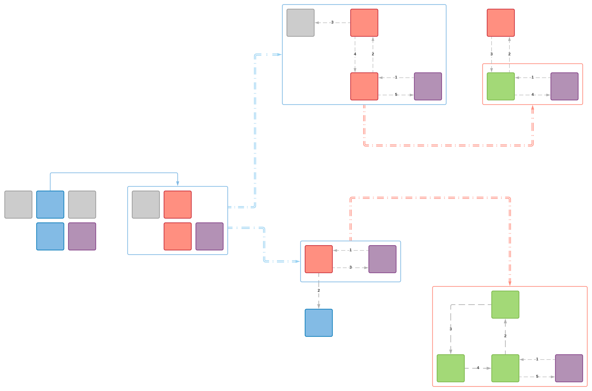
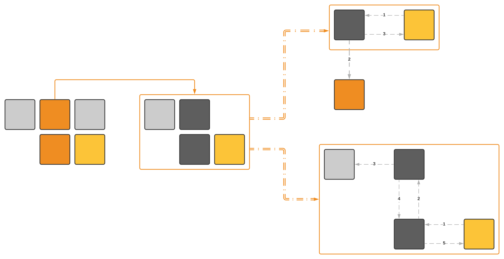

Here we are. We spent time to craft a software model, to agree upon convention and to exercise different approaches, namely sketch-first & code-first approaches. It is great. But at the end of the day comes the question: how can one leverage all of this in his daily life? As we said before, we do not invest time and energy for fun. We want our cash back. 

Remember, we can surface our underlying model in many different flavors. Leveraging the schematic and tightened tile-based view will be perfect to support the discussion today. Remember what we have in stock:

C4 main stages: Context, Container, Component & Code.

C4 complementary stages: Landscape, Workflow & Deployment.

Starting from this, see how one could effectively achieve different missions within a project.

## I need to shape a solution

I am likely to be - or acting as - a **solution architect** or a **product manager**. My goal is to quickly grasp how the ecosystem look like, how I can couple with existing products, how I can shape a new solution, morph an existing one, ... To do so, I can navigate back and forth between **C4.L** & **C4.1**, stressing out synergies & coupling, and start to sketch the future.

{}
Capture the ecosystem and shape portfolio.
{}

## I need to tailor a solution

I am likely to be - or acting as - a **product owner** or **UX designer**. I would like to express how end-users will interact with my products, and refining key workflows. I can do so using **C4.1**, **C4.2** & **C4.W**, which let me focus on both static & dynamic aspects of the usage. I can gauge what should make sense in term of form-factor, and how stuff snaps into place.   

{}
Streamline user experience and stress out key features.
{}

## I need to size a solution

I am likely to be - or acting as - a **project manager** or a **team member**. I am in charge of providing consolidated metrics to plan a development. I can incrementally refine figures following up **C4** stages split.   

{}
​​​​​​​Improving sizing while decreasing risk.
{}

One word about work quantification activity, often (poorly) referred as sizing activity. Work quantification is an incremental activity. To better materialize the stages - and their underlying implication - it is more accurate to speak about bet, estimate & sizing instead of a single sizing one. 

## I need to develop a solution

I am likely to be - or acting as - an **architect**, a **technical lead** or a **team member**. The comprehensive set of **C4** main stages are perfect to feed my backlog, support the development and introduce my demos. Main workflows are properly materialized using **C4.W** and support discussion such as performance or payload format.   

{}
Pave the path and support technical decision making.
{}

## I need to deploy a solution

I am likely to be - or acting as - a **devops**. **C4.1** and **C4.2** outline the big picture, when **C4.D** materializes how things will come in term of unit of deployment. I can leverage **C4.W** to ensure deployment will take into account workflows to optimize for data locality or smart clustering. 

{}
Tailor deployment.
{}

## I need to document a solution

I am likely to be - or acting as - a **technical writer** or a **team member**. I can focus on **C4.1** & **C4.2** to set the scene. Then, all the **C4.W** are perfect material to ensure documentation will cover all main use cases, and usher end-user through his usage.

{}
Pen compelling documentation.
{}

## I need to market a solution

I am likely to be - or acting as - a **pre-sales** or **application engineer**. I would like to leverage all the existing **C4** materials, but emphasize brand consistency. I focus on feeding my audience with straightforward view of what should be done, and how things are linked and distributed. My work can be part of broader one which dictates its own rule regarding style.

{}
Brand technical proposal.
{}

## I need to...

It is up to you, **fellow readers**, to fill the dot.  
Up to you to unleash the power of your software model to successfully craft and deliver the solution you are part of. 
Journey is far to be over. It is just the beginning. And your have been cast to play at the forefront!!

{}
Experience. Improve. Share. Enjoy.
{}