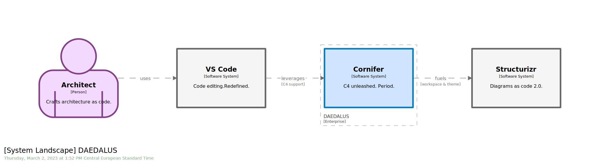

Some time ago we introduced the concept of [architecture as code, or a code-first approach]({}). We took the opportunity to leverage the [Structurizr tool suite]({}) to support the end-user journey. However, most of that journey focused on what you can gain from a single model defined as code, without spending too much time on how to author that model.

Authoring files benefits from dedicated tooling. The main objective of such tooling is to support users with editing and validation. We are all used to leveraging dedicated IDEs when crafting software. Sadly, C4 DSL does not come with first-class tooling. To fill this gap and enforce consistency along the whole workflow, a dedicated [VS Code](https://code.visualstudio.com/) extension has been developed, namely [Cornifer](https://github.com/rvr06/cornifer). While you can certainly achieve great results by other means, **VS Code + Cornifer** is the recommended stack.

Whether you are a seasoned C4 DSL author or plan to start your architecture as code journey, **Cornifer** extension will support you along the way. Coupled with Structurizr engine, it provides a top-notch architecture stack. Give it a try and start contributing to the code-first architecture community.