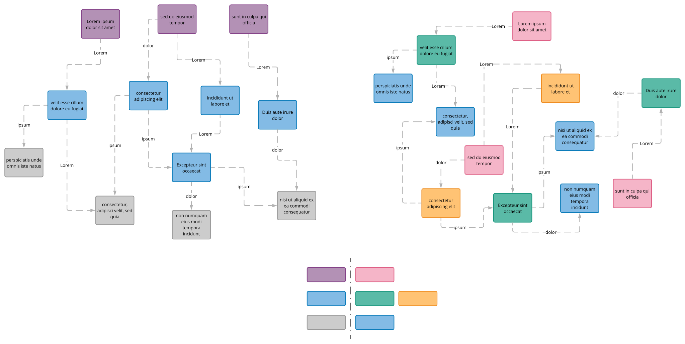
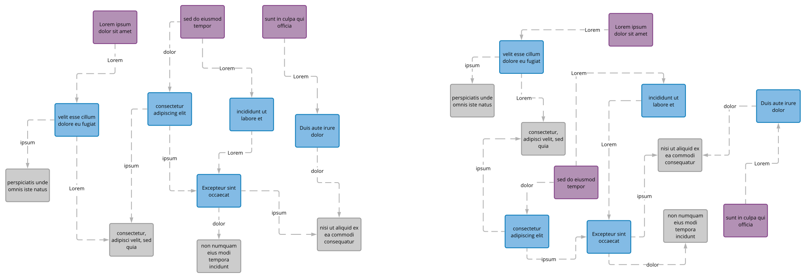
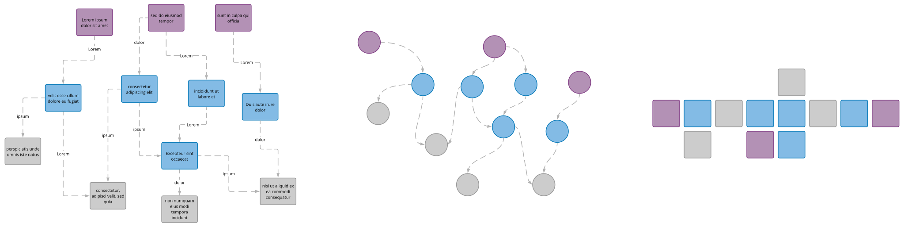
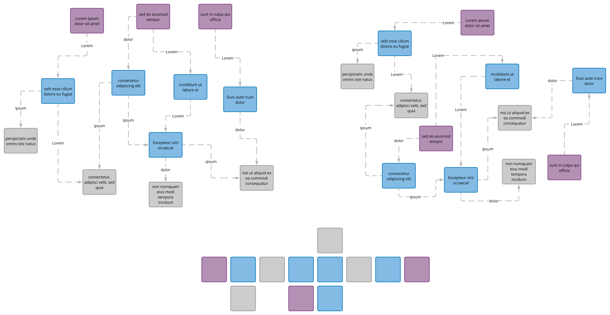
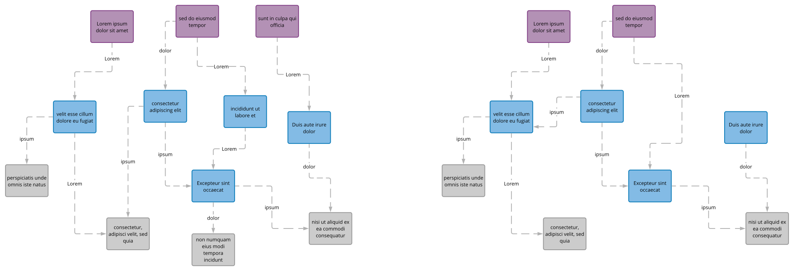
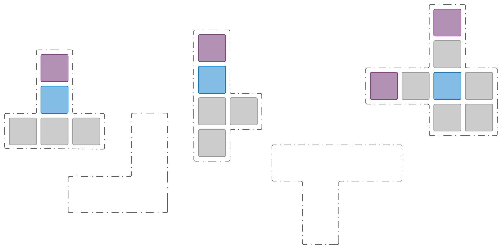
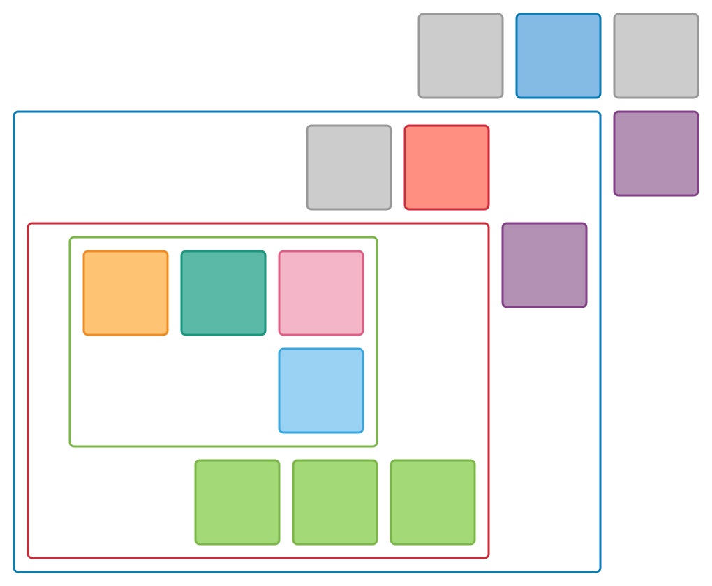
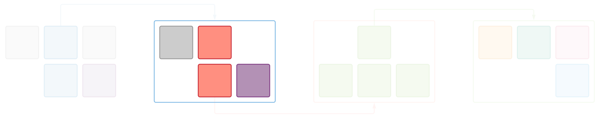

Using a hypothetical requirement as a foundation, this bootcamp guides you through incremental stages to gradually define and refine a comprehensive software model. Throughout this journey, you will explore the multiple dimensions that a software model should encompass. Each stage provides insights into both the corresponding Structurizr syntax and the underlying C4 philosophy.

This course is designed for self-directed learning, allowing you to progress at your own pace.

## The Problem with Inconsistent Diagrams

Different levels of abstraction, inconsistent legends, and mismatched notation make it difficult to:
- Compare the left and right diagrams
- Identify coupling between the left and right systems
- Make informed architectural decisions

## Consistent Architecture Enables Better Communication

When diagrams use the same model and consistent semantics:

Teams can focus on discussing content rather than deciphering different notations.

## Adaptive Audience Views

Similar to the `MVVM` pattern, you can switch between different views of the same `software model` to present the most meaningful perspective for your audience. Lossless model simplification facilitates identification and comparison (similar to hashing).

## Spot the Differences

Compare the underlying model, not the layout.

## Layout Consistency

Enforcing layout consistency makes the comparison process easier.

## Pattern Recognition Enables Reusability

Identifying common patterns is the first step toward building reusable architectural components.

## Consistency Reveals Key Insights

Consistent diagrams help answer critical questions:
- Which features are most important?
- What level of detail is appropriate?
- Why are some components treated differently than others?

## Serve Your Audience

Reduce cognitive load by making architectural diagrams as clear and accessible as possible. Every effort to help your audience understand the content quickly is worthwhile.
