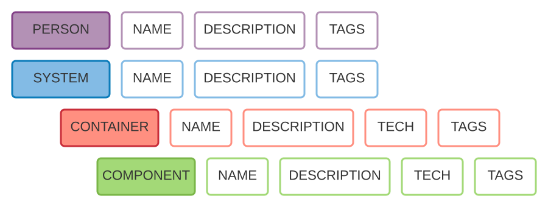
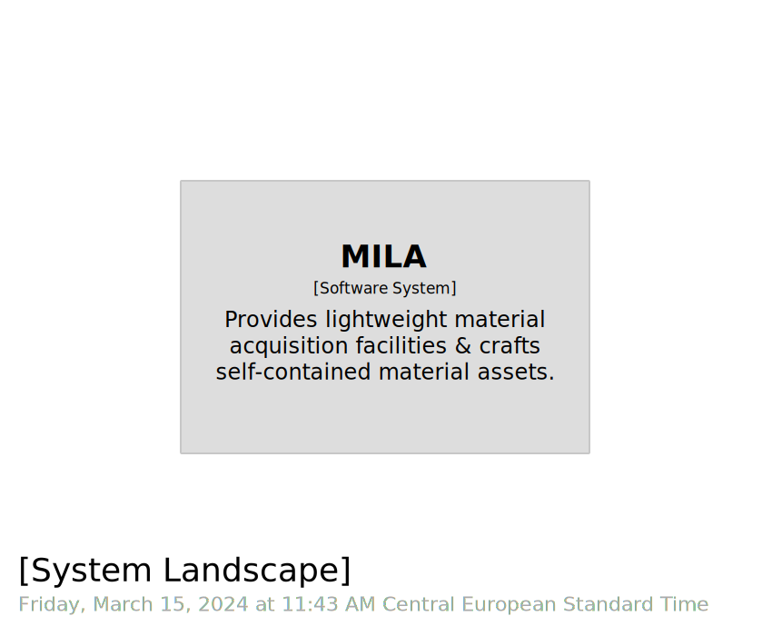
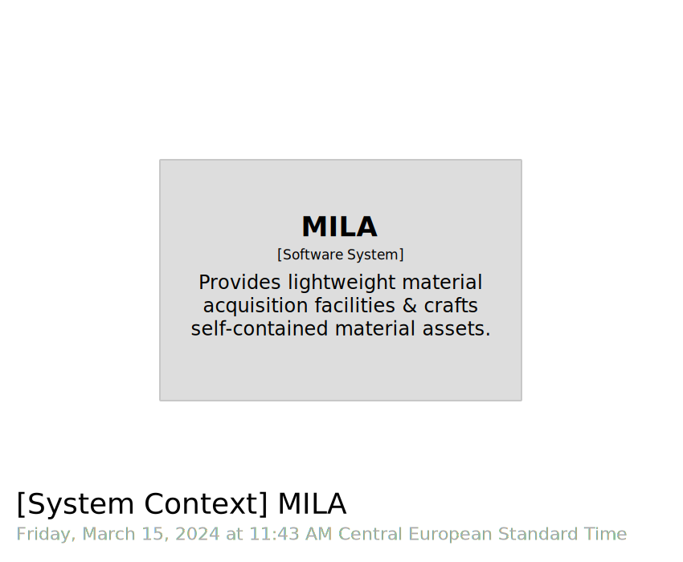

# STAGE 01

 
 
  
 
 
 

In this module, you will learn how to:
- Shape a `workspace`
- Define a `software system`
- Visualize a `software model`
- Exercise the end to end pipeline, back and forth, between `DSL` and `Structurizr`.

⌛ Estimated time to complete: 15 min

## Bootstrap

`Structurizr DSL` is a **D**omain **S**pecific **L**anguage that enables to define a `software model` - based on the `C4 model` taxonomy - as text. 

✏️ Create a new directory.  
✏️ Create a `workspace.dsl` file to describe your `software model`.

Both name and extension are fixed, and serve 2 purposes:
- `.dsl` extension serves as trigger to activate `Cornifer` extension and `C4` support.
- `Structurizr Lite` that we leverage to ingest and display our `software model` expects to find a `workspace.dsl` under the documentation root directory (e.g the mounted volume).

## Add a workspace

`Structurizr DSL` is inherently a hierarchical structure (think `JSON`), fully defined [here](https://github.com/structurizr/dsl/blob/master/docs/language-reference.md) (no need to deep dive to attend this course).



It is composed of elements, such as `person` or `container` (mapping the matching `C4 model` taxonomy), which can be enriched with metadata such as `name` or `description`.

`Workspace` is the root element of this hierarchy.  

✏️ Start typing `workspace`, and pick the matching snippet.

`Cornifer` is a styling and auto-completion tool. Therefore, it will help getting a basic code structure :

```diff
+ workspace "name" "description" {
+ 	!identifiers hierarchical
+ 	!impliedRelationships false
+ 	
+ 	model {
+ 	}
+ 	views {
+ 	}
+ }
```

`Cornifer` provides a broad palette of snippets for all main C4 DSL keywords (structure, model, view, ...). Start typing and leverage code completion to fuel a TAB-jump placeholder structure, enabling blazing fast edition.

You end up with:
- The `workspace` keyword to give project name & description
- The `model` section which will handle the model description ie the elements & relationships
- The `views` section which will expose which view we would like to surface from the model description

[Naming](https://rvr06.github.io/c4-bootcamp/docs/convention/#taxonomy) your workspace as well as providing quick [description](https://rvr06.github.io/c4-bootcamp/docs/convention/#description) should be done at the very beginning. Don't wait for it, or you'll forget about it. 

✏️ Fill in the different placeholders.

<details><summary>📙 REVEAL THE ANSWER</summary>

```diff
- workspace "name" "description" {
+ workspace "MILA" "Multiple Images Lightweight Acquisition" {
	!identifiers hierarchical
	!impliedRelationships false
	
	model {
	}
	views {
	}
}
```
</details><br> 

Exclamation mark prefix lines introduce some good default which will be explained [later](../stage%2013/README.md).

✏️ Save your file. 

You may noticed that it triggered formatting, preventing you to commit and push wrong-formatted model, that could noise team work.

## Visualize your model

✏️ Hit the Preview button. 

It will launch a new instance of dockerized `Structurizr Lite`, and browse to it, e.g. `http://localhost:8000/workspace/diagrams`.

✏️ Accept the `Structurizr Lite - End User License Agreement`.

You should be prompted with `This workspace is empty - please see Getting Started for details of how to create a workspace.`

It is fine. See it as the `Red` stage of `Red Green Refactor` cycle. 

Whatever the topic you are working at, make _pipeline setup_ a first-class citizen. This should not be obvious for everyone, but this kind of detail highlights how professional your code base is.

Let's see what we can do to fix this broken pipeline.

## Add a software system

It is time to introduce your first element, a `software system`. 

✏️ Place your cursor within the `model` block, and start typing `softwareSystem`.  

Once again, leverage snippet to materialize matching placeholder:

```c4u
identifier = softwareSystem "name" "description" "tags" {}
```

✏️ Fill in the different placeholders.

Resulting workspace should look like:

<details><summary>📙 REVEAL THE ANSWER</summary>

```diff
workspace "MILA" "Multiple Images Lightweight Acquisition" {
	!identifiers hierarchical
	!impliedRelationships false
	
	model {
+			mila = softwareSystem "MILA" "Provides [...]" "" {
+			}
	}
	views {
	}
}
```
</details><br> 

✏️ Save again, and refresh the browser page.  

Empty `views` section is smartly interpreted by `Structurizr Lite`, which will auto-generate for you all - meaningful regarding the model you describe - views. As we only populate our model with a `softwareSystem`, we are prompted with `systemLandscape` & `systemContext` ones. 

| &nbsp;&nbsp;&nbsp;&nbsp;&nbsp;&nbsp;&nbsp;&nbsp;&nbsp;&nbsp;&nbsp;&nbsp;&nbsp;&nbsp;&nbsp;&nbsp;&nbsp;&nbsp;&nbsp;&nbsp;&nbsp;&nbsp;&nbsp;&nbsp; C4.L &nbsp;&nbsp;&nbsp;&nbsp;&nbsp;&nbsp;&nbsp;&nbsp;&nbsp;&nbsp;&nbsp;&nbsp;&nbsp;&nbsp;&nbsp;&nbsp;&nbsp;&nbsp;&nbsp;&nbsp;&nbsp;&nbsp;&nbsp;&nbsp; | &nbsp;&nbsp;&nbsp;&nbsp;&nbsp;&nbsp;&nbsp;&nbsp;&nbsp;&nbsp;&nbsp;&nbsp;&nbsp;&nbsp;&nbsp;&nbsp;&nbsp;&nbsp;&nbsp;&nbsp;&nbsp;&nbsp;&nbsp;&nbsp; C4.1 &nbsp;&nbsp;&nbsp;&nbsp;&nbsp;&nbsp;&nbsp;&nbsp;&nbsp;&nbsp;&nbsp;&nbsp;&nbsp;&nbsp;&nbsp;&nbsp;&nbsp;&nbsp;&nbsp;&nbsp;&nbsp;&nbsp;&nbsp;&nbsp;|
|-|-|
|  |  |

Remind the `Red Green Refactor` cycle. This step move from `Red` to `Green`. At this stage, nothing to refactor. You clear your first stage. Kudos!

## Wrapup

📘 Completing this stage should lead to this [final workspace](./workspace.dsl).
  
We do now have a complete pipeline, from `model` to `views`, enabling fast iteration.  

It is now time to start a [new stage](../stage%2002/README.md). 

## Further reading

- [workspace](https://github.com/structurizr/dsl/blob/master/docs/language-reference.md#workspace)
- [model](https://github.com/structurizr/dsl/blob/master/docs/language-reference.md#model)
- [softwareSystem](https://github.com/structurizr/dsl/blob/master/docs/language-reference.md#softwareSystem)
- [views](https://github.com/structurizr/dsl/blob/master/docs/language-reference.md#views)
