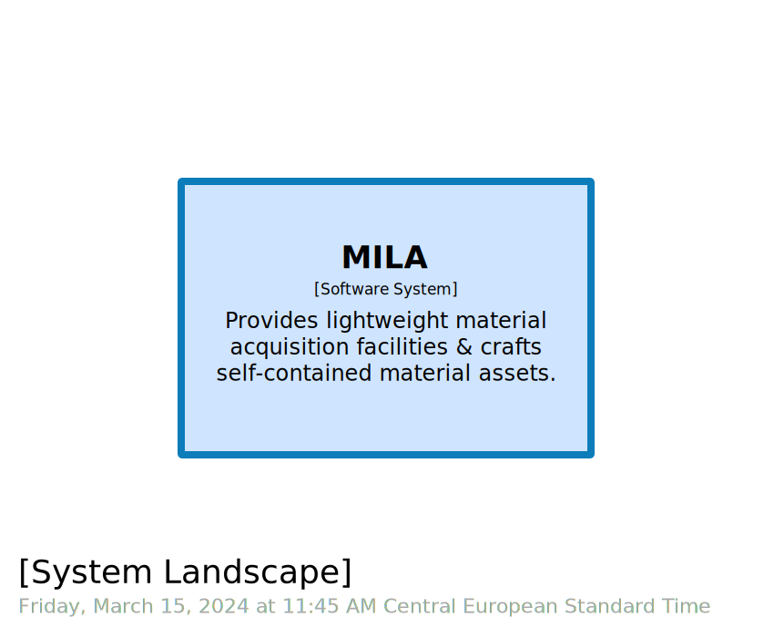
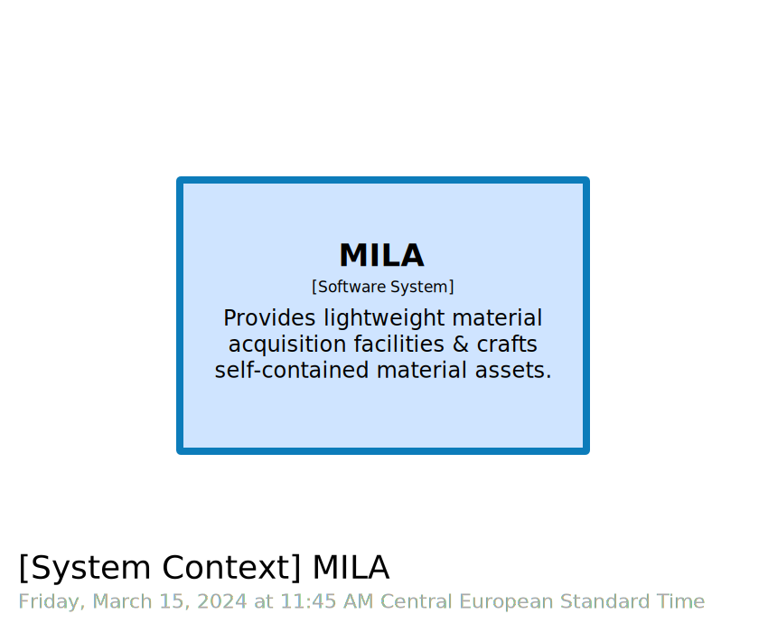

# STAGE 02

 
 
  

In this module, you will learn how to:
- Customize `system landscape` aka `C4.L` and `system context` aka `C4.1` views
- Customize visualization through `theme`

⌛ Estimated time to complete: 15 min

## Take control of views section

From last stage we inherit empty `views` section:

```diff
views {
}
```

Sometimes, you may want to have deeper control over views, eg changing default `top-bottom` layout to `left-right` one. Given our `model` current state, empty `views` section is equivalent to:

```diff
views {
+	systemLandscape "SystemLandscape" "" {
+		include *
+		autolayout
+    }
+    
+    systemContext mila "SystemContext" "" {
+		include *
+		autolayout
+    }
}
```

So let's expand this empty `views` section leveraging `Cornifer` snippets for `systemLandscape` and `systemContext`.

✏️ Within `views` section, type `systemLandscape` & fill in placeholders accordingly.  
✏️ Within `views` section, type `systemContext` & fill in placeholders accordingly.

## Theme your views

As [previously](https://rvr06.github.io/c4-bootcamp/docs/code/#theme) stressed, theming is a very powerful tool. Once crafted, it can be easily shared.
Without any theme, the default rendering of `views` is:

| &nbsp;&nbsp;&nbsp;&nbsp;&nbsp;&nbsp;&nbsp;&nbsp;&nbsp;&nbsp;&nbsp;&nbsp;&nbsp;&nbsp;&nbsp;&nbsp;&nbsp;&nbsp;&nbsp;&nbsp;&nbsp;&nbsp;&nbsp;&nbsp; C4.L &nbsp;&nbsp;&nbsp;&nbsp;&nbsp;&nbsp;&nbsp;&nbsp;&nbsp;&nbsp;&nbsp;&nbsp;&nbsp;&nbsp;&nbsp;&nbsp;&nbsp;&nbsp;&nbsp;&nbsp;&nbsp;&nbsp;&nbsp;&nbsp; | &nbsp;&nbsp;&nbsp;&nbsp;&nbsp;&nbsp;&nbsp;&nbsp;&nbsp;&nbsp;&nbsp;&nbsp;&nbsp;&nbsp;&nbsp;&nbsp;&nbsp;&nbsp;&nbsp;&nbsp;&nbsp;&nbsp;&nbsp;&nbsp; C4.1 &nbsp;&nbsp;&nbsp;&nbsp;&nbsp;&nbsp;&nbsp;&nbsp;&nbsp;&nbsp;&nbsp;&nbsp;&nbsp;&nbsp;&nbsp;&nbsp;&nbsp;&nbsp;&nbsp;&nbsp;&nbsp;&nbsp;&nbsp;&nbsp;|
|-|-|
|  |  |

✏️ Create a new `theme.dslf` file. `dslf` stands for `.dsl` fragment.  
✏️ Create a new style in your theme file by adding the following code to it:

```diff
+ 	styles {
+ 		element "Software System" {
+ 			background #CFE4FF
+ 			stroke #0C7CBA
+ 			strokeWidth 8
+ 		}
+ 	}
```

Theme engine works by pairing styles with tags. Every `Structurizr` keyword is tagged under the hood by built-in tags (`softwareSystem` keyword <-> `Software System` tag). Of course, you can enrich your model with custom tags. Exhaustive possibilities are listed [here](https://github.com/structurizr/dsl/blob/master/docs/language-reference.md#element-style) for `elements` and [there](https://github.com/structurizr/dsl/blob/master/docs/language-reference.md#relationship-style) relationships.

✏️ Reference this theme from the `views` leveraging `!include` keyword:

```diff
views {
+	!include theme.dslf
}
```

✏️ Save your workspace, and refresh your browser:

| &nbsp;&nbsp;&nbsp;&nbsp;&nbsp;&nbsp;&nbsp;&nbsp;&nbsp;&nbsp;&nbsp;&nbsp;&nbsp;&nbsp;&nbsp;&nbsp;&nbsp;&nbsp;&nbsp;&nbsp;&nbsp;&nbsp;&nbsp;&nbsp; C4.L &nbsp;&nbsp;&nbsp;&nbsp;&nbsp;&nbsp;&nbsp;&nbsp;&nbsp;&nbsp;&nbsp;&nbsp;&nbsp;&nbsp;&nbsp;&nbsp;&nbsp;&nbsp;&nbsp;&nbsp;&nbsp;&nbsp;&nbsp;&nbsp; | &nbsp;&nbsp;&nbsp;&nbsp;&nbsp;&nbsp;&nbsp;&nbsp;&nbsp;&nbsp;&nbsp;&nbsp;&nbsp;&nbsp;&nbsp;&nbsp;&nbsp;&nbsp;&nbsp;&nbsp;&nbsp;&nbsp;&nbsp;&nbsp; C4.1 &nbsp;&nbsp;&nbsp;&nbsp;&nbsp;&nbsp;&nbsp;&nbsp;&nbsp;&nbsp;&nbsp;&nbsp;&nbsp;&nbsp;&nbsp;&nbsp;&nbsp;&nbsp;&nbsp;&nbsp;&nbsp;&nbsp;&nbsp;&nbsp;|
|-|-|
|  |  |

One quick remark regarding why we decided to create a new `theme.dslf` file to define our theme, instead of directly amending `views` section of existing `workspace.dsl` file. Doing so clearly splits concerns, `workspace.dsl` defining `model` & `views` while `theme.dslf` defines `styles`. It is also easier to swap `theme` as we only have to amend the `!include` line within `workspace.dsl` accordingly.

## Wrapup

📘 Completing this stage should lead to this [final workspace](./workspace.dsl).  

We learn how to take full control of the `views` section, and how to define the rendering of our `software model` thanks to a theme.  

Let's see where theme really shines in the [next stage](../stage%2003/README.md).

## Further reading

- [systemLandscape view](https://github.com/structurizr/dsl/blob/master/docs/language-reference.md#systemLandscape-view)
- [systemContext view](https://github.com/structurizr/dsl/blob/master/docs/language-reference.md#systemContext-view)
- [theme](https://github.com/structurizr/dsl/blob/master/docs/language-reference.md#theme)