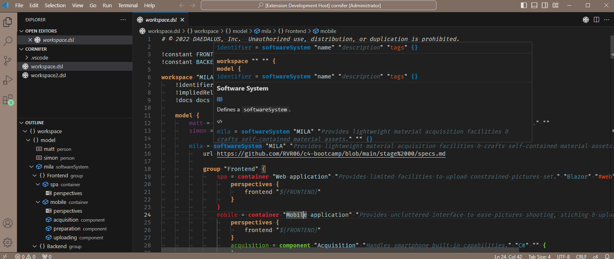
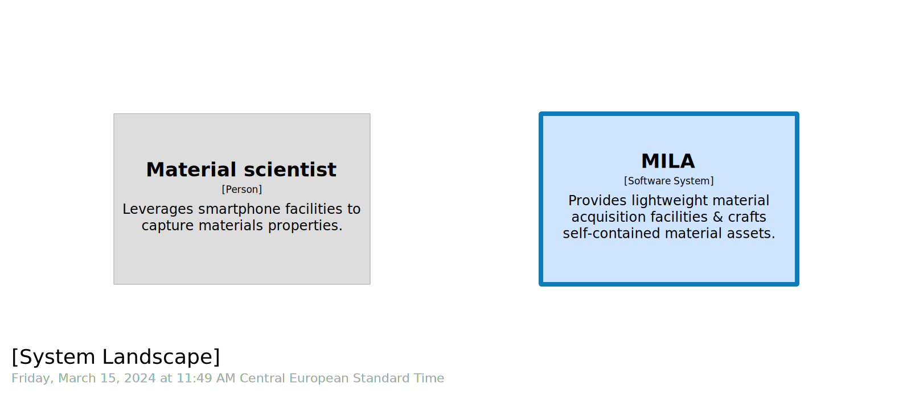
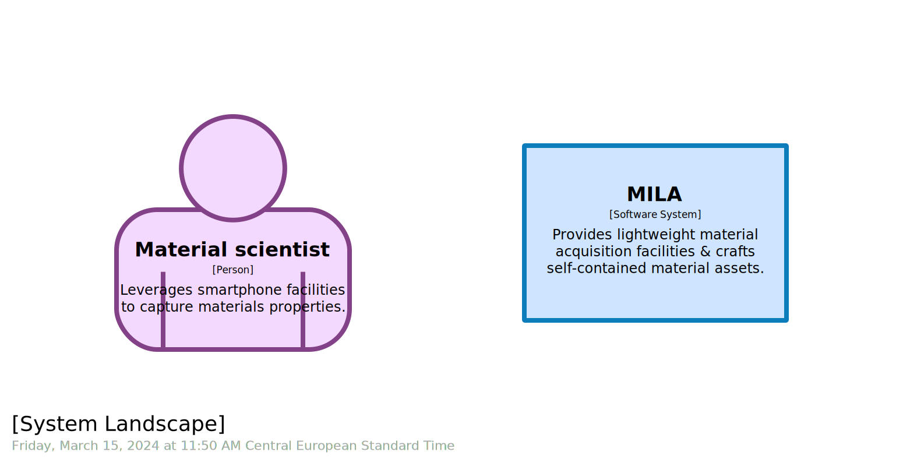
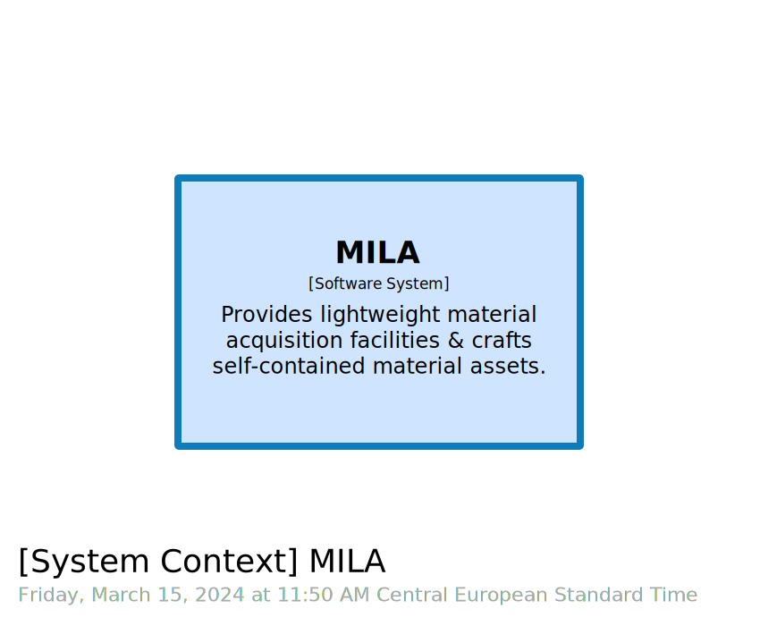
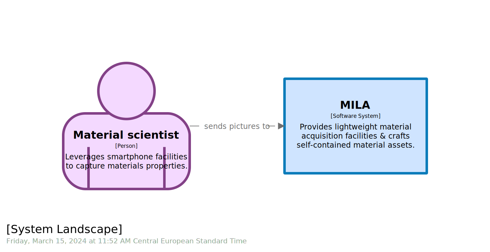
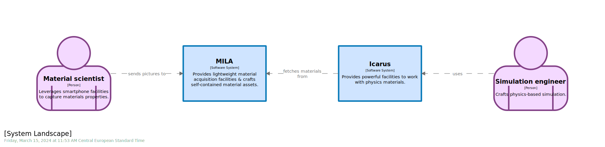
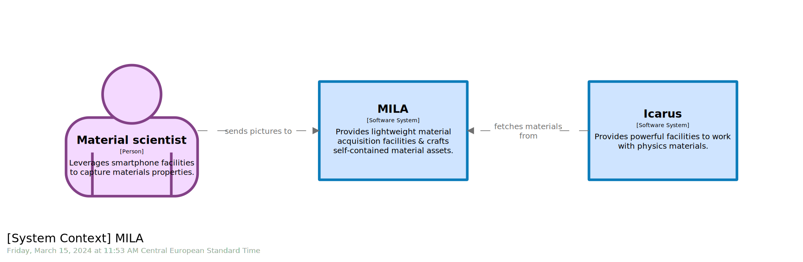
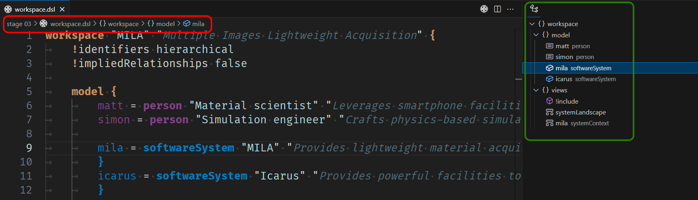

# STAGE 03

 
 

In this module, you will learn how to:
- Define a `persona`
- Add `relationship` to a `software model`

⌛ Estimated time to complete: 15 min

## Add a person

Defining `persona` is one - the most - important thing to do when starting to describe a `software model`. 

✏️ Start typing `person` within `model` section.

And let `Cornifer` fill the matching structure:  

```c4u
identifier = person "name" "description" "tags"
```

✏️ Ignore `tags` field for now, but fill in with meaningful `name` & `description`. 

<details><summary>📙 REVEAL THE ANSWER</summary>

```diff
	model {
+		matt = person "Material scientist" "Leverages [...]" ""

		mila = softwareSystem "MILA" "Provides [...]" ""  {
		}
	}
}
```
</details><br>

You may notice at this stage that your workspace is colorful. It is on purpose to decrease mental load.


As a corollary, colorless lines should trigger some warning, as it often means misspelling or improper structural position. To ease diagnostic, simply hover the `C4` keyword, and you will have access to contextual help.



✏️ Save your workspace and refresh your browser.

| &nbsp;&nbsp;&nbsp;&nbsp;&nbsp;&nbsp;&nbsp;&nbsp;&nbsp;&nbsp;&nbsp;&nbsp;&nbsp;&nbsp;&nbsp;&nbsp;&nbsp;&nbsp;&nbsp;&nbsp;&nbsp;&nbsp;&nbsp;&nbsp; C4.L &nbsp;&nbsp;&nbsp;&nbsp;&nbsp;&nbsp;&nbsp;&nbsp;&nbsp;&nbsp;&nbsp;&nbsp;&nbsp;&nbsp;&nbsp;&nbsp;&nbsp;&nbsp;&nbsp;&nbsp;&nbsp;&nbsp;&nbsp;&nbsp; | &nbsp;&nbsp;&nbsp;&nbsp;&nbsp;&nbsp;&nbsp;&nbsp;&nbsp;&nbsp;&nbsp;&nbsp;&nbsp;&nbsp;&nbsp;&nbsp;&nbsp;&nbsp;&nbsp;&nbsp;&nbsp;&nbsp;&nbsp;&nbsp; C4.1 &nbsp;&nbsp;&nbsp;&nbsp;&nbsp;&nbsp;&nbsp;&nbsp;&nbsp;&nbsp;&nbsp;&nbsp;&nbsp;&nbsp;&nbsp;&nbsp;&nbsp;&nbsp;&nbsp;&nbsp;&nbsp;&nbsp;&nbsp;&nbsp;|
|-|-|
|  |  |

As expected, `person` has been added to the model. However, it is not obvious that `Matt` is a `person`. It is rendered as a plain old box, and you need to focus on the second line - the one embraced with square brackets `[]` - to notice that element type is provided to you, namely `[Software System]` and `[Person]`. So, even if information is prompted, this view requires some effort from the reader. We can live this way, but one could for sure improve the user experience. One may argue this extra workload is manageable. But remember 2 things here:
- Audience is by essence heterogenous. What is manageable for you does not mean it is manageable for all.
- Workload, even the smallest one, that can be spared, has to be. This way, you can allocate more elsewhere.

What about customizing our theme to materialize this difference? Have a look at which traits one could customize [here](https://github.com/structurizr/dsl/blob/master/docs/language-reference.md#element-style).

✏️ Amend `theme.dslf` to discriminate `person` & `software system`.

<details><summary>📙 REVEAL THE ANSWER</summary>

```diff
views {
	styles {
+		element "Person" {
+			background #F4D9FF
+			stroke #834187
+			strokeWidth 8
+			shape Person
+		}
	}
}
```
</details><br>

✏️ Save workspace, and refresh the browser.

Let's have a look at how we improve - or at least we hope -  the UX:

| &nbsp;&nbsp;&nbsp;&nbsp;&nbsp;&nbsp;&nbsp;&nbsp;&nbsp;&nbsp;&nbsp;&nbsp;&nbsp;&nbsp;&nbsp;&nbsp;&nbsp;&nbsp;&nbsp;&nbsp;&nbsp;&nbsp;&nbsp;&nbsp; C4.L &nbsp;&nbsp;&nbsp;&nbsp;&nbsp;&nbsp;&nbsp;&nbsp;&nbsp;&nbsp;&nbsp;&nbsp;&nbsp;&nbsp;&nbsp;&nbsp;&nbsp;&nbsp;&nbsp;&nbsp;&nbsp;&nbsp;&nbsp;&nbsp; | &nbsp;&nbsp;&nbsp;&nbsp;&nbsp;&nbsp;&nbsp;&nbsp;&nbsp;&nbsp;&nbsp;&nbsp;&nbsp;&nbsp;&nbsp;&nbsp;&nbsp;&nbsp;&nbsp;&nbsp;&nbsp;&nbsp;&nbsp;&nbsp; C4.1 &nbsp;&nbsp;&nbsp;&nbsp;&nbsp;&nbsp;&nbsp;&nbsp;&nbsp;&nbsp;&nbsp;&nbsp;&nbsp;&nbsp;&nbsp;&nbsp;&nbsp;&nbsp;&nbsp;&nbsp;&nbsp;&nbsp;&nbsp;&nbsp;|
|-|-|
|  |  |

One can easily - leveraging both `color` & `shape` - visually clustered information, and UX is definitively better. We can allocate spared brain resources to other activities. Mission completed &check;

## Add a relationship

The mainspring of `person` is to interact with your ecosystem. It is time to materialize this relationship.

✏️ Type `relationship` at the end of the `model` section. 

Matching `Cornifer` snippet materializes:

```c4u
identifier -> identifier "description" "technology" "tags"
```

✏️ Add a `relationship` qualifying interaction between `Matt` & `MILA`.

<details><summary>📙 REVEAL THE ANSWER</summary>

```diff
	model {
		matt = person "Material scientist" "Leverages [...]" ""
		
		mila = softwareSystem "MILA" "Provides [...]" ""  {
		}
		
+		matt -> mila "sends pictures to" "" ""
	}
}
```
</details><br>

You may notice that relationship parts, before and after the `->`, are also semantically colored to decrease mental load.


✏️ Save workspace, and refresh the browser.  

Everything seems to react as expected:

| &nbsp;&nbsp;&nbsp;&nbsp;&nbsp;&nbsp;&nbsp;&nbsp;&nbsp;&nbsp;&nbsp;&nbsp;&nbsp;&nbsp;&nbsp;&nbsp;&nbsp;&nbsp;&nbsp;&nbsp;&nbsp;&nbsp;&nbsp;&nbsp; C4.L &nbsp;&nbsp;&nbsp;&nbsp;&nbsp;&nbsp;&nbsp;&nbsp;&nbsp;&nbsp;&nbsp;&nbsp;&nbsp;&nbsp;&nbsp;&nbsp;&nbsp;&nbsp;&nbsp;&nbsp;&nbsp;&nbsp;&nbsp;&nbsp; | &nbsp;&nbsp;&nbsp;&nbsp;&nbsp;&nbsp;&nbsp;&nbsp;&nbsp;&nbsp;&nbsp;&nbsp;&nbsp;&nbsp;&nbsp;&nbsp;&nbsp;&nbsp;&nbsp;&nbsp;&nbsp;&nbsp;&nbsp;&nbsp; C4.1 &nbsp;&nbsp;&nbsp;&nbsp;&nbsp;&nbsp;&nbsp;&nbsp;&nbsp;&nbsp;&nbsp;&nbsp;&nbsp;&nbsp;&nbsp;&nbsp;&nbsp;&nbsp;&nbsp;&nbsp;&nbsp;&nbsp;&nbsp;&nbsp;|
|-|-|
|  |  |

## Complete the big picture

✏️ Complete big picture according to [requirements](../stage%2000/specs.md).

<details><summary>📙 REVEAL THE ANSWER</summary>

```diff
	model {
		matt = person "Material scientist" "Leverages [...]" ""
+		simon = person "Simulation engineer" "Crafts [...]" ""		
		
		mila = softwareSystem "MILA" "Provides [...]" ""  {
		}
+		icarus = softwareSystem "Icarus" "Provides [...]" "" {
+		}
		
		matt -> mila "sends pictures to" "" ""
+		simon -> icarus "uses" "" ""
+		icarus -> mila "fetches materials from" "" ""
	}
}
```
</details><br>

As for `element` like `person` or `software system`, `relationships` are [themable](https://github.com/structurizr/dsl/blob/master/docs/language-reference.md#relationship-style).

```diff
views {
	styles {
+		relationship "Relationship" {
+			routing Direct
+		}
	}
}
```

✏️ Save workspace, and refresh the browser.  

And see how, step by step, we strengthen the outcome.	




Step by step, while enriching the `software model`, we thicken the `workspace.dsl`. One may have notice that `Cornifer` provides both `Outline` (green) & `Breadcrumb` (red) helpers to quickly navigate within the `workspace`: 



For now, it may seem overkill, but as times goes and `workspace` complicates, it will become a powerful tool to efficiently explore the `software model`. 

## Analysis

`System landscape` & `system context` are the highest zoom levels, showing where your system lives. One should easily grasp interactions with both `person` & other `sofwtware system` if any:
- `MILA` is the `software system` we are focusing on. We provide a high level description enabling a layman to quickly jump in.
- 2 identified `Persona`:
	* As `Matt`'s title - material scientist - highlights, we are talking about a seasoned user. We capture in the description how he will interact with our application.
	* `Simon` profile is different, he does not interact with `MILA` directly, that while he only appears with `system landscape`.  
- We materialize coupling with external `software system`, here `Icarus`. You may notice that we do not provide neither generic description nor exhaustive listing of facilities. We pick those which are contextually meaningful. 
- We use one-way technology agnostic arrows for `relationships` with straightforward intent. Prefer plain old English sentence starting with a verb. One can then fluently read the diagram, prefixing & suffixing the sentence accordingly e.g. `Material scientist` sends pictures to `MILA` or `Icarus` fetches materials from `MILA`. At this stage, it seems useless to give more insights especially regarding technology stack.

## Wrapup

📘 Completing this stage should lead to this [final workspace](./workspace.dsl).  

As we enrich model, it is now easier to grasp how `system landscape` & `system context` complement each others, especially how landscape awareness strengthens decision making. Knowing that `Simon` plays a role can be non meaningful for developer who will develop `MILA` internals, but makes a lot of sense for stakeholders. Remember, heterogenous audience shares common interest but appreciates tailored insights. Leveraging traits such as `color` and `shape` to convey semantic enforces focus while enriching context.  

Let's see how one could go a step further in the [next stage](../stage%2004/README.md)

## Further reading

- [person](https://github.com/structurizr/dsl/blob/master/docs/language-reference.md#person)
- [relationship](https://github.com/structurizr/dsl/blob/master/docs/language-reference.md#relationship)