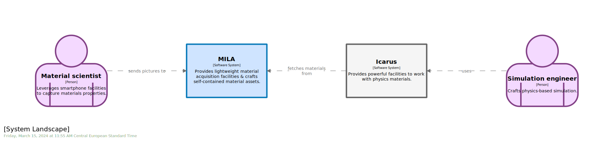

# STAGE 04

  
 
  
  

In this module, you will learn how to:
- Document a `software model` with `comment`
- Enrich a `software model` with `tag` to convey semantic
- Customize visualization thanks to `theme`
- Enrich a `software model` with `url` to link with external resources

⌛ Estimated time to complete: 15 min

## Comment

As part of the code base, `software model` obeys same rule, namely _all can be enforced by the underlying language - here DSL - has to be_. If we need more, don't be afraid to fallback to plain old comment `#`. As workspace now lands in our repository, one obvious one is to add `copyright` information.

✏️ Add `copyright` information.

<details><summary>📙 REVEAL THE ANSWER</summary>

```diff
+# © 2022 DAEDALUS, Inc. Unauthorized use, distribution, or duplication is prohibited.
workspace "MILA" "Multiple Images Lightweight Acquisition" {
}
```
</details><br>

## Tag & theme

One may have noticed there is some asymetry on the `software model` we are shaping that could be better materiliazed, namely the fact that it involves 2 different `software systems` that does not play the same role: `MILA` is the main one, `Icarus` is a satellite one. It could be obvious for folks regularly involved in the project, but remember that audience is heterogenous and making stuff explicit does not harm. Let's see how one could improve this by introducing a new dimension to our `software model` via `tag`.

✏️ Fill the `tag` field of `Icarus` `software system`.

In case you previously cleared every placeholder, and are now lost on picking back the right one, simply hover over the `C4` `softwareSystem` keyword, and `Cornifer` will provide all information you are looking for. `Tag` can be whatever you want, e.g. `123`, `a b c` & `#aaaBbbCccc` are all valid. Even if no convention is enforced, you might find it helpful to prefix all your tags with `#` and use single word tags, like we are used to for other applications such as `twitter`.

<details><summary>📙 REVEAL THE ANSWER</summary>

```diff
model {
	mila = softwareSystem "MILA" "Provides [...]" "" {
	}
-	icarus = softwareSystem "Icarus" "Provides [...]" "" {
+	icarus = softwareSystem "Icarus" "Provides [...]" "#external" {
	}
}
}
```
</details><br>

This `tag` becomes now _actionable_ from the `theme` side to fine-tune downstream rendering.

✏️ Amend `theme.dslf` to handle the `tag` you introduce above.  f you were not able to complete the previous exercise for whatever reason, use the `#external` tag for now.

<details><summary>📙 REVEAL THE ANSWER</summary>

```diff
views {
	styles {
		element "Software System" {
			background #CFE4FF
			stroke #0C7CBA
			strokeWidth 8
		}
+		element "#external" {
+			background #F5F5F5
+			stroke #666666
+			strokeWidth 8
+		}
    }
}
```
</details><br>

At this point we name our `tag` `#external`, as it will be used to tag elements we consider as external regarding the `software model` we are crafting, `MILA`. This has nothing to do with the fact an element belongs - or not - to the same `group`. Imagine you are looking on a geographic map for insights regarding bordering regions. Regions that belong to the same country and adjacent countries are considered _external_. They are there to give spatial context, but are usually grayed out when region insights we are focusing on is colored. 


Consider `Grand Est` French region as our current `software model`. Both `Hauts-de-France` French region and external countries like `Schweiz` are considered _external_, the same way. They provide context but should not steal the focus.

✏️ Save your workspace, and refresh the browser page.  

As a software system, `Icarus` will inherit from matching built-in `Software System` style. But as we provide an extra `#external` tag, style will be amended accordingly and some aspects superseded.   

| &nbsp;&nbsp;&nbsp;&nbsp;&nbsp;&nbsp;&nbsp;&nbsp;&nbsp;&nbsp;&nbsp;&nbsp;&nbsp;&nbsp;&nbsp;&nbsp;&nbsp;&nbsp;&nbsp;&nbsp;&nbsp;&nbsp;&nbsp;&nbsp; C4.L &nbsp;&nbsp;&nbsp;&nbsp;&nbsp;&nbsp;&nbsp;&nbsp;&nbsp;&nbsp;&nbsp;&nbsp;&nbsp;&nbsp;&nbsp;&nbsp;&nbsp;&nbsp;&nbsp;&nbsp;&nbsp;&nbsp;&nbsp;&nbsp; | &nbsp;&nbsp;&nbsp;&nbsp;&nbsp;&nbsp;&nbsp;&nbsp;&nbsp;&nbsp;&nbsp;&nbsp;&nbsp;&nbsp;&nbsp;&nbsp;&nbsp;&nbsp;&nbsp;&nbsp;&nbsp;&nbsp;&nbsp;&nbsp; C4.1 &nbsp;&nbsp;&nbsp;&nbsp;&nbsp;&nbsp;&nbsp;&nbsp;&nbsp;&nbsp;&nbsp;&nbsp;&nbsp;&nbsp;&nbsp;&nbsp;&nbsp;&nbsp;&nbsp;&nbsp;&nbsp;&nbsp;&nbsp;&nbsp;|
|-|-|
|  |  |

Regarding the tag precedence algorithm, last one wins:

```c4u
# Built-in 'Software System' style is applied
cornifer = softwareSystem "Cornifer" "" "" {}

# Apply built-in 'Software System' style, then '#tag1' one.
# If some traits are shared by styles, '#tag1' ones supersede those from built-in 'Software System'
cornifer = softwareSystem "Cornifer" "" "#tag1" {}

# Apply built-in 'Software System' style, then '#tag1' one, then '#tag2' one.
# If some traits are shared by styles, '#tag1' ones supersede those from built-in 'Software System', 
# and '#tag2' ones supersede those from both built-in 'Software System' & '#tag1'
cornifer = softwareSystem "Cornifer" "" "#tag1,#tag2" {}
```

We materialize coupling with external `software system`, here `Icarus`, leveraging out of scope (gray color) semantic. The intent is to provide context, not to lose focus. We are there to talk about `MILA`.

## Url

Hyperlinks are great to navigate complex topic, and `software model` makes no exception:
- Your audience may not be familiar with all content
- Some taxonomy may be ambiguous
- You would like to smooth or speed up entry points by providing contextual & meaningful links instead of generic ones
- ...

Whatever the reason, feel free to leverage `url` keyword to enrich your model.

✏️ Add url to `MILA` `software system`.

<details><summary>📙 REVEAL THE ANSWER</summary>

```diff
model {
	matt = person "Material scientist" "Leverages [...]" ""
	simon = person "Simulation engineer" "Crafts [...]" ""
	
	mila = softwareSystem "MILA" "Provides [...]" "" {
		url https://github.com/rvr06/c4-bootcamp/blob/main/stage%2000/specs.md
	}
	icarus = softwareSystem "Icarus" "Provides [...]" "#external" {
	}
}
```
</details><br>

Doing so will enrich matching element within views with an extra `#` symbol. Double clicking it will trigger the navigation. You can provide more than one link (like project website & project repository), but only the first one will be used for navigation. 

Regarding the url precedence algorithm, last one wins:
```c4u
cornifer = softwareSystem "Cornifer" "" "" {
	url https://github.com/rvr06/c4-bootcamp/blob/main/stage%2000/specs.md
	url https://github.com/rvr06/c4-bootcamp/
}
```
Whatever the one you pick, enriching your model is important as it allows `.dsl` reader to quickly access meaninfgul information, making your `software model` acting as an information hub.

## Wrapup

📘 Completing this stage should lead to this [final workspace](./workspace.dsl).  

You learn how to enrich your `software model` with metadata that can be consumed downstream by `Structurizr` engine to improve outcomes.  

What about digging in a bit deeper in the [next stage](../stage%2005/README.md)?

## Further reading

- [comment](https://github.com/structurizr/dsl/blob/master/docs/language-reference.md#comments) 
- [tag](https://github.com/structurizr/dsl/blob/master/docs/language-reference.md#tags)
- [theme](https://github.com/structurizr/dsl/blob/master/docs/language-reference.md#theme)
- [url](https://github.com/structurizr/dsl/blob/master/docs/language-reference.md#url)
