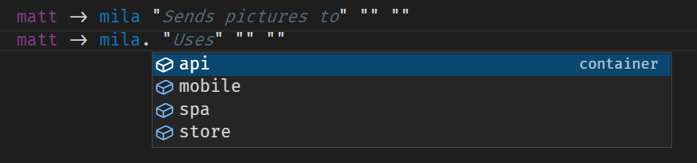
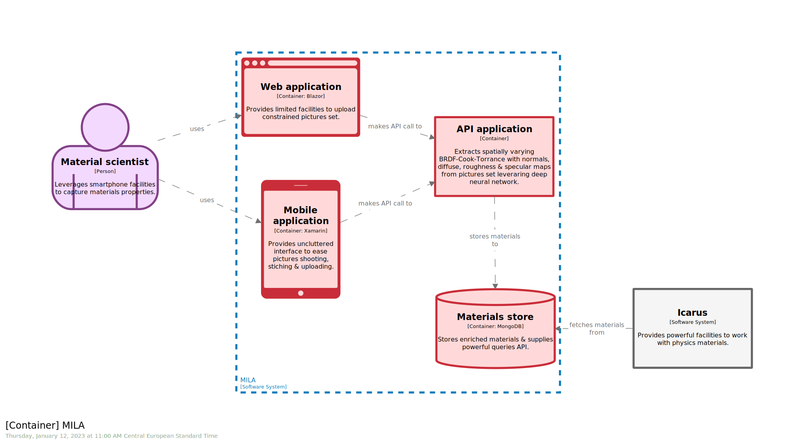

# STAGE 05

 
  


In this module, you will learn how to:
- Define a `container`
- Enrich a `software model` with `technology`
- Visualize a new level, the `container` one, aka `C4.2`

⌛ Estimated time to complete: 15 min

## Enrich model

✏️ Locate `MILA` `software system`, and start typing `container` within.

As expected, `Cornifer` fuels accordingly:

```c4u
identifier = container "name" "description" "technology" "tags" {}
```

`Name`, `description` & `tags` are well-known players but a brand-new dimension, the `technology` one, appears. Take the opportunity to leverage this dimension to enrich your model, providing dedicated insights such as `Blazor` or `MongoDB` to qualify underlying technology stack.

✏️ Fill in the different placeholders.

<details><summary>📙 REVEAL THE ANSWER</summary>

```diff
mila = softwareSystem "MILA" "Provides [...]" "" {
+    spa = container "Web application" "Provides [...]" "Blazor" "#web" {
+    }
+    mobile = container "Mobile application" "Provides [...]" "Xamarin" "#mobile" {
+    }
+    api = container "API application" "Extracts [...]" "" "" {
+    }
+    store = container "Materials store" "Stores [...]" "MongoDB" "#db" {
+    }
}
```
</details><br> 

You may notice that we do not provide `technology` for the `api` container. It is fine. Sometime you do not have all the information. Sometime, choice has not been made yet. Remember, modern architecture is not an _all-in upfront_ one. It will be refined along the way. Good news, your `software model` lands in your code base, and thus can benefit same facilities, such as incremental update, facilitated diff, ... Your `software model` is alive. It evolves. It morphes. And, it is an healhty behavior.

✏️ Do not forget to update the relationships section.

`Cornifer` comes in with built-in `Intellisense` to speed up `DSL` edition:



<details><summary>📙 REVEAL THE ANSWER</summary>

```diff
model {
	matt -> mila "sends pictures to" "" ""
+	matt -> mila.spa "uses" "" ""
+	matt -> mila.mobile "uses" "" ""
	
	simon -> icarus "uses" "" ""
	
	icarus -> mila "fetches materials from" "" ""
+	icarus -> mila.store "fetches materials from" "" ""
	
+	mila.spa -> mila.api "makes API call to" "" ""
+	mila.mobile -> mila.api "makes API call to" "" ""
+	mila.api -> mila.store "stores materials to" "" ""
}
```
</details><br> 

## Update views

✏️ Add the view we are interested in, leveraging `Cornifer`, by typing `container` within `views` section:

<details><summary>📙 REVEAL THE ANSWER</summary>

```diff
views {
+	# C4.2
+	container mila "Container" "" {
+		include *
+		autoLayout
+	}
}
```
</details><br> 

✏️ To avoid ending up with default, one can amend `theming` to take into account new players:

<details><summary>📙 REVEAL THE ANSWER</summary>

```diff
views {
	styles {
+		element "Container" {
+			background #FFD9D9
+			stroke #C92D39
+			strokeWidth 8
+		}
+		
+		element "#web" {
+			shape WebBrowser
+		}
+		element "#db" {
+			shape Cylinder
+		}
+		element "#mobile" {
+			shape MobileDevicePortrait
+		}
	}
}
```
</details><br> 

✏️ Save your workspace, and refresh the browser.



Notice how `tags` once again allow us to slightly change the display, speeding up the visual inspection e.g. `smartphone` & `browser` shapes.

## Analysis

Coming from `System Context` diagram, imagine you deep dived within the `MILA` blue box. A system is composed by container(s) - think executable granularity such as desktop app, web app, backend, database...
- A dashed bounding box stresses parent `software system` boundary.
- Involved `person` & external `software system` are still presents and help us to refine which internal parts are coupled. One could notice that `API` application is totally agnostic of `MILA` system I/O.
- Two entry points with asymmetric facilities & different form factors to interact with our application from an end-user perspective...
- … both leveraging - through gRPC - a back-end service for post-processing...
- … which in turn persists enriched data into some storage area.
- Starting from container cardinality & heterogeneity, we are able to sketch how one could deploy the application, organize both source code control & backlog, and tailor team(s) accordingly. 

## Wrapup

📘 Completing this stage should lead to this [final workspace](./workspace.dsl).  

We learn how to tackle the `container` level, starting refining technical proposal by introducing `technology`. As usual, `theming` is there to enhance `views`, and make downstream reading smarter.  

Let's see how to replicate this approach in [next stage](../stage%2006/README.md).

## Further reading

- [container](https://github.com/structurizr/dsl/blob/master/docs/language-reference.md#container)
- [technology](https://github.com/structurizr/dsl/blob/master/docs/language-reference.md#technology)
- [container view](https://github.com/structurizr/dsl/blob/master/docs/language-reference.md#container-view)