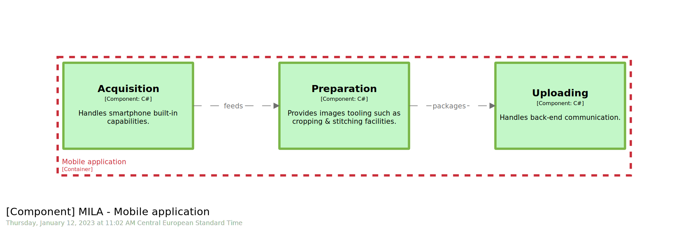

# STAGE 06

  


In this module, you will learn how to:
- Define a `component`
- Visualize a new level, the `component` one, aka `C4.3`

⌛ Estimated time to complete: 15 min

## Add a component

✏️ Locate `mobile` `container`, and start typing `component` within.  

As expected, `Cornifer` reacts accordingly:

```c4u
identifier = component "name" "description" "technology" "tags" {}
```

As for `container`, `component` can be enriched with `name`, `description`, `technology` & `tags`:

✏️ Fill in the different placeholders.

<details><summary>📙 REVEAL THE ANSWER</summary>

```diff
mobile = container "Mobile application" "Provides [...]" "Xamarin" "#mobile" {
+    acquisition = component "Acquisition" "Handles [...]" "C#" "" {
+    }
+    preparation = component "Preparation" "Provides [...]" "C#" "" {
+    }
+    uploading = component "Uploading" "Handles [...]" "C#" "" {
+    }
}
```
</details><br> 

✏️ Enrich `relationships` section.

<details><summary>📙 REVEAL THE ANSWER</summary>

```diff
model {
+    mila.mobile.acquisition -> mila.mobile.preparation "peeds" "" ""
+    mila.mobile.preparation -> mila.mobile.uploading "Packages" "" ""
}
```
</details><br> 

## Visualize components

✏️ Add the view we are interested in, leveraging `Cornifer`, by typing `component` within `views` section, using `left-right` layout (`autolayout lr`).

<details><summary>📙 REVEAL THE ANSWER</summary>

```diff
views {
+    # C4.3
+    component mila.mobile "mila_mobile-4_3" "" {
+        include *
+        autolayout lr
+    }
}
```
</details><br> 

✏️ Amend `theming` right now to enhance downstream `views`.

<details><summary>📙 REVEAL THE ANSWER</summary>

```diff
views {
	styles {
+		element "Component" {
+			background #C3F7C8
+			stroke #7AB648
+			strokeWidth 8
+		}
    }
}
```
</details><br> 

✏️ Save your workspace, and refresh your browser.



## Analysis

Coming from `Container` diagram, imagine you jumped in the `Mobile` application red box. `Component` stage is the place where we split a given `container` into bounding contexts. This stage is very important as component should be crafted in a sustainable way. Take the opportunity to see beyond the current use case and put genericity & agnosticity as first-class citizen. As for Lego or Tangram, pieces should be reused in a near future for a brand-new application. 
- A dashed bounding box stresses parent `container` boundary.
- Notice how we specify `language` for each of the components.
- We clearly materialize `relationships` as well
- And as always, ensure you provide proper naming & description.

## Wrapup

📘 Completing this stage should lead to this [final workspace](./workspace.dsl).  

We learn how to tackle the `component` level, refining proposal internals. As usual, `theming` is there to enhance `views`, and make downstream reading smarter.  

Until now we capture the static aspect of our `software model`, let's see how we deal with dynamic one as well in [next stage](../stage%2007/README.md).

## Further reading

- [component](https://github.com/structurizr/dsl/blob/master/docs/language-reference.md#component)
- [component view](https://github.com/structurizr/dsl/blob/master/docs/language-reference.md#component-view)