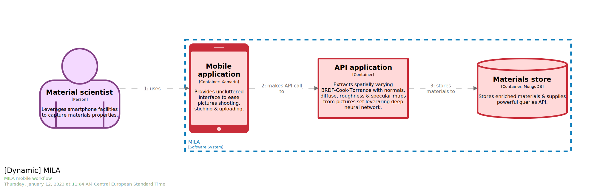
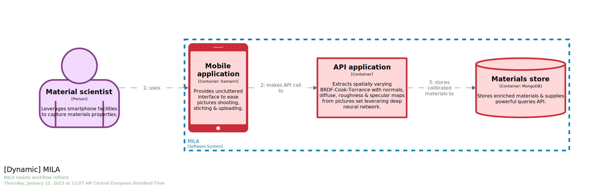
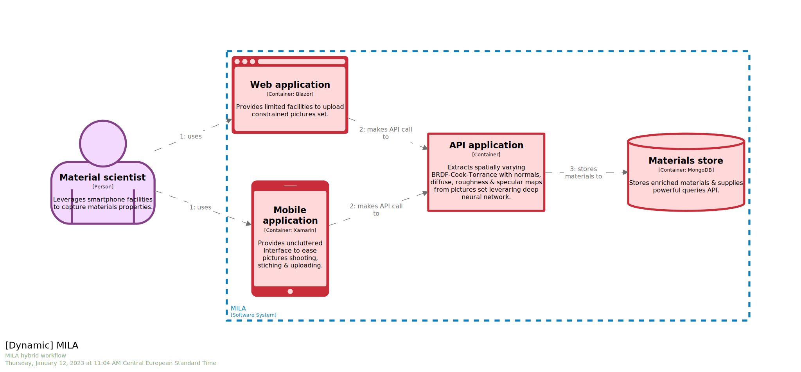

# STAGE 07


In this module, you will learn how to:
- Enrich `views` with `animation` to stage visualization 
- Define a new type of view, the `dynamic` one, aka `C4.W` to materialize flows

⌛ Estimated time to complete: 15 min

## Animate views

Navigating through complex `software model` can be tricky without speaker or voice-over system. Luckily, you can enrich your `views` with `animation` to sequence the element entrance. 

```diff
+ animation {
+   }
```

✏️ Add an `animation` section within a view, and apply a _per line staging_ by listing all elements (scoped by the given view) you would like to see animated.

<details><summary>📙 REVEAL THE ANSWER</summary>

```diff
container mila "Container" "" {
    include *
+   animation {
+       matt
+       mila.spa mila.mobile
+       mila.api
+       mila.store
+       icarus
+   }
    autoLayout
}
```
</details><br> 

✏️ Save your workspace, and refresh your browser.

See how you can now use the bottom-right toolbar of the matching view to play the animation. Each stage unfolds one after another. It is especially useful for supporting discussion when the current view is complex. You don't have to serve the whole thing in one go to your audience, but can provide a staggered walkthrough instead.

## Materialize workflow

Above `animation` is useful when you can play it eg through `Structurizr`, but becomes useless if you don't have proper tooling e.g. `.svg` diagram export. Another way of materializing flow is to leverage the dedicated view, the `dynamic` one.

✏️ Place within `views` section, start typing `dynamic`, autocomplete, and fill placeholders.

<details><summary>📙 REVEAL THE ANSWER</summary>

```diff
+ dynamic mila  "mila-workflow" "MILA mobile workflow" {
+   autolayout lr
+ }
```
</details><br> 

Here you specify and stage the `relationships` you would like to be part of the `view`, with a _per line staging_ algorithm. If `relationship` is declared upstream, `description`, `technology` & `tags` will be automatically used.

✏️ Reference previously declared `relationships`

<details><summary>📙 REVEAL THE ANSWER</summary>

```diff
dynamic mila  "mila-workflow" "MILA mobile workflow" {
+   matt -> mila.mobile
+   mila.mobile -> mila.api
+   mila.api -> mila.store
    autolayout lr
}
```
</details><br> 

✏️ Save your workspace, and refresh your browser.



## Customize workflow

You also have the ability to overwrite `description` field, if for some reasons you need to (contextual message...)

✏️ Amend a `relationship` by specifying a contextual `description` field

<details><summary>📙 REVEAL THE ANSWER</summary>

```diff
dynamic mila "mila-workflow" "MILA mobile workflow refined" {
   matt -> mila.mobile
   mila.mobile -> mila.api
-  mila.api -> mila.store
+  mila.api -> mila.store "stores calibrated materials to"
   autoLayout
}
```
</details><br> 

✏️ Save your workspace, and refresh your browser.



## Materialize advanced workflow

Underlying workflow engine is smart enough to accomodate parallel pipeline for complex scenario.
Parallel pipeline are declared within `dynamic` view by starting multiple `{}` pattern

```diff
+ {
+     [...]    
+ }
+ {
+     [...]
+ }
```

✏️ Add 2 parallel pipelines, one for `mobile`, another one for `web application`

<details><summary>📙 REVEAL THE ANSWER</summary>

```diff
views {
+   dynamic mila "mila-workflow-hybrid" "MILA hybrid workflow" {
+   {
+       matt -> mila.mobile
+       mila.mobile -> mila.api
+       mila.api -> mila.store
+   }
+   {
+       matt -> mila.spa
+       mila.spa -> mila.api
+       mila.api -> mila.store
+   }
+   autolayout lr
+}
}
```
</details><br> 

✏️ Save your workspace, and refresh your browser.



## Wrapup

📘 Completing this stage should lead to this [final workspace](./workspace.dsl).  

The idea behind code-first approach is to craft a rich `software model` and to provide multiple views - or viewpoints - to support decision making. That is what `animation` or `dynamic` bring: other viewpoints. Remember, you are unlikely to be able to provision a dedicated speaker every time you need to read/think about a `software model`. Make everything you can to ensure your `software model` is self-contained and self-explainatory.

Another dimension that deserves a dedicated stage is the deployment one. [Here](../stage%2008/README.md) we go.

## Further reading

- [animation view](https://github.com/structurizr/dsl/blob/master/docs/language-reference.md#animation)
- [dynamic view](https://github.com/structurizr/dsl/blob/master/docs/language-reference.md#dynamic-view)