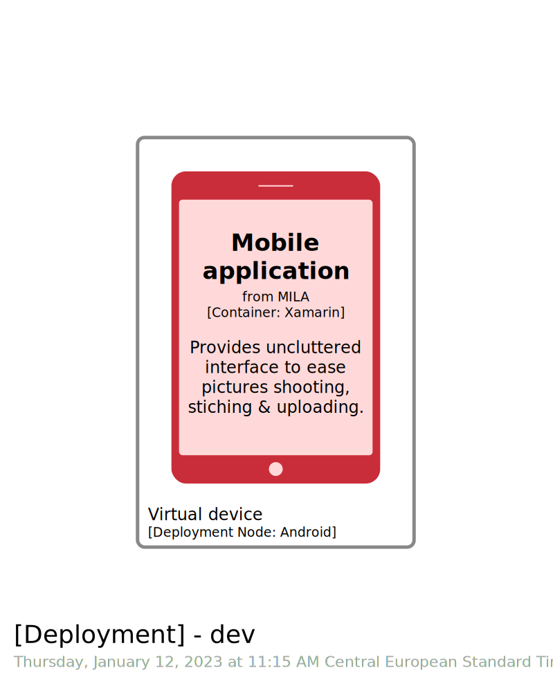
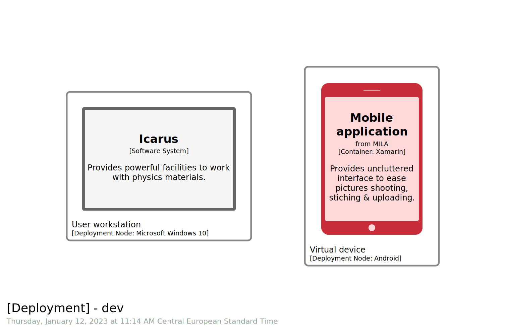
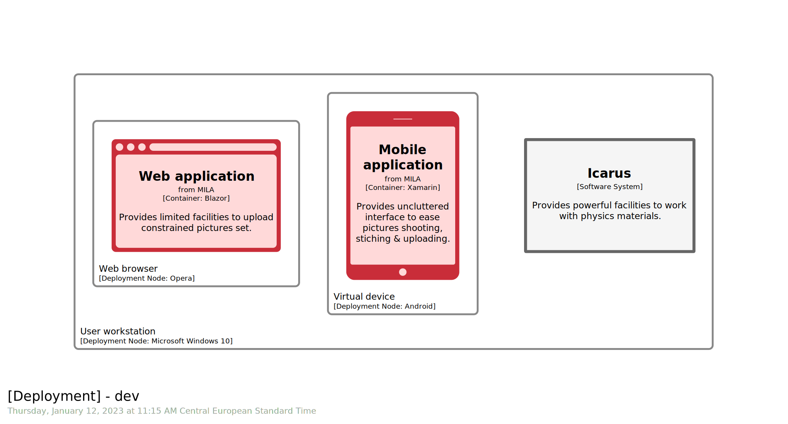
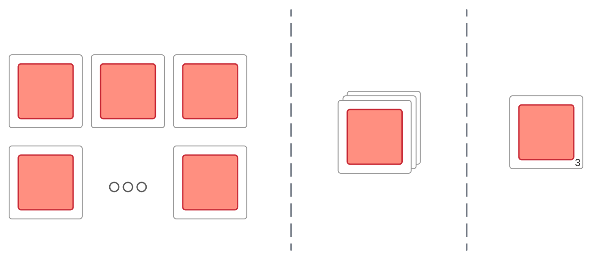
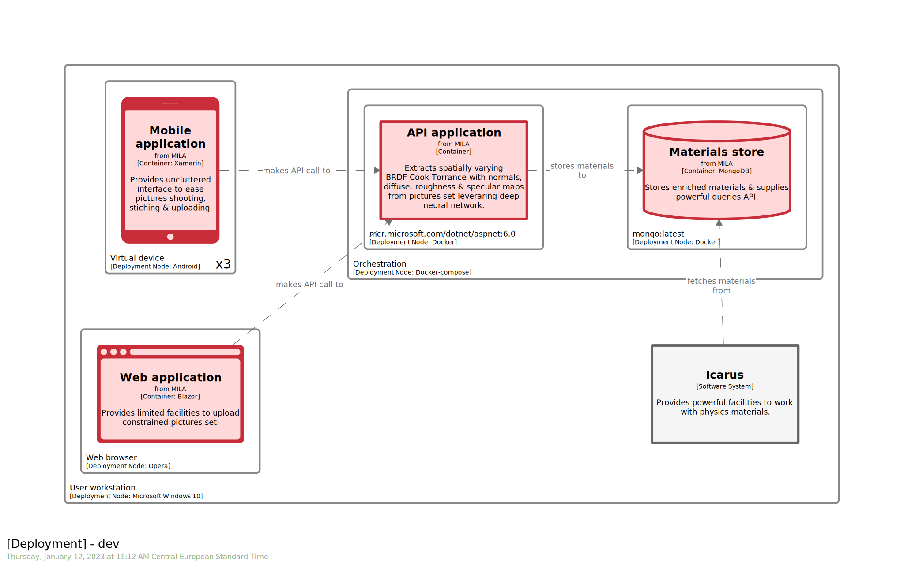

# STAGE 08


 

  


In this module, you will learn how to:
- Define a `deployment environment`
- Define a `deployment node`
- Deploy a `software system` through `software system instance`
- Deploy a `container` through `container instance`
- Visualize a new dimension of a `software model`, the `deployment` one, aka `C4.D`.

⌛ Estimated time to complete: 30 min

Thus far, we describe our `software model` without materializing how it will be deployed. One important point is to catch that a single `software model` can be deployed in multiple ways, and thus you are likely to end up with multiple `deployment views`. Corollary, make sure you keep other views agnostic of deployment concerns. `Container view` does not care about deployment stack, as a `deployment view` already covers it. Eg specifying `docker` as `technology` or `tags` for a `container` is wrong. It is simply a dimension mismatch.  
Even if modern `CI/CD` pipelines tend to minimize difference between environments (eg by leveraging containers), you are likely to end up with at least 2 kind of deployments you would like to deploy `software model` on, namely `dev` environment & `prod` one. This chapter will focus on `dev`, next one will cover the `prod`.

## Define a deployment environment

To start with, we need to declare a `deployment environment` within our `model`. 

✏️ Do it by writing `deploymentEnvironment` at the end of the `model` section.

`Cornifer` provides matching snippet:

```c4u
identifier_ = deploymentEnvironment "name" {}
```

✏️ Fill in properly.

<details><summary>📙 REVEAL THE ANSWER</summary>

```diff
model {
    mila.mobile.preparation -> mila.mobile.uploading "packages" "" ""
    
+   dev_ = deploymentEnvironment "dev" {
+   }
}
```
</details><br> 

## Define a deployment node

`Software system` & `container` will be deployed within `deployment environment` through respectively `software system instance` & `container instance`. Those instances do not land directly within `deployment environment` but belongs to a `deployment node`, which materialize the deployment layers. Add our first `deployment node` within previously created `deployment environment`. 

✏️ Start typing `deploymentNode` within `deploymentEnvironment` section.

`Cornifer` will prompt the matching snippet:

```c4u
deploymentNode "name" "description" "technology" "tags" 1|#instances {}
```

Last placeholder, `1|#instances`, comes with 2 options, `|` acting as option delimiter. First entry, here `1`, is always the default one, so in doubt fallback to it.  


✏️ Fill in the different placeholders. 

Once again, if you do not have enough clues or knowledge, it is perfectly fine to let some of them empty.

<details><summary>📙 REVEAL THE ANSWER</summary>

```diff
model {
    dev_ = deploymentEnvironment "dev" {
+       deploymentNode "Virtual device" "" "Android" "" 1 {
+       }
    }
}
```
</details><br> 

Last field, `instances`, is an important one. See [instances section](#instances) for more details, but assume you can fill with `1` for now.

## Deploy a container

✏️ Within brand-new `deploymentNode`, type `containerInstance` and move ahead.

```c4u
container_identifier_ = containerInstance softwareSystem_identifier.container_identifier deploymentGroup_identifier "tags" {}
```

`deployment group` field will be covered in [next chapter](../stage%2009/README.md), so assume `""` is enough for now.

✏️ Fill in placeholders.

<details><summary>📙 REVEAL THE ANSWER</summary>

```diff
model {
    dev_ = deploymentEnvironment "dev" {
        deploymentNode "Virtual device" "" "Android" "" 1 {
+           mobile_ = containerInstance mila.mobile "" "" {
+           }
        }
    }
}
```
</details><br> 

## Visualize the model

✏️ Add matching view, typing `deployment` within `views` section leveraging `Cornifer`.

```c4u
deployment * identifier "name" "description" {
    include *
}
```

✏️ Fill in the placeholders.

Use the previously defined `deployment environment` identifier, and name your view accordingly

<details><summary>📙 REVEAL THE ANSWER</summary>

```diff
views {
+   # C4.D
+   deployment * dev_ "DevDeployment" "" {
+       include *
+       autolayout lr
+   }
}
```
</details><br> 

✏️ Save your workspace and refresh your browser.



## Deploy frontend elements

`Software model` may be composed by multiple `software system` & `container`. For every one of them, repeat the same operation. Let's try to deploy a `software system`. 

✏️ Leveraging `Cornifer`, create a new `deploymentNode` to host `Icarus` `software system`, and pick `softwareSystemInstance` snippet within:

```c4u
softwareSystem_identifier_ = softwareSystemInstance softwareSystem_identifier deploymentGroup_identifier "tags" {}
```

✏️ Feed placeholder accordingly.

<details><summary>📙 REVEAL THE ANSWER</summary>

```diff
dev_ = deploymentEnvironment "dev" {
+   deploymentNode "User workstation" "" "Microsoft Windows 10" "" 1 {            
+       icarus_ = softwareSystemInstance icarus "" "" {
+       }
+   }
```
</details><br> 

✏️ Save your workspace and refresh your browser.



Note that:
- `deployment node` can be stacked ie a `deployment node` can contain another `deployment node`. It describes the stack a `software system` or a `container` will be deployed on, and thus think of it in term of layers. A web application lands on a browser which lands on an `OS`. A backend service is deployed through a container, which is itself managed by an orchestrator, which is deployed...
- `deployment node` can contain multiple `software system` or `container`

✏️ Let's see how it applies in our use case by deploying the `mila.spa` container.

<details><summary>📙 REVEAL THE ANSWER</summary>

```diff
dev_ = deploymentEnvironment "dev" {
    deploymentNode "User workstation" "" "Microsoft Windows 10" "" 1 {
+       deploymentNode "Web browser" "" "Opera" "" 1 {
+           spa_ = containerInstance mila.spa "" "" {
+           }
+       }
        
        icarus_ = softwareSystemInstance icarus "" "" {
        }
    }
}
```
</details><br> 

✏️ Fix the mistake we made before, as `Virtual device` should be deployed on `User workstation` as well.

<details><summary>📙 REVEAL THE ANSWER</summary>

```diff
-   }		
-   deploymentNode "Virtual device" "" "Android" "" 1 {
-       mobile_ = containerInstance mila.mobile "" "" {
-       }
-   }	
+       deploymentNode "Virtual device" "" "Android" "" 1 {
+           mobile_ = containerInstance mila.mobile "" "" {
+           }
+       }
+   }
```
</details><br> 

✏️ Save your workspace and refresh your browser.  

See how `Structurizr` renders our `view` right now. `Software system` and `container` are properly gathered and stacked:



## Deploy backend elements

✏️ Deal with backend elements, assuming each of them is deployed individually in a dedicated container, and we do have orchestration on top.


<details><summary>📙 REVEAL THE ANSWER</summary>

```diff
dev_ = deploymentEnvironment "dev" {
    deploymentNode "User workstation" "" "Microsoft Windows 10" "" 1 {
        
+        deploymentNode "Orchestration" "" "Docker-compose" "" 1 {
+            deploymentNode "mcr.microsoft.com/dotnet/aspnet:6.0" "" "Docker" "" 1 {
+                api_ = containerInstance mila.api "" "" {
+                }
+            }
+            deploymentNode "mongo:latest" "" "Docker" "" 1 {
+                url https://hub.docker.com/_/mongo
+                store_ = containerInstance mila.store "" "" {
+                }
+            }
+        }
    }
}
```
</details><br> 


## Instances

In some cases, it is useful to materialize cardinality eg to highlight we address a pool of instances instead of a single one. As many things, this can be done in many ways:



`Structurizr` opts for the option on the right, and it is what `instances` field is for: specifying number or magnitude order.



## Wrapup

📘 Completing this stage should lead to this [final workspace](./workspace.dsl).  

The fact that [deployment view](https://rvr06.github.io/c4-bootcamp/docs/c4-model/#complementary-diagram) was introduced after the [4 main ones](https://rvr06.github.io/c4-bootcamp/docs/c4-model/#recipe) does not mean it should be less considered. Describing how `software model` is deployed will support discussion at an early stage, such as how do we organize our team to develop and test, or what is our `CI/CD` infrastructure needs, ...

Let's move to the [next stage](../stage%2009/README.md) to scale this approach.

## Further reading

- [deployment environment](https://github.com/structurizr/dsl/blob/master/docs/language-reference.md#deploymentEnvironment)
- [deployment node](https://github.com/structurizr/dsl/blob/master/docs/language-reference.md#deploymentNode)
- [software system instance](https://github.com/structurizr/dsl/blob/master/docs/language-reference.md#softwareSystemInstance)
- [container instance](https://github.com/structurizr/dsl/blob/master/docs/language-reference.md#containerInstance)
- [deployment view](https://github.com/structurizr/dsl/blob/master/docs/language-reference.md#deployment-view)
