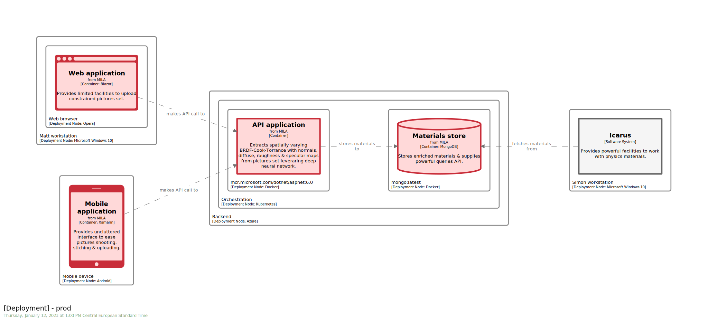
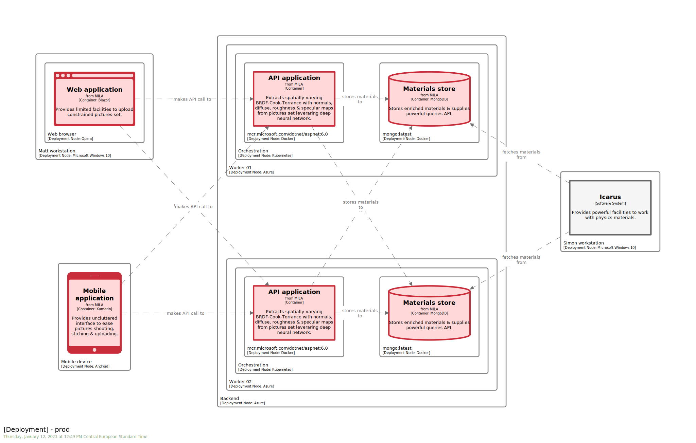
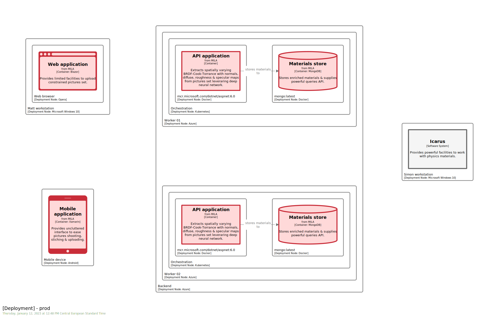
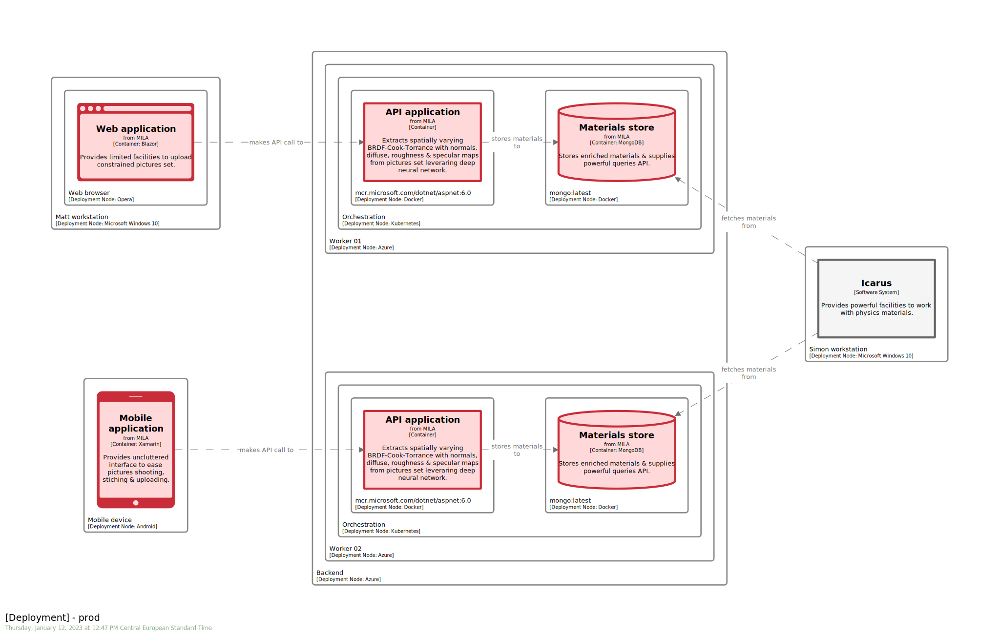
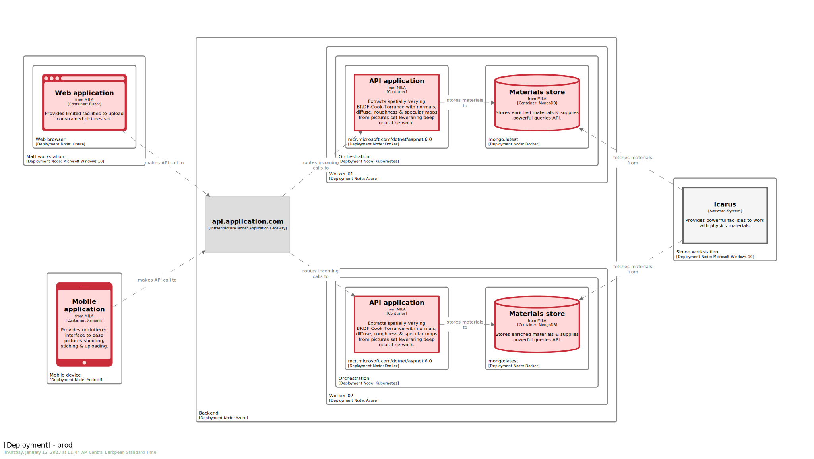
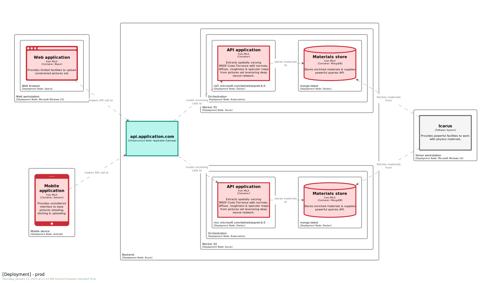
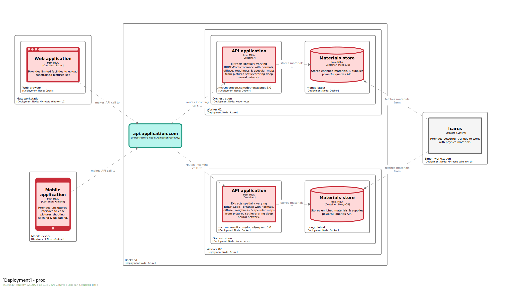
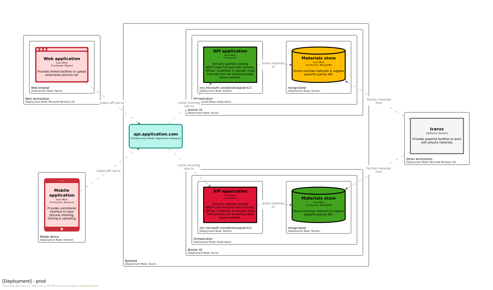

# STAGE 09


In this module, you will learn how to:
- Define a `deployment group`
- Define an `infrastructure node`
- Enrich insights with `health check`[^1]

⌛ Estimated time to complete: 45 min

## Define production deployment

When crafting a new deployment, you can either start from scratch or from an existing one. We take this last option here, duplicating previously created `dev_` `deployment environment`.

✏️ Update `model` section accordingly.

<details><summary>📙 REVEAL THE ANSWER</summary>

```diff
model {
+    prod_ = deploymentEnvironment "prod" {
+        deploymentNode "User workstation" "" "Microsoft Windows 10" "" 1 {
+            deploymentNode "Web browser" "" "Opera" "" 1 {
+                spa_ = containerInstance mila.spa "" "" {
+                }
+            }
+            
+            icarus_ = softwareSystemInstance icarus "" "" {
+            }
+            
+            deploymentNode "Virtual device" "" "Android" "" 1 {
+                mobile_ = containerInstance mila.mobile "" "" {
+                }
+            }
+            
+            deploymentNode "Orchestration" "" "Docker-compose" "" 1 {
+                deploymentNode "mcr.microsoft.com/dotnet/aspnet:6.0" "" "Docker" "" 1 {
+                    api_ = containerInstance mila.api "" "" {
+                    }
+                }
+                
+                deploymentNode "mongo:latest" "" "Docker" "" 1 {
+                    url https://hub.docker.com/_/mongo
+                    store_ = containerInstance mila.store "" "" {
+                    }
+                }
+            }
+        }
+    }
}
```
</details><br> 

✏️ Update `views` section to manage this new `deployment environment`.

<details><summary>📙 REVEAL THE ANSWER</summary>

```diff
# C4.D
views {
    deployment * dev_ "DevDeployment" "" {
        include *
    }

+   deployment * prod_ "ProdDeployment" "" {
+       include *
+       autolayout lr
+   }
}
```
</details><br> 

✏️ Amend some points:
- As we do have 2 personas, we have to materiliaze 2 user workstations, one hosting `MILA`, the other hosting `Icarus`.
- Obviously, `virtual device` is replaced by `mobile device`
- Kubernetes being the de-facto standard for remote orchestration, we swap previous `docker-compose` layer. 

<details><summary>📙 REVEAL THE ANSWER</summary>

```diff
model {
    prod_ = deploymentEnvironment "prod" {
-       deploymentNode "User workstation" "" "Microsoft Windows 10" "" 1 {
+       deploymentNode "Matt workstation" "" "Microsoft Windows 10" "" 1 {
            deploymentNode "Web browser" "" "Opera" "" 1 {
                spa_ = containerInstance mila.spa "" "" {
                }
            }
            
-           icarus_ = softwareSystemInstance icarus "" "" {
-           }
+       }
+       deploymentNode "Simon workstation" "" "Microsoft Windows 10" "" 1 {
+           icarus_ = softwareSystemInstance icarus "" "" {
+           }
+       }
            
-           deploymentNode "Virtual device" "" "Android" "" 1 {
-               mobile_ = containerInstance mila.mobile "" "" {
-               }
-           }
+       deploymentNode "Mobile device" "" "Android" "" 1 {
+           mobile_ = containerInstance mila.mobile "" "" {
+           }
+       }
            
+       deploymentNode "Backend" "" "Azure" "" 1 {
-           deploymentNode "Orchestration" "" "Docker-compose" "" 1 {
+           deploymentNode "Orchestration" "" "Kubernetes" "" 1 {
                deploymentNode "mcr.microsoft.com/dotnet/aspnet:6.0" "" "Docker" "" 1 {
                    api_ = containerInstance mila.api "" "" {
                    }
                }
                
                deploymentNode "mongo:latest" "" "Docker" "" 1 {
                    url https://hub.docker.com/_/mongo
                    store_ = containerInstance mila.store "" "" {
                    }
                }
            }
        }
    }
}
```
</details><br> 

Resulting view materializes this configuration:



## Introduce redundancy

Imagine we do foresee high traffic to cope with. We could introduce a new backend stack to make sure we can handle it.

✏️ Duplicate the `Backend` content by introducing 2 new root `deploymentNode`.

<details><summary>📙 REVEAL THE ANSWER</summary>

```diff
deploymentNode "Backend" "" "Azure" "" 1 { 
-    [...]
+   deploymentNode "Worker 01" "" "Azure" "" 1 { 
+       [...] 
+   }
+   deploymentNode "Worker 02" "" "Azure" "" 1 { 
+       [...] 
+   }
}
```
</details><br> 



Every relationships is duplicated, as we do not specify how `Structurizr` should cluster deployed instances.

## Introduce deployment group

`Deployment group` is the `Structurizr` way to cluster stack, and enforce proper relationships bulkhead. 

✏️ Add 2 `deployment group` within `deploymentEnvironment` section.  
✏️ Dispatch `api` & `db` `container instances` among those 2 `deployment group`, leveraging dedicated `container instance` field.

Remember to hover `C4` keyword if you are lost.

<details><summary>📙 REVEAL THE ANSWER</summary>

```diff
prod_ = deploymentEnvironment "prod" {
+   worker1_ = deploymentGroup "Worker 01"
+   worker2_ = deploymentGroup "Worker 02"

    deploymentNode "Matt workstation" "" "Microsoft Windows 10" "#windows" 1 {
        deploymentNode "Web browser" "" "Opera" "#opera" 1 {
            spa_ = containerInstance mila.spa worker2_ "" {
            }
        }
    }
    
    deploymentNode "Simon workstation" "" "Microsoft Windows 10" "#windows" 1 {
        icarus_ = softwareSystemInstance icarus worker1_,worker2_ "" {
        }
    }
    
    deploymentNode "Mobile device" "" "Android" "#android" 1 {
        mobile_ = containerInstance mila.mobile worker1_ "" {
        }
    }

    deploymentNode "Backend" "" "Azure" "" 1 { 
        deploymentNode "Worker 01" "" "Azure" "#azure" 1 {
            deploymentNode "Orchestration" "" "Kubernetes" "#k8s" 1 {
                deploymentNode "mcr.microsoft.com/dotnet/aspnet:6.0" "" "Docker" "#docker" 1 {
-                   api_ = containerInstance mila.api "" "" {
+                   api_ = containerInstance mila.api worker1_ "" {
                    }
                }
                
                deploymentNode "mongo:latest" "" "Docker" "#docker" 1 {
                    url https://hub.docker.com/_/mongo
-                   store_ = containerInstance mila.store "" "" {
+                   store_ = containerInstance mila.store worker1_ "" {
                    }
                }
            }
        }
        
        deploymentNode "Worker 02" "" "Azure" "#azure" 1 {
            deploymentNode "Orchestration" "" "Kubernetes" "#k8s" 1 {
                deploymentNode "mcr.microsoft.com/dotnet/aspnet:6.0" "" "Docker" "#docker" 1 {
-                   api_ = containerInstance mila.api "" "" {
+                   api_ = containerInstance mila.api worker2_ "" {
                    }
                }
                
                deploymentNode "mongo:latest" "" "Docker" "#docker" 1 {
                    url https://hub.docker.com/_/mongo
-                   store_ = containerInstance mila.store "" "" {
+                   store_ = containerInstance mila.store worker2_ "" {
                    }
                }
            }
    }
}
```
</details><br> 



Relationships are no more tangled, because they simply disapear... 

✏️ Fix that by spreading over `deploymentGroup` information among other `container instance` & `software system instance`. 

<details><summary>📙 REVEAL THE ANSWER</summary>

```diff
prod_ = deploymentEnvironment "prod" {
    worker1_ = deploymentGroup "Worker 01"
    worker2_ = deploymentGroup "Worker 02"
    
    deploymentNode "Matt workstation" "" "Microsoft Windows 10" "#windows" 1 {
        deploymentNode "Web browser" "" "Opera" "#opera" 1 {
-           spa_ = containerInstance mila.spa "" "" {
+           spa_ = containerInstance mila.spa worker2_ "" {
            }
        }
    }
    
    deploymentNode "Simon workstation" "" "Microsoft Windows 10" "#windows" 1 {
-       icarus_ = softwareSystemInstance icarus "" "" {
+       icarus_ = softwareSystemInstance icarus worker1_,worker2_ "" {
        }
    }
    
    deploymentNode "Mobile device" "" "Android" "#android" 1 {
-       mobile_ = containerInstance mila.mobile "" "" {
+       mobile_ = containerInstance mila.mobile worker1_ "" {
        }
    }
}
```
</details><br> 



## Introduce infrastructure node

This dynamic dispatch per device type is unlikely to happen from its own. For realistic sake, let's materialize the brick that perform the underlying magic. To do so, we introduce a new kind of element, the `infrastructure node`.

✏️ Add an `infrastructure node` within `Backend` `deployment node`.

<details><summary>📙 REVEAL THE ANSWER</summary>

```diff
- deploymentNode "Backend" "" "Azure" "" 1 {
+ backend_ = deploymentNode "Backend" "" "Azure" "" 1 {
+   gateway_ = infrastructureNode "api.application.com" "" "Application Gateway" ""
```
</details><br> 

✏️ Replace `deployment group` references by new `relationships` between `instances` & `infrastructure node`.

<details><summary>📙 REVEAL THE ANSWER</summary>

```diff
prod_ = deploymentEnvironment "prod" {
    worker1_ = deploymentGroup "Worker 01"
    worker2_ = deploymentGroup "Worker 02"
    
-   deploymentNode "Matt workstation" "" "Microsoft Windows 10" "" 1 {
+   ws_ = deploymentNode "Matt workstation" "" "Microsoft Windows 10" "" 1 {
-       deploymentNode "Web browser" "" "Opera" "" 1 {
+       browser_ = deploymentNode "Web browser" "" "Opera" "" 1 {
-           spa_ = containerInstance mila.spa worker2_ "" {
+           spa_ = containerInstance mila.spa "" "" {
            }
        }
    }
    
    deploymentNode "Simon workstation" "" "Microsoft Windows 10" "" 1 {
        icarus_ = softwareSystemInstance icarus worker1_,worker2_ "" {
        }
    }
    
-   deploymentNode "Mobile device" "" "Android" "" 1 {
+   phone_ = deploymentNode "Mobile device" "" "Android" "" 1 {
-       mobile_ = containerInstance mila.mobile worker1_ "" {
+       mobile_ = containerInstance mila.mobile "" "" {
        }
    }
    
    backend_ = deploymentNode "Backend" "" "Azure" "" 1 {
       gateway_ = infrastructureNode "api.application.com" "" "Application Gateway" ""
        
-       deploymentNode "Worker 01" "" "Azure" "" 1 {
-           deploymentNode "Orchestration" "" "Kubernetes" "" 1 {
-               deploymentNode "mcr.microsoft.com/dotnet/aspnet:6.0" "" "Docker" "" 1 {
+       w01_ = deploymentNode "Worker 01" "" "Azure" "" 1 {
+           k8s_ = deploymentNode "Orchestration" "" "Kubernetes" "" 1 {
+               docker_ = deploymentNode "mcr.microsoft.com/dotnet/aspnet:6.0" "" "Docker" "" 1 {
                    api_ = containerInstance mila.api worker1_ "" {
                    }
                }
                
                deploymentNode "mongo:latest" "" "Docker" "" 1 {
                    url https://hub.docker.com/_/mongo
                    store_ = containerInstance mila.store worker1_ "" {
                    }
                }
            }
        }
        
-       deploymentNode "Worker 02" "" "Azure" "" 1 {
-           deploymentNode "Orchestration" "" "Kubernetes" "" 1 {
-               deploymentNode "mcr.microsoft.com/dotnet/aspnet:6.0" "" "Docker" "" 1 {
+       w02_ = deploymentNode "Worker 02" "" "Azure" "" 1 {
+           k8s_ = deploymentNode "Orchestration" "" "Kubernetes" "" 1 {
+               docker_ = deploymentNode "mcr.microsoft.com/dotnet/aspnet:6.0" "" "Docker" "" 1 {
                    api_ = containerInstance mila.api worker2_ "" {
                    }
                }
                
                deploymentNode "mongo:latest" "" "Docker" "" 1 {
                    url https://hub.docker.com/_/mongo
                    store_ = containerInstance mila.store worker2_ "" {
                    }
                }
            }
        }
    }
    
+   prod_.phone_.mobile_ -> prod_.backend_.gateway_ "makes API call to" "" ""
+   prod_.ws_.browser_.spa_ -> prod_.backend_.gateway_ "makes API call to" "" ""
+   
+   prod_.backend_.gateway_ -> prod_.backend_.w01_.k8s_.docker_.api_ "routes incoming calls to" "" ""
+   prod_.backend_.gateway_ -> prod_.backend_.w02_.k8s_.docker_.api_ "routes incoming calls to" "" ""
}
```
</details><br> 
			
`Infrastructure node` are there to materialize `DNS`, `load balancer`, `gateway`, ...



✏️ Improve rendering by introducing new style for `infrastructure node`. 

Eg, picking new color schema to align with `Cornifer` one strenghtens consistency.

<details><summary>📙 REVEAL THE ANSWER</summary>

```diff
views {
	styles {
+       element "Infrastructure Node" {
+           background #B8F5ED
+           stroke #19967d
+           strokeWidth 8
+       }
    }
}
```
</details><br> 



It is still difficult to discriminate for layman. Luckily, there are plenty of [traits](https://github.com/structurizr/dsl/blob/master/docs/language-reference.md#element-style) one can modify to strengthen visual identity. 

✏️ What about changing `shape` & `height` as well to explicit?

<details><summary>📙 REVEAL THE ANSWER</summary>

```diff
views {
	styles {
        element "Infrastructure Node" {
+           shape RoundedBox
+           Height 200
            background #B8F5ED
            stroke #19967d
            strokeWidth 8
        }
    }
}
```
</details><br> 

Better, isn't it?



## Enrich with health check

`Health check` is a widespread facility in Cloud environment. It allows an administrator or service to ping a dedicated URL to assess the health of an endpoint. Having an easy way of visualizing all ecosystem health at once is very useful when one would like to monitor or diagnose issue. 
 
✏️ Pick a `software system instance` or a `container instance` you would like to enrich, start typing `healthCheck`.

Let `Cornifer` be your guide: 

```c4u
healthCheck "name" url interval timeout
```

✏️ Fill in placeholders.

Assuming you have properly [instrumented](https://docs.microsoft.com/en-us/aspnet/core/host-and-deploy/health-checks?view=aspnetcore-6.0) your API application, you should end up with: 

<details><summary>📙 REVEAL THE ANSWER</summary>

```diff
deploymentNode "Orchestration" "" "Docker-compose" "#dockerCompose" 1 {
    deploymentNode "mcr.microsoft.com/dotnet/aspnet:6.0" "" "Docker" "#docker" 1 {
        api_ = containerInstance mila.api "" "" {
+           healthCheck "API is up & running" "http://localhost:5000/healthz" 60 0
        }
    }
```
</details><br> 

Sadly, at the time of writing, `Structurizr Lite` [does not support](https://structurizr.com/help/health-checks) `health check` view, where:
- `Healthy` elements are highlighted in green
- `Faulty` elements are highlighted in red
- `Blurry` elements are highlighted in amber

 Mirroring what `health check` view provides can be achieved by leveraging what we learned thus far.

1. ✏️ Create a brand-new `theme-health-check.dslf` to mirror
    <details><summary>📙 REVEAL THE ANSWER</summary>

    ```diff
    + views {
    + 	styles {
    + 		element "#healthy" {
    + 			stroke #000000
    + 			background #42a31f
    + 		}
    + 		element "#blurry" {
    + 			stroke #000000
    + 			background #ffbf00
    + 		}
    + 		element "#faulty" {
    + 			stroke #000000
    + 			background #e01436
    + 		}
    + 	}
    + }
    ```
    </details><br> 
1. ✏️ Amend your `workspace.dsl` accordingly
    <details><summary>📙 REVEAL THE ANSWER</summary>

    ```diff
    views {
        !include theme.dslf
    +	!include theme-health-check.dslf
    ```
    </details><br> 
1. ✏️ Tag some instances
    <details><summary>📙 REVEAL THE ANSWER</summary>

    ```diff
    w01_ = deploymentNode "Worker 01" "" "Azure" "#azure" 1 {
        k8s_ = deploymentNode "Orchestration" "" "Kubernetes" "#k8s" 1 {
            docker_ = deploymentNode "mcr.microsoft.com/dotnet/aspnet:6.0" "" "Docker" "#docker" 1 {
    -           api_ = containerInstance mila.api worker1_ "" {
    +           api_ = containerInstance mila.api worker1_ "#healthy" {
                }
            }
            
            deploymentNode "mongo:latest" "" "Docker" "#docker" 1 {
                url https://hub.docker.com/_/mongo
    -           store_ = containerInstance mila.store worker1_ "" {
    +           store_ = containerInstance mila.store worker1_ "#blurry" {
                }
            }
        }
    }
    ```
    </details><br> 
1. ✏️ Save you workspace and refresh your browser 
    

Obviously, `health check` view performs this dynamically leveraging provided `healthCheck` url. Depending on what software you are working on, this single feature can justify the `Structurizr` paid upgrade.  

## Wrapup

📘 Completing this stage should lead to this [final workspace](./workspace.dsl).  

Whether you leverage autolayout or you tailor a custom one, ensure you keep [consistency](https://rvr06.github.io/c4-bootcamp/docs/usage/#layout-consistency) between related `view`. Here, you may notice how layout support difference spotting between `dev` & `prod` deployments, as everything is consistently dispatched.  

[Next chapter](../stage%2010/README.md) will go a step further to beautify deployment views. 

## Further reading

- [deployment group](https://github.com/structurizr/dsl/blob/master/docs/language-reference.md#deploymentGroup)
- [infrastructure node](https://github.com/structurizr/dsl/blob/master/docs/language-reference.md#infrastructurenode)
- [health check](https://github.com/structurizr/dsl/blob/master/docs/language-reference.md#healthcheck)

[^1]: `Health check` is a widespread facility in Cloud environment. It allows an administrator or service to ping a dedicated URL to assess the health of an endpoint. Having an easy way of visualizing all ecosystem health at once is very useful when one would like to monitor or diagnose issue. 