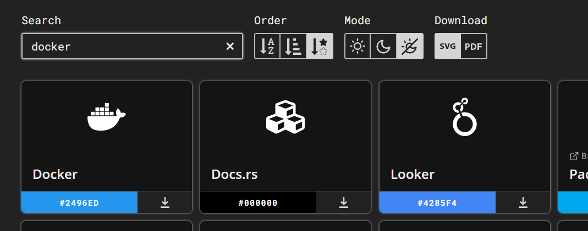
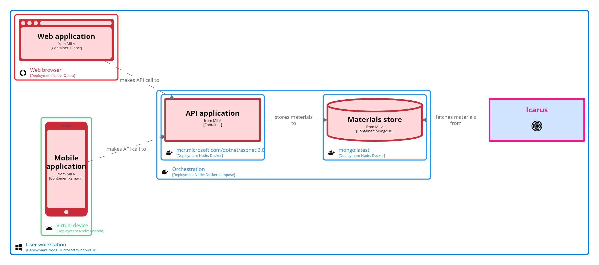
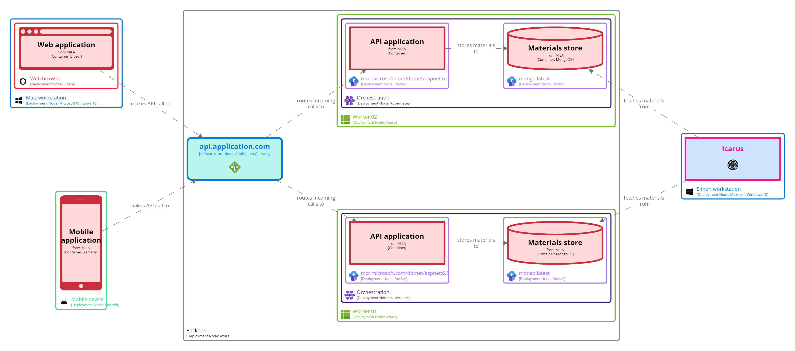
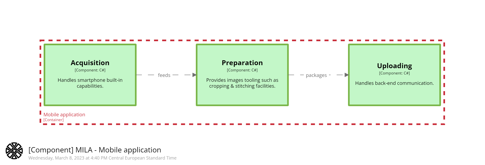

# STAGE 10

 
 

In this module, you will learn how to:
- Enrich theme with `icon`
- Enrich theme with `branding`

⌛ Estimated time to complete: 15 min

## Enrich theme

Remember the `styles` syntax. Exhaustive option can be found [here](https://github.com/structurizr/dsl/blob/master/docs/language-reference.md#element-style) and [there](https://github.com/structurizr/dsl/blob/master/docs/language-reference.md#relationship-style), but common ones used for `deployment` views are:

```c4u
element "#tag" {
    stroke #AABBCC
    color #CCBBAA
    icon file|url
}
```

Styling a diagram is an important step. Ensure you don't break both consistency and semantic by randomly proceeding:
- leverage dedicated image library is a good pattern to enforce consistency. You may notice you can provide a file for icon. Prefer the url option, as it won't noise your repository, and allow multiple `software model` to reuse the same assets, without duplication.
- pick meaningful color, instead of eye-candy one. Most of the brand come with iconic color, use it. 

Luckily, there is an amazing project - aka [Simple Icons](https://simpleicons.org) - that performs this particular work for us:



Sadly, `Structurizr` only deals with `.png` or `.jpg` for icons. Broadly used icons has been converted [here](https://github.com/rvr06/cornifer-contrib) and more are coming.

✏️ Create a brand-new `theme-deploy.dslf`.  
✏️ Create some styles for tags like `#android`, `#opera`, `#windows`, ... using `https://raw.githubusercontent.com/rvr06/cornifer-contrib/main/assets/__XXX__` path

<details><summary>📙 REVEAL THE ANSWER</summary>

```diff
+views {
+	styles {
+		element "#android" {
+			stroke #3DDC84
+			color #3DDC84
+			icon "https://raw.githubusercontent.com/rvr06/cornifer-contrib/main/assets/android.png"
+		}
+		element "#opera" {
+			stroke #FF1B2D
+			color #FF1B2D
+			icon "https://raw.githubusercontent.com/rvr06/cornifer-contrib/main/assets/opera.png"
+		}
+		element "#daedalus" {
+			icon "https://raw.githubusercontent.com/rvr06/cornifer-contrib/main/assets/daedalus.png"
+		}
+	}
+}
```
</details><br> 

✏️ Modify the workspace to reference those new styles.

<details><summary>📙 REVEAL THE ANSWER</summary>

```diff
views {
	!include theme.dslf
-   !include theme-health-check.dslf
+	!include theme-deploy.dslf
```
</details><br> 

✏️ Tag some elements within the 2 `deploymentEnvironment`.

<details><summary>📙 REVEAL THE ANSWER</summary>

```diff
- deploymentNode "Dev workstation" "" "Microsoft Windows 10" "" 1 {
+ deploymentNode "Dev workstation" "" "Microsoft Windows 10" "#windows" 1 {
-   deploymentNode "Web browser" "" "Opera" "" 1 {
+   deploymentNode "Web browser" "" "Opera" "#opera" 1 {
        spa_ = containerInstance mila.spa "" "" {
        }
    }
    
-   icarus_ = softwareSystemInstance icarus "" "" {
+   icarus_ = softwareSystemInstance icarus "" "#daedalus" {
    }
    
-   deploymentNode "Virtual device" "" "Android" "" 1 {
+   deploymentNode "Virtual device" "" "Android" "#android" 1 {
        mobile_ = containerInstance mila.mobile "" "" {
        }
    }
}
```
</details><br> 



One could also leverage some existing [themes](https://structurizr.com/help/themes), by using `theme` keyword:

```diff
+views {
+	theme https://static.structurizr.com/themes/microsoft-azure-2021.01.26/theme.json
}
```

✏️ Do so, and tag some instances [accordingly](https://structurizr.com/help/theme?url=https://static.structurizr.com/themes/microsoft-azure-2021.01.26/theme.json):

<details><summary>📙 REVEAL THE ANSWER</summary>

```diff
- w01_ = deploymentNode "Worker 01" "" "Azure" "" 1 {
-     k8s_ = deploymentNode "Orchestration" "" "Kubernetes" "" 1 {
-         docker_ = deploymentNode "mcr.microsoft.com/dotnet/aspnet:6.0" "" "Docker" "" 1 {
+ w01_ = deploymentNode "Worker 01" "" "Azure" "Microsoft Azure - All Resources" 1 {
+     k8s_ = deploymentNode "Orchestration" "" "Kubernetes" "Microsoft Azure - Kubernetes Services" 1 {
+         docker_ = deploymentNode "mcr.microsoft.com/dotnet/aspnet:6.0" "" "Docker" "Microsoft Azure - Container Instances" 1 {
```
</details><br> 



## Semantic theme

Semantic theme equivalent to `theme.dslf` has been released [there](https://raw.githubusercontent.com/rvr06/cornifer-contrib/main/themes/semantic-alt/theme.json) to spare some time and enforce consistency between teams. To use it, proceed as above:
1. ✏️ Delete `theme.dslf`
1. ✏️ Amend `views` section to get rid of `!include` and to pull the `semantic` theme instead. It is `Cornifer` default when you autocomplete `theme` snippet:
    ```diff
    views {
    -   !include theme.dslf
    +    theme https://raw.githubusercontent.com/rvr06/cornifer-contrib/main/themes/semantic-alt/theme.json
         theme https://static.structurizr.com/themes/microsoft-azure-2021.01.26/theme.json
    ```

## Heraldry theme

Commonly used brands like `#docker` and `#linux` has also been gathered in a dedicated [heraldry](https://raw.githubusercontent.com/rvr06/cornifer-contrib/main/themes/heraldry/theme.json) theme:

```diff
views {
    theme https://raw.githubusercontent.com/rvr06/cornifer-contrib/main/themes/semantic-alt/theme.json
+   theme https://raw.githubusercontent.com/rvr06/cornifer-contrib/main/themes/heraldry/theme.json
    theme https://static.structurizr.com/themes/microsoft-azure-2021.01.26/theme.json
```

## Add logo

✏️ Amend `theme.dslf`

```diff
views {
+	branding {
+		logo https://raw.githubusercontent.com/rvr06/cornifer-contrib/main/assets/daedalus.png
+	}
}
```

Logo has been automatically added within title area (bottom-left corner): 



## Wrapup

📘 Completing this stage should lead to this [final workspace](./workspace.dsl).  

You see how one could enhance views by enriching `theme`. Themes can be shared and should be reused to enforce consistency.  

[Next stage](../stage%2011/README.md) will introduce another useful feature.

## Further reading

- [branding](https://github.com/structurizr/dsl/blob/master/docs/language-reference.md#branding)
- [theme](https://github.com/structurizr/dsl/blob/master/docs/language-reference.md#theme)