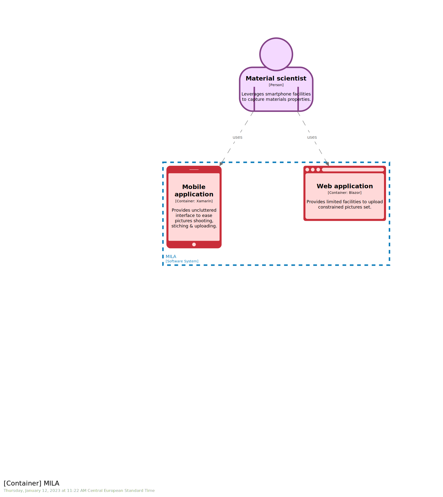

# STAGE 11

  

In this module, you will learn how to:
- Filter a view by `exclude` pattern
- Filter a view by `include` pattern
- Disable filter

⌛ Estimated time to complete: 10 min

Most of the time, you would like that your view contains all that matters. You achieve this by specifying the internal `include *` field, where `Structurizr` does all the heavy [lifting](https://github.com/structurizr/dsl/blob/master/docs/language-reference.md#include) for you. You can also explicitly list what you want (not very sustainable in most cases) or use predicate. Those techniques are beyond this course but available [there](https://github.com/structurizr/dsl/blob/master/docs/language-reference.md#include). One common technique to achieve the same goal is to leverage built-in `filtered` view. Let's see how it works.

Assuming you do have a view you would like to filter, just start typing `filtered` and let `Cornifer` guide you:

```c4u
filtered "baseview_name" include|exclude "tags" "name" "description"
```
Start by specifying the view you would like to filter, the strategy `include|exclude` and the `tag(s)` which will serve to match the strategy against.

## Filter view (exclude)

✏️ Create a `filtered` view from `Container` one, taking all but stuff tagged with `#web`.

<details><summary>📙 REVEAL THE ANSWER</summary>

```diff
views {
    container mila "Container" "" {
        include *
    }

+   filtered "Container" exclude "#web" "Container-mobile-filter" ""
}
```
</details><br> 


## Filter view (include)

✏️ Create a `filtered` view from `Container` one, taking all that is tagged with either `Person`, `Relationship`, `#mobile` or `#web`.

<details><summary>📙 REVEAL THE ANSWER</summary>

```diff
views {
    container mila "Container" "" {
        include *
    }

+   filtered "Container" include "Person, Relationship, #mobile, #web" "Container-frontend-filter" ""
}
```
</details><br> 



## Filter view (full)

As soon as you introduce a `filtered` view, the base one is no more part of the resulting `views`. If you want it back, simply get it back by introducing a matching filter eg `exclude ""`:

✏️ Create a non `filtered` view from `Container` one.

<details><summary>📙 REVEAL THE ANSWER</summary>

```diff
views {
    container mila "Container" "" {
        include *
    }

+   filtered "Container" exclude "" "Container-full" ""
}
```
</details><br> 


## Analysis

You may have noticed how layout is shared among views, which may seem strange, but prove to be very powerful for [effective diff spoting](https://rvr06.github.io/c4-bootcamp/docs/usage/#layout-consistency).

## Wrapup

📘 Completing this stage should lead to this [final workspace](./workspace.dsl).  

Filtering complex `software model` is an easy task with built-in `filtered` views, and serve many purposes:
- Comparing option A and option B
- Tracing evolution between version 1 and version 2
- Focusing on a dedicated aspect like frontend or backend
- ...

Another great tool exists to vary viewpoints, and it is all about [next stage](../stage%2012/README.md) is.

## Further reading

- [filtered-view](https://github.com/structurizr/dsl/blob/master/docs/language-reference.md#filtered-view)