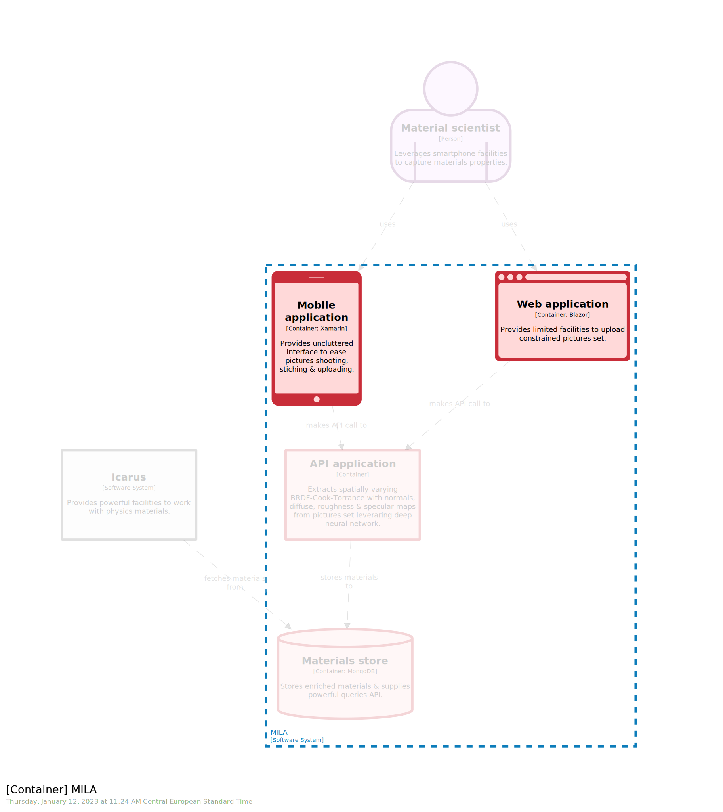

# STAGE 12

  


In this module, you will learn how to:
- Leverage `perpsective` to provide different reading grid to reader 
- Leverage `constant` to DRY your model

⌛ Estimated time to complete: 10 min

## Create a perspective

Last stage introduces `filtered view` to narrow complex views, focusing on one or few traits instead of the whole bunch. There is another tool that achieves the same goal, but operates at the `model` level, and thus, spread over all the matching `views`. It consists of annotating the model with the `perspectives` field.

```diff
spa = container "Web application" "Provides [...]" "Blazor" "#web" {
+    perspectives {
+        frontend "Frontend"
+    }
}
```

This will enable `binoculars` facility within `Structurizr` which will enable dynamic filtering for every views containing this element. 

## DRY your model

✏️ Apply `perspectives` to the different `containers`, using either `frontend` or `backend`.

<details><summary>📙 REVEAL THE ANSWER</summary>

```diff
mila = softwareSystem "MILA" "Provides [...]" "" {
    spa = container "Web application" "Provides [...]" "Blazor" "#web" {
        perspectives {
            frontend "Frontend"
        }
    }
    mobile = container "Mobile application" "Provides [...]" "Xamarin" "#mobile" {
+       perspectives {
+           frontend "Frontend"
+       }
    }
    api = container "API application" "[...]" "" "" {
+       perspectives {
+           backend "Backend"
+       }
    }
    store = container "Materials store" "Stores [...]" "MongoDB" "#db" {
+       perspectives {
+           backend "Backend"
+       }
    }
}
```
</details><br> 



Remember, as part of the code base, `software model` should obey same rules. **D**on't **R**epeat **Y**ourself is a well-known software pattern. Here, we duplicate `"Frontend"` and `"Backend"` twice, and it is not very sustainable. We could have more complex label, such as `"Focus on frontend relative blocks"` instead of `"Frontend"`. Anyway, if we decide to change at some point the label, we need to make many updates and it is error prone. We are used to leverage `constant` to tackle this kind of issue in our code base, and it is exactly how the `DSL` works.

```c4u
# Declare a constant
!constant FRONTEND "Focus on frontend"

# Use a constant
${FRONTEND}
```

✏️ Refactor your workspace to leverage `!constant`.

<details><summary>📙 REVEAL THE ANSWER</summary>

```diff
+ !constant FRONTEND "Focus on frontend"

workspace "MILA" "Multiple Images Lightweight Acquisition" {
	
				spa = container "Web application" "Provides [...]" "Blazor" "#web" {
					perspectives {
-                       frontend "Frontend"
+						frontend "${FRONTEND}"
					}
				}
```
</details><br> 

Using `constant` leads to more sustainable code, and it dries the `model` accordingly.

## Wrapup

📘 Completing this stage should lead to this [final workspace](./workspace.dsl).  

Domain Specific Language aka `DSL` is like other languages, and should be considered this way. It is a powerful toolkit to write sustainable piece of code.

Let's have a look on other features in the [next stage](../stage%2013/README.md).

## Further reading

- [!constants](https://github.com/structurizr/dsl/blob/master/docs/language-reference.md#constants)
- [perspectives](https://github.com/structurizr/dsl/blob/master/docs/language-reference.md#perspectives)