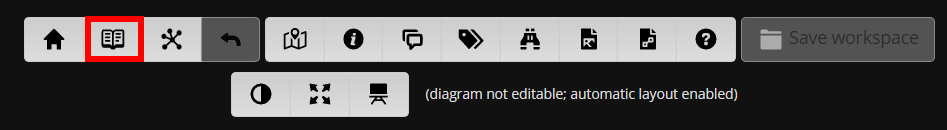
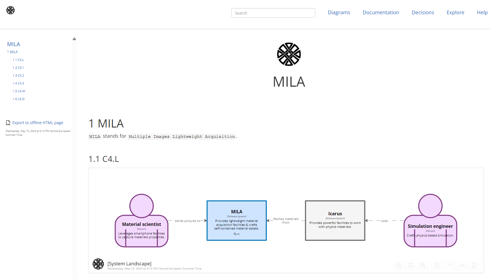
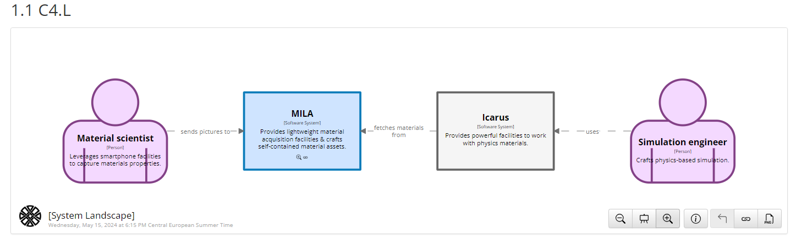
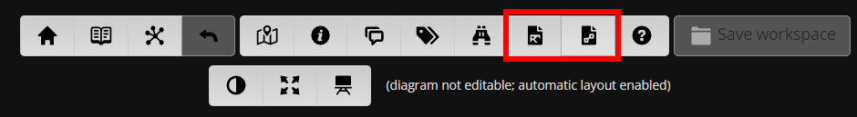

# STAGE 14

  


In this module, you will learn how to:
- Activate documentation tab within `Structurizr` through `!docs`
- Use the `embed` tag within `markdown` file
- Leverage `Struturizr` export facilities

⌛ Estimated time to complete: 10 min

## Activate documentation

You have the ability to specify a dedicated folder that will be processed by `Structurizr` to feed its documentation section.

1. ✏️ Create a `docs` folder
1. ✏️ Create a `markdown` file within `docs` folder
1. ✏️ Fill in some content eg:
    ```diff
    + ## MILA
    + 
    + `MILA` stands for `Multiple Images Lightweight Acquisition`.
    ```
1. ✏️ Amend your `workspace.dsl`
    ```diff
    workspace "MILA" "Multiple Images Lightweight Acquisition" {
        !identifiers hierarchical
        !impliedRelationships false
    +   !docs docs
    ```

Every `markdown` file found in the `docs` will be included. This is a good way to provide consolidated material library.

Check your changes by activating `Cornifer preview` and navigate to the `documentation` tab within `Structurizr`.




## Leverage embed tag 

What if your markdown could embed dynamic & up to date `C4` views you can interact with, instead of plain old snapshots you are used to? 
- No more tedious and error prone snapshot export & documentation update
- Not only the doc is up to date, but content is interactive

✏️ Amend your previously created `markdown` file:

```diff
## MILA

`MILA` stands for `Multiple Images Lightweight Acquisition`.

+ ### C4.L

+ 
```

Refresh your browser and see how `Structurizr` fetches matching `views` for you, providing widget reader can interact with (zoom, filter, ...).



## Export materials

`Embed` tag is only interpretated by `Structurizr`, which is fine if your stack is built around its ecosystem. Maybe you are not so lucky, or you need some plain old materials to feed a slide deck, ... Luckily, `Structurizr` provides built-in export facility, making `software model` snapshotting straightforward.  



Prefer `.svg` over `.png` if you need to accommodate proper zooming. However, and unfortunately for us, `.svg` are still really painful to deal with (eg no preview within Pull Request for non `https .svg`).  

## Wrapup

📘 Completing this stage should lead to this [final workspace](./workspace.dsl).  

You see how a single `software model` can be operated in different ways, surfacing `views` that can in turn feed technical documentation or slide deck downstream. Main goal of defining a `software model` is to support decision making, wherever they occur, so it is great to see we are not stuck to a corner. Define once, explore where makes sense.

After this documentation interlude, go back to `workspace` and see how one could [tidy up](../stage%2015/README.md) `model` by introducing `group`.

## Further reading

- [!docs](https://github.com/structurizr/dsl/blob/master/docs/language-reference.md#documentation)
- [embed](https://structurizr.com/help/documentation/diagrams)