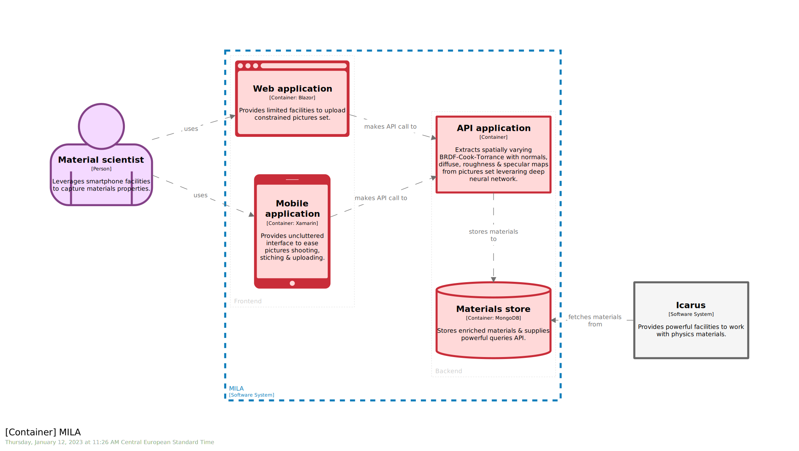

# STAGE 15

 

In this module, you will learn how to:
- Cluster related elements through `group`

⌛ Estimated time to complete: 5 min

## Add group

`Structurizr` provides the ability to gather related elements together. Not only it structures `model` section, but it will also improves downstream rendering by introducing boundary around grouped elements. Resulting layout is smarter, enforcing related elements locality.  

You can only group siblings elements:
* `people` and `software systems` within `model` section
* `containers` within their parent `software system`
* `components` within their parent `container`

Dedicated snippet is provided via `Cornifer`:

```c4u
group "name" {}
```

✏️ Split `MILA` `softwareSystem` in 2 `groups`, namely `frontend` & `backend`, by encompassing existing containers accordingly. 

<details><summary>📙 REVEAL THE ANSWER</summary>

```diff
mila = softwareSystem "MILA" "Provides [...]" "" {
+   group "Frontend" {
        spa = container "Web application" "" "" "" {}
        mobile = container "Mobile application" "" "" "" {}
+   }
+   group "Backend" {
        api = container "API application" "" "" "" {}
        store = container "Materials store" "" "" "" {}
+   }
}
```
</details><br> 

✏️ Save your workspace, and refresh your browser.



Every `view` involving grouped `containers` has been updated to reflect grouping: a named boundary now properly delimits `group`. 

## Wrapup

📘 Completing this stage should lead to this [final workspace](./workspace.dsl).  

Especially useful when `software model` is becoming complex (like micro-services architecture) or to highlight elements operating jointly, `group` allows to tidy up `model` section, while supporting layout engine and easing visual identification.  

`Software model` is likely to operate in bigger ecosystem and you may wonder how one could avoid ending up with a monolith `workspace`. [Next stage](../stage%2016/README.md) introduces a way to face such a situation.

## Further reading

- [group](https://github.com/structurizr/dsl/blob/master/docs/language-reference.md#group)