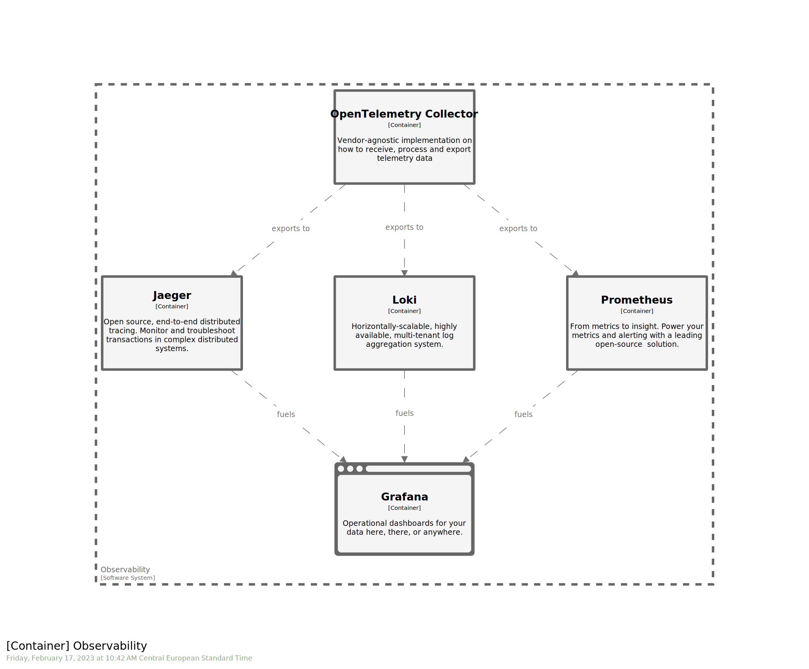
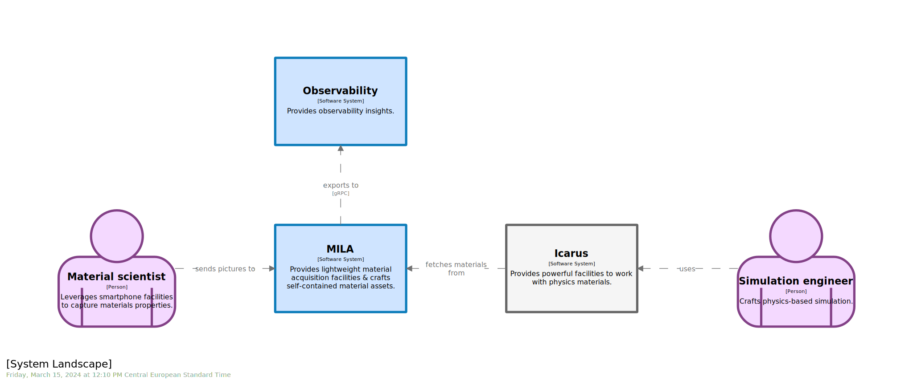
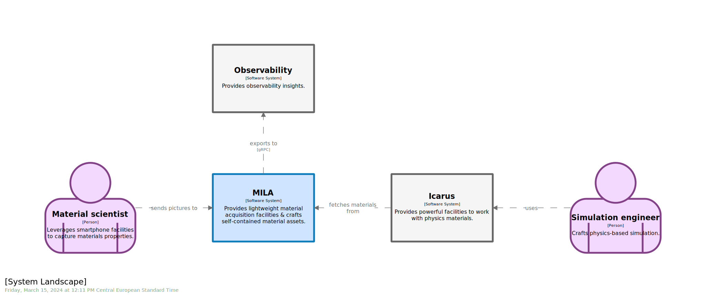
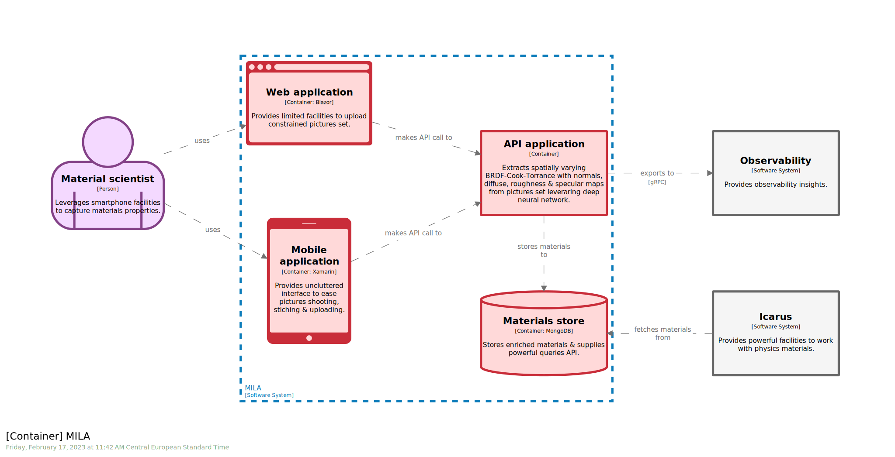

# STAGE 16


  


In this module, you will learn how to:
- Use the `!include` keyword to embed a `dsl fragment`
- Use the `ref` keyword to reference an element from an included `dsl fragment`

⌛ Estimated time to complete: 15 min

## Observability

Observability is a must-have for modern applications to gather insights and ease troubleshooting.
Observability stack comes with different flavors, but you are likely to share the same for multiple `software systems`. 
 
There are multiple ways to deal with that within `C4` world:
1. We could define an external `Observability` `software system` within our workspace, populating internals with `containers` & `components` we have to bridge with. This approach implies you duplicate the `Observability` bunch for every observable `software system` you are documentating. Not that scalable...
1. We could define an external `Observability` `software system` within our workspace, leveraging `url` field to provide navigation facility to `Observability` dedicated `workspace`. This approach is fine, as long as we don't have to surface coupling with `Observability` `software system` internals.
1. We could define a dedicated `Observability` `workspace` and leverage `.dsl` tooling to weave pieces. This way, you benefit best of both worlds, meaning you define `Observability` `software system` only once AND you are able to surface in-depth coupling.

As you can imagine, this stage will focus on the last alternative.

## Fragments

Two `dsl` fragments has been crafted for the sake of this stage, namely [observability.model.dslf](./fragments/observability.model.dslf) and [observability.views.dslf](./fragments/observability.views.dslf):
- Sticking to separation of concerns, we keep `model` & `views` pieces apart. 
Due to how `!include` facility works - performing in-situ swap - within `.dsl`, it is by the way the only way to do.
- We use a well-known naming pattern, amidst `.xxx.` materializing the dimension  

## Import

✏️ Complement `model` by importing `observability.model.dslf` fragment 

<details><summary>📙 REVEAL THE ANSWER</summary>

```diff
+ #region OBSERVABILITY

+ !include observability.model.dslf

+ #endregion

dev_ = deploymentEnvironment "dev" {
```
</details><br>

> Feel free to use - or nor - `region` construct to tidy up your workspace. 

✏️ Complement `views` by importing `observability.views.dslf` fragment 

<details><summary>📙 REVEAL THE ANSWER</summary>

```diff
views {
    theme https://raw.githubusercontent.com/rvr06/cornifer-contrib/main/themes/semantic-alt/theme.json
    
+   !include observability.views.dslf
```
</details><br>

Notice how `Struturizr` enriched your views library with the imported one:



## Plug

Once you complement `model` & `views` sections, it's now time to link `observability` to your `software system`. Do so by materializing missing `relationships`. 

✏️ Reference `obs` `software system` via [!ref](https://github.com/structurizr/dsl/blob/master/docs/language-reference.md#ref) keyword
✏️ Plug `obs` into ecosystem by adding missing relationships

<details><summary>📙 REVEAL THE ANSWER</summary>

```diff
#region OBSERVABILITY

!include observability.model.dslf

+!ref obs {
+}

+ mila -> obs "exports to" "gRPC" ""
+ mila.api -> obs "exports to" "gRPC" ""

#endregion
```
</details><br>



## Amend

`Observability` `software system` is now part of our ecosystem. But it appears to not be considered as external, and thus does not benefit of the semantic styling we applied so far. It makes sense as it has been crafted outside with no awereness of usage. Luckily, `Structurizr` allows for downstream tagging and styling to accommodate specific situation.

✏️ Amend fragment by applying the `#external` `tag` to `obs` `software system`

<details><summary>📙 REVEAL THE ANSWER</summary>

```diff
#region OBSERVABILITY

!include observability.model.dslf

+!ref obs {
+    tags "#external"
+}

mila -> obs "exports to" "gRPC" ""
mila.api -> obs "exports to" "gRPC" ""

#endregion
```
</details><br>

Check how style is properly propagated and how every view react accordingly.




## Wrapup

📘 Completing this stage should lead to this [final workspace](./workspace.dsl).  

> Once is luck, twice is coincidencen three times is a pattern.

Code first approach advocates to process your `.dsl` as plain old source code. `Rule of three` is a well-known pattern that we should also apply in our case. And we do, promoting `Observability` materials as self-contained and reusable architecture pieces. Leveraging `Structurizr`, we can now seamlessly assemble and combine fragments, enabling smarter outcome materials while decreasing maintenance cost.  

In `Object Oriented Programming` world, `inheritance` is never far away `composition`. See how it applies in the [next stage](../stage%2017/README.md).  

## Further reading

- [include](https://github.com/structurizr/dsl/blob/master/docs/language-reference.md#includes)
- [!ref](https://github.com/structurizr/dsl/blob/master/docs/language-reference.md#ref)
