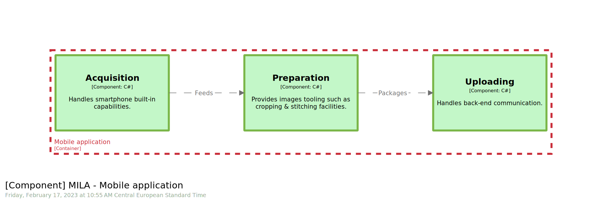
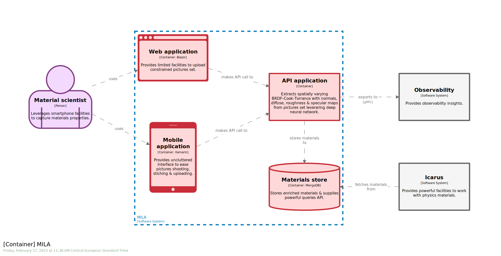
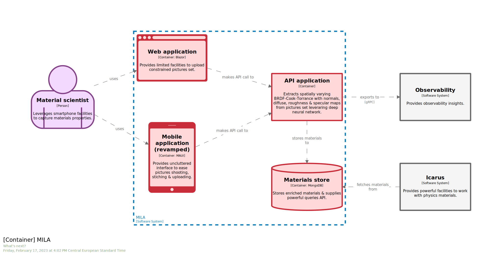
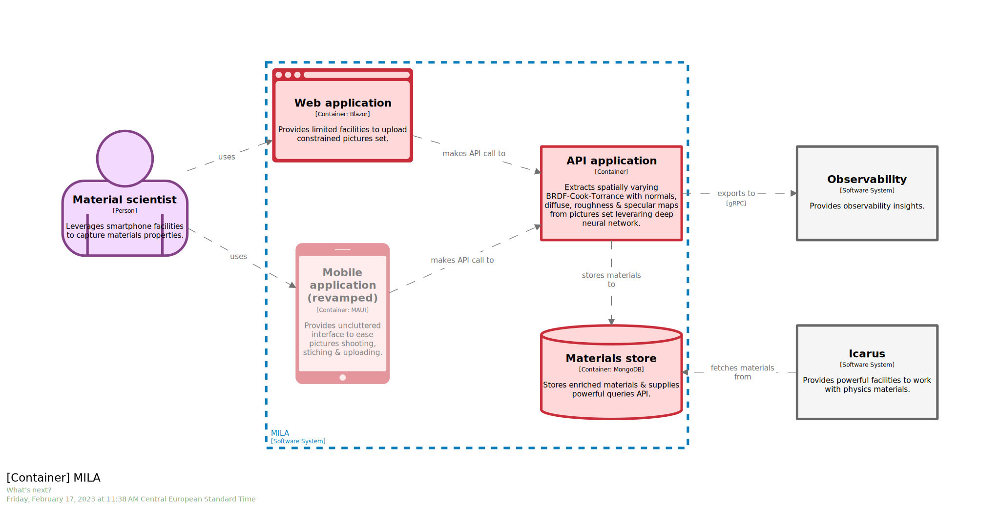

# STAGE 17

  
  

In this module, you will learn how to:
- Use the `extends` keyword to extend an existing `workspace`
- Use the `ref` keyword to reference and amend an element from an included `dsl fragment`

⌛ Estimated time to complete: 15 min

## Handle the growth

You may have noticed our `workspace` has sizably grown, compared to [where](../stage%2001/workspace.dsl) we started. As for code, it is not so much the amount of lines but the amount of responsibilities this single workspace is now in charge of that may become an issue and thus lead to changes.  
As always with those controversial topics, YMMV, but we can foresee to common scenarios that may induce changes:
1. Clustering teams contribution ie **segregating**
1. Providing variations without noising reference ie **branching**

We'll cover both scenarios in this stage.

## Extend

All scenarios share the same entry point, namely creating a brand-new `workspace` that _extends_ an existing one.

✏️ Create a new `workspace` which extends the [existing one](./core/workspace.dsl), located in the `core` folder. Note that you can also provide an `url` to extend an online `workspace`. Feel free to look at [language reference](https://github.com/structurizr/dsl/blob/master/docs/language-reference.md#workspace) for details.

<details><summary>📙 REVEAL THE ANSWER</summary>

```diff
+ workspace extends core/workspace.dsl {
+   !identifiers hierarchical
+	!impliedRelationships false
+ }
```
</details><br>

## Segregate

Assume decision was made to offload the mobile development to a dedicated team. Opportunity was taken to lighten the main `workspace` from `mobile` insights, meaning we want all `C4.3` pieces to be relocated.

✏️ Reference `mila.mobile` `container` through `!ref` keyword 

<details><summary>📙 REVEAL THE ANSWER</summary>

```diff
workspace extends core/workspace.dsl {
	!identifiers hierarchical
	!impliedRelationships false
	
+	model {
+		!ref mila.mobile {
+		}
+	}
}
```
</details><br>

✏️ Drain `mila.mobile` existing components and matching relationships from [workspace](../stage%2016/workspace.dsl). 

<details><summary>📙 REVEAL THE ANSWER</summary>

```diff
workspace extends core/workspace.dsl {
	!identifiers hierarchical
	!impliedRelationships false
	
	model {
		!ref mila.mobile {
+			acquisition = component "Acquisition" "Handles smartphone built-in capabilities." "C#" "" {
+			}
+			preparation = component "Preparation" "Provides images tooling such as cropping & stitching facilities." +"C#" "" {
+			}
+			uploading = component "Uploading" "Handles back-end communication." "C#" "" {
+			}

+			acquisition -> preparation "Feeds" "" ""
+			preparation -> uploading "Packages" "" ""
		}
	}
}
```
</details><br>

✏️ Drain existing view from [workspace](../stage%2016/workspace.dsl). 

<details><summary>📙 REVEAL THE ANSWER</summary>

```diff
+	views {
+		# C4.3
+		component mila.mobile "mila_mobile-4_3" "" {
+			include *
+		}
+	}
```
</details><br>

Check that `Structurizr` is seamlessly serving all views, from current `workspace` and parent one.



> By splitting the `software system` in 2 `workspaces`, we broke the original `container to component` navigation. You can partially splice them again via `mila.mobile` container `url` field within parent `workspace`.

## Branch 

Assume now the new team want to spike a `Xamarin` to `MAUI` migration, but do not want to noise current materials with this work, ie do not modify existing `container view` from parent `workspace`:



[MAUI](https://dotnet.microsoft.com/en-us/apps/maui) stands for **.NET Multi-platform App UI**. It is the new Microsoft framework to build native, cross-platform desktop and mobile apps all in one.

See how one could proceed to do so.

✏️ Add a new `container` to `MILA` `software system` to materialize the new application.

<details><summary>📙 REVEAL THE ANSWER</summary>

```diff
model {
+	!ref mila {
+		maui = container "Mobile application (revamped)" "Provides uncluttered interface to ease pictures shooting, stiching & uploading." "MAUI" "#mobile" {
+			url https://dotnet.microsoft.com/en-us/apps/maui
+		}		
+	}
}
```
</details><br>

✏️ Add missing relationship betwenn `maui` & `mila.api`  
✏️ Add missing relationship betwenn `maui` & `matt`

<details><summary>📙 REVEAL THE ANSWER</summary>

```diff
model {
	!ref mila {
		maui = container "Mobile application (revamped)" "Provides uncluttered interface to ease pictures shooting, stiching & uploading." "MAUI" "#mobile" {
			url https://dotnet.microsoft.com/en-us/apps/maui
		}
		
+		maui -> mila.api "makes API call to" "" ""
	}
	
+	!ref matt {
+		-> mila.maui "uses" "" ""
+	}
}
```
</details><br>


✏️ Create a dedicated `view` 

<details><summary>📙 REVEAL THE ANSWER</summary>

```diff
views {
+	container mila "what_s_next" "What's next?" {
+		include *
+		exclude mila.mobile
+	}
}
```
</details><br>



✏️ Style newcomers

<details><summary>📙 REVEAL THE ANSWER</summary>

```diff
model {
	!ref mila {
-		maui = container "Mobile application (revamped)" "Provides uncluttered interface to ease pictures shooting, stiching & uploading." "MAUI" "#mobile" {
+		maui = container "Mobile application (revamped)" "Provides uncluttered interface to ease pictures shooting, stiching & uploading." "MAUI" "#mobile, #newcomer" {
			url https://dotnet.microsoft.com/en-us/apps/maui
		}
	}
}

views {
+	styles {
+		element "#newcomer" {
+			opacity 50
+		}
+	}
}
```
</details><br>

> We use `opacity` field to stress out this piece is not crafted yet, but team can agree upon and use other conventions. Opacity can be used to highlight either upcoming elements or dying ones, so be sure to provide audience with the proper reading grid.

You should end up with the final diagram: 




## Wrapup

📘 Completing this stage should lead to this [final workspace](./workspace.dsl).  

As for code, there are so many flavors on how things could or should be organized, that it is difficult to provide clear guidance. This said, seasoned folks commonly end up with:
- Start smarlty, ie know your toolchain, what can be done and what can't, and start with a proper default. Remember, code first approach is all about dealing with plain old files, so at the very end, you can easily undo or redo. But don't get me wrong. Don't make crazy choices. 
- Scale gently, ie do not introduce extra complexity if it isn't worth it. We could have split `workpace` a couple of stages ago. We also could live with a monolith `workspace` for a while longer. It's up to the team(s) to decide how to sequence and schedule operations.

Whatever the decision you make, consider your toolchain as first class citizen and write down matching `Architecture Decision Record` accordingly.  

Document as well the technology stack changes by filling up dedicated `ADR` and update your [technology landscape](../bonus%20stage%2004/README.md).


## Further reading

- [extends](https://github.com/structurizr/dsl/blob/master/docs/language-reference.md#workspace)
- [!ref](https://github.com/structurizr/dsl/blob/master/docs/language-reference.md#ref)
